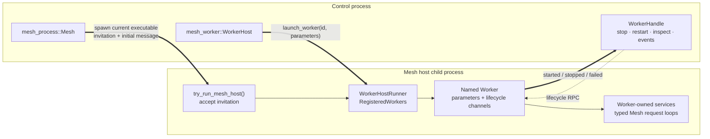
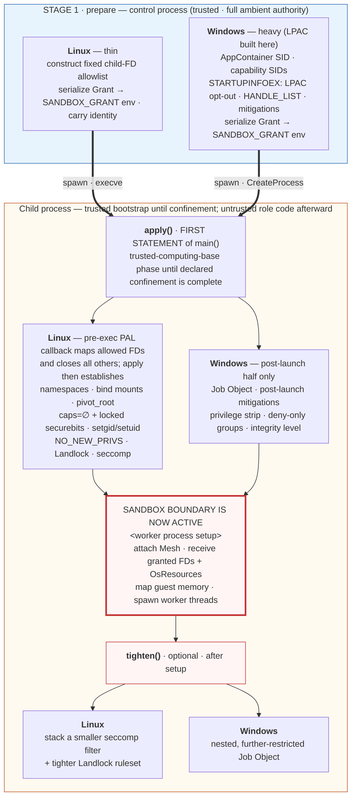
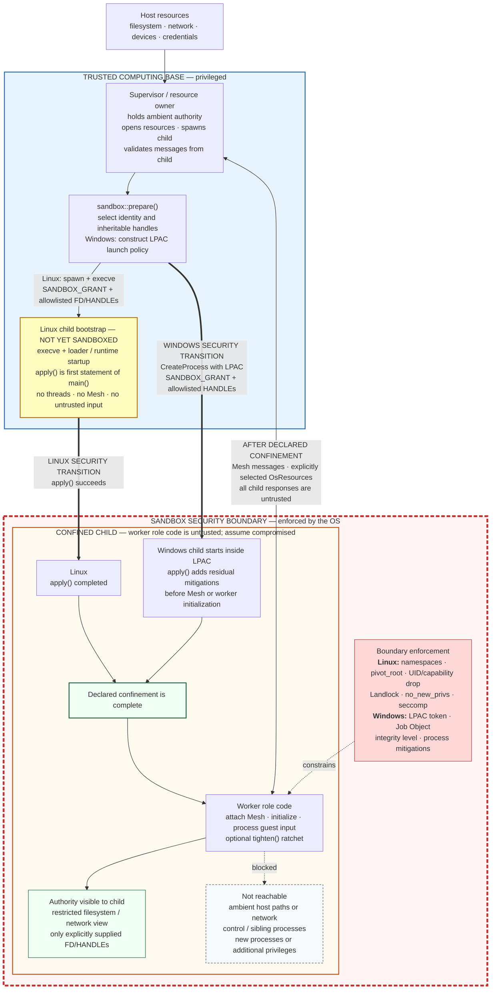
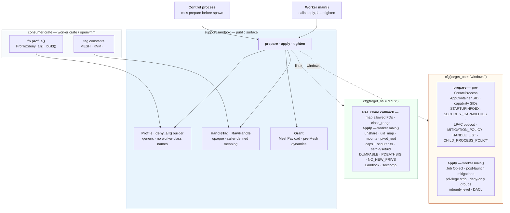

# OpenVMM / OpenHCL Worker Sandboxing — Design Document

> **Status:** *Draft for team review.*
> **Audience:** OpenVMM / OpenHCL maintainers, security reviewers, and
> implementers of the `support/sandbox` crate.
> **Supersedes:** the implementation choices in
> [`Sandbox_architecture.md`](./Sandbox_architecture.md).
> **Implements:** the decisions in
> [`Sandbox_tsd.md`](./Sandbox_tsd.md) (the TSD).
> **Complements:** [`uid_gid_sandboxing.md`](./uid_gid_sandboxing.md),
> which details the UID/GID strategy consumed by `Grant.target_uid`.
>
> This document is the **normative** description of the sandbox
> interface and its platform backends. Where it disagrees with the TSD
> or the architecture doc, this document wins; every such disagreement
> is recorded in [§3.2](#32-decisions-changed-since-the-tsd).

---

## Table of contents

1. [Overview](#1-overview)
2. [Requirements](#2-requirements)
3. [Decisions](#3-decisions)
4. [Threat model](#4-threat-model)
5. [Architecture](#5-architecture)
6. [The `support/sandbox` interface](#6-the-supportsandbox-interface)
7. [Linux design](#7-linux-design)
8. [Windows design](#8-windows-design)
9. [Intent → primitive mapping](#9-intent--primitive-mapping)
10. [Resource brokering & handle hygiene](#10-resource-brokering--handle-hygiene)
11. [Failure modes, observability, and auditing](#11-failure-modes-observability-and-auditing)
12. [Testing & CI strategy](#12-testing--ci-strategy)
13. [Migration & rollout](#13-migration--rollout)
14. [Open questions & deferred work](#14-open-questions--deferred-work)
15. [References](#15-references)
- [Appendix B — Wire schema](#appendix-b--wire-schema)

---

## 1. Overview

### 1.1 Goal

Give every OpenVMM and OpenHCL worker process a **default-deny
sandbox** that is established before the worker executes any
attacker-reachable code, is described in an **intent-level,
platform-neutral vocabulary** that worker authors can write and
security reviewers can audit, and is enforced by **first-class OS
primitives** on both Linux and Windows.

Concretely, a worker that has been compromised through its device
emulation surface must be unable to:

- open any filesystem path the control process did not grant it,
- create any network connection it was not granted,
- spawn a child process,
- signal, `ptrace`, debug, or read the memory of any other process,
- acquire any privilege or capability it did not start with,
- reach any kernel attack surface (syscall / `ioctl` / Win32k) beyond
  what its declared role requires.

The measure of success is that this holds **by construction and by
default** — a worker author who writes no sandbox code at all gets a
worker that refuses to start, not a worker that runs unconfined.

### 1.2 Non-goals

Carried forward from TSD §Non-goals, plus additions:

- Replacing Mesh as the IPC mechanism.
- Turning OpenVMM / OpenHCL into a microkernel.
- Sandboxing single-process / dev-mode launches. The existing
  `Mesh::new(single_process = true)` path
  (`openvmm/openvmm_entry/src/meshworker.rs:37-50`) remains available
  and unsandboxed.
- Replacing operator-deployed MAC systems (SELinux, AppArmor, WDAC).
  These are complementary; we document recommended policies in
  `Guide/` but do not author them at runtime.
- Sandboxing **non-Mesh subprocess launches** in v1. See
  [§13.4](#134-non-mesh-spawn-sites).
- macOS parity. A stretch goal and an explicit non-blocker.
- Being a substitute for trust-boundary input validation. The existing
  `tracelimit` / `thiserror` / `open_enum!` discipline remains
  mandatory and is unaffected by this design.

### 1.3 Terminology

| Term | Meaning |
|---|---|
| **Control process** | The long-lived, multi-threaded process that spawns and supervises workers: `openvmm_entry` (OpenVMM host) or `underhill_core` (OpenHCL). Holds the ambient authority the workers must not inherit. |
| **Mesh host** | A child OS process created by `mesh_process` and joined to the control process's Mesh node. It runs a `WorkerHostRunner` and may host one or more registered workers. |
| **Worker** | A self-contained lifecycle component launched by `mesh_worker` to perform one role (a device emulator, diagnostics server, or VM tombstone holder). In the sandboxed deployment, it runs inside a dedicated Mesh host process; the host runtime and worker are confined together. |
| **Profile** | An opaque, immutable policy value, built from `Profile::deny_all()` in the crate that owns the worker and linked into whoever applies it. **Not** a wire type — policy is linked, not sent (C5). |
| **Grant** | The small, dynamic, per-spawn envelope the control process hands the worker *before Mesh exists*: `wire_version`, an `Identity`, and the inherited-handle allowlist. Delivered via the `SANDBOX_GRANT` environment variable. |
| **`prepare`** | Control-process setup done before the child exists, via `sandbox::prepare()`. On Linux: handle hygiene, grant serialization, identity. On Windows: additionally the entire LPAC construction, since there is no post-launch equivalent. |
| **`apply`** | The worker confining itself, as the first statement of `main()`, via `sandbox::apply()`. On Linux: the *entire* sandbox. On Windows: the post-launch half. |
| **`tighten`** | Optional progressive tightening, run by the worker after its own initialization completes, via an additive-only `Restrictions` spec. Runs `sandbox::tighten()`. |
| **Intent** | A platform-neutral capability statement — e.g. `Network::None`, `Syscalls::Allow(...)` — expressed through the widening builder ([§6.1](#61-type-vocabulary)) and translated by each backend into platform primitives. Public. |

### 1.4 Existing process model: Mesh hosts, workers, and services

OpenVMM and OpenHCL use **Mesh** as their primary typed communication fabric.
A `mesh::Sender<T>` / `mesh::Receiver<T>` pair has the same API whether both
ends are in one process or on different nodes. When an endpoint moves to
another process, Mesh serializes `MeshPayload` messages over the platform IPC
transport and carries non-serializable resources in a sideband:

- Linux uses Unix domain sockets and transfers FDs with `SCM_RIGHTS`.
- Windows uses ALPC and transfers handles by duplication.
- Channel endpoints are themselves transferable resources, so the topology can
  change after launch without introducing a central message router.

Two layers build the process and worker model:

| Layer | Responsibility |
|---|---|
| **`mesh_process`** | Creates the parent Mesh node, spawns another instance of the current executable, gives it an IPC invitation, tracks the child, and reports node failure to connected channels. This creates a **Mesh host process**, not a particular worker. |
| **`mesh_worker`** | Defines registered worker types and their lifecycle. A `WorkerHost` in the control process sends launch requests to a `WorkerHostRunner` in the selected host process. The runner resolves a `WorkerId`, constructs the worker from typed parameters, and runs it on a dedicated thread. |

The control process launches a separate-process worker as follows:

1. It creates the process-wide `mesh_process::Mesh`.
2. It creates a `(WorkerHost, WorkerHostRunner)` channel pair. The
   `WorkerHost` remains in the control process; the `WorkerHostRunner` is placed
   in the new host's initial Mesh message.
3. It calls `Mesh::launch_host(ProcessConfig, initial_message)`.
   `mesh_process` creates an invitation and spawns the current executable. On
   Linux, the invitation uses a pre-connected socket duplicated to FD 3 and
   metadata in `MESH_WORKER_INVITATION`; on Windows it uses inherited ALPC
   invitation state and an object-directory handle.
4. Early in child startup, the executable recognizes the invitation and calls
   `try_run_mesh_host()`. That joins the child node to the parent, receives the
   initial message, and runs the supplied `WorkerHostRunner` against the
   compile-time `RegisteredWorkers` catalog.
5. The control process calls `WorkerHost::launch_worker(id, parameters)`.
   Mesh sends the worker ID, lifecycle channels, and typed parameters to the
   child. Parameters may contain additional channel endpoints and explicitly
   selected FDs/HANDLEs.
6. The runner starts the worker and returns lifecycle events through a
   `WorkerHandle`. The control process retains that handle to inspect, stop,
   join, or hot-restart the worker in another host process.



A **service** is not a separate Mesh process abstraction. It is normally an
async or synchronous request loop that owns a typed `Receiver` and may run
inside a worker or another component. Moving the receiver in a
`MeshPayload`—for example, as part of worker parameters—moves the service
endpoint across the process boundary without changing the caller's channel
API. A child host can therefore contain one or more workers, and each worker
can expose multiple services.

For sandboxing, every cross-process Mesh object is security-relevant:

- The invitation FD/HANDLE is bootstrap authority and must be on the spawn
  allowlist.
- The initial message, worker parameters, channel endpoints, and sideband OS
  resources are the only intended authority delivered to the child.
- Possession of a channel endpoint determines which Mesh ports a process can
  address, but Mesh does not make messages trustworthy. The control process
  must validate all requests and responses received from a sandboxed worker.
- On Linux, `sandbox::apply()` must complete before `try_run_mesh_host()`
  decodes the invitation, starts Mesh infrastructure, receives the initial
  message, or dispatches a worker. On Windows, LPAC is active at process
  creation and the post-launch `apply()` remainder must complete before the
  same Mesh join.

The concrete OpenVMM wrapper follows this split in
`openvmm_entry/src/meshworker.rs`: `VmmMesh::make_host()` first creates a Mesh
host process, then callers use the returned `WorkerHost` to launch the VM,
vTPM, VNC, debugger, or other registered worker. In single-process development
mode, `make_host()` returns a local `WorkerHost` instead; worker-facing code and
Mesh channel APIs remain unchanged.

---

## 2. Requirements

Requirements carry stable IDs. Design sections, tests, and PRs cite
them.

### 2.1 Functional requirements

| ID | Requirement |
|---|---|
| **R-F1** | A single crate, `support/sandbox`, provides the entire sandbox surface for both platforms. Consumers do not `#[cfg]` on target OS to use it. |
| **R-F2** | The sandbox is established in named, ordered stages — `prepare` (control process, before spawn), `apply` (worker, first statement of `main()`), and the optional `tighten` — as defined in [§5.1](#51-the-three-stages). |
| **R-F3** | The control process declares a worker's sandbox by naming exactly one `Profile`. No other sandbox parameter is authored at the call site. |
| **R-F4** | The worker's sandbox is fully applied before the worker attaches to Mesh, starts an async runtime, reads configuration, or touches the network. |
| **R-F5** | Workers may optionally tighten their sandbox further after initialization completes (`tighten`), and this must be a strict ratchet — it can never relax an applied restriction. |
| **R-F6** | Every resource a worker uses arrives as an inherited file descriptor or handle. Workers never open resources by name. |
| **R-F7** | A profile mismatch or wire-format mismatch between the control process and the worker is a hard, immediate failure — never a silent misinterpretation. |
| **R-F8** | A developer can disable the sandbox entirely for debugging, and that switch cannot be present in a production build. |

### 2.2 Security requirements

| ID | Requirement | Threat addressed |
|---|---|---|
| **R-S1** | Default-deny: a worker whose `Profile` (built from `deny_all()`) grants nothing can reach nothing. Absence of policy denies; it does not permit. | All |
| **R-S2** | No ambient filesystem authority. A compromised worker cannot `open(2)` / `CreateFile` any path outside its granted view, including via `/proc/self/fd` re-open or `..` traversal. | Lateral movement to host FS |
| **R-S3** | No ambient network authority. A worker not granted network access cannot create a socket that reaches any peer. | Exfiltration, lateral movement |
| **R-S4** | No privilege acquisition. A worker cannot gain a capability, privilege, or token group it did not start with — including via `execve` of a setuid binary or a token-manipulating API. | Privilege escalation |
| **R-S5** | No process creation. A worker cannot `fork`, `execve`, or `CreateProcess`. | Payload staging, sandbox escape via helper |
| **R-S6** | No inter-process reach. A worker cannot `ptrace`, debug, signal, open, or read the memory of any other process, including its siblings and its own control process. | Lateral movement between workers |
| **R-S7** | No ambient descriptor authority. Every FD/HANDLE in the worker is on an explicit allowlist; everything else is closed or non-inheritable before the worker runs. | Ambient-authority leak (TSD Topic 12) |
| **R-S8** | Minimized kernel attack surface. Workers restrict their syscall surface (Linux, opt-in per [R-S13]) and disable Win32k (Windows). | Kernel LPE from a compromised worker |
| **R-S9** | No dynamic code. A worker cannot make writable memory executable or load an unsigned/remote image. | Payload execution |
| **R-S10** | No attacker-reachable code runs before the sandbox is applied, and no async-signal-safe fork/exec window is required to achieve it. On Linux the worker self-applies its sandbox as the first statement of `main()`, in a fresh single-threaded address space. | TSD complaint #1 — the reason this redesign exists |
| **R-S11** | No third-party sandbox crate type (`landlock::*`, `seccompiler::*`, `caps::*`, `windows-sys::*`) appears in the public API of `support/sandbox`. | TSD complaint #5 — encapsulation |
| **R-S12** | Sandbox failure of a *required* primitive aborts the worker. It never degrades silently. | Fail-loud |
| **R-S13** | Syscall filtering (Linux seccomp) is opt-in per worker class, not a universal requirement, because the syscall list encodes link-set details that drift. Workers that opt out must have no reachable resource to abuse. | TSD Topic 3 |

### 2.3 Platform & deployment requirements

| ID | Requirement |
|---|---|
| **R-P1** | **OpenHCL baseline: Linux 6.6** (`Guide/src/dev_guide/getting_started/build_ohcl_kernel.md:15-16`, branch `product/hcl-main/6.6`). Landlock ABI 3. |
| **R-P2** | **OpenVMM-host Linux baseline: 5.15 LTS.** Landlock ABI 1 only. |
| **R-P3** | **Windows baseline: Windows 10 1809 (build 17763) / Windows Server 2019.** Covers LPAC, all mitigation policies used here, and nested Job Objects. |
| **R-P4** | Workers may *opportunistically* use features above the baseline, detected at runtime. They must never *require* them. Capability probing degrades; it does not hardcode. |
| **R-P5** | The design must name its supported deployment surfaces and specify the degraded mode for each. See [§7.6](#76-deployment-surface--degradation-matrix). |
| **R-P6** | Windows and Linux backends are both **v1 deliverables**. Neither is a forward-compatibility placeholder. |
| **R-P7** | No new external crate dependency is taken where an in-tree equivalent exists. |

### 2.4 Operational requirements

| ID | Requirement |
|---|---|
| **R-O1** | Per-spawn sandbox cost stays within the noise of existing `mesh_process` spawn cost. Budget: **< 5 ms** added per spawn on both platforms. |
| **R-O2** | A sandbox denial is diagnosable from outside the worker. The control process must be able to report *which* worker, *which* profile, and *what* was denied — without running rich code inside a dying worker. |
| **R-O3** | Sandbox policy changes are reviewable as a diff. A reviewer must be able to see what a profile grants without reading BPF or SID constants. |
| **R-O4** | CI runs both sandbox-enabled and sandbox-disabled configurations. |
| **R-O5** | The design must not require root in the OpenVMM-host deployment. OpenHCL's control process is root and may use that; OpenVMM-host may not assume it. |

### 2.5 Requirement → TSD traceability

| Requirement | Source |
|---|---|
| R-F1, R-S11 | TSD Topic 9 |
| R-F2, R-F5 | TSD Topic 6 |
| R-F3 | TSD Topic 8 (as amended — see [§3.2](#32-decisions-changed-since-the-tsd)) |
| R-F4, R-S10 | TSD Topic 1 complaint #1, Topic 6 |
| R-F6, R-S7 | TSD Topic 5, Topic 12 |
| R-S1, R-S2 | TSD Topic 2, Topic 4 |
| R-S3 | TSD Topic 4 (net NS primary) |
| R-S8, R-S13 | TSD Topic 3, Topic 4 |
| R-S12, R-O2 | TSD Topic 7 |
| R-P1, R-P2, R-P4 | TSD Topic 4 kernel baselines |
| R-P5 | TSD open question 4 |
| R-P6 | Team decision, this document |
| R-P7 | Project guidelines — "avoid taking new external dependencies" |
| R-O4 | TSD Topic 10 |

---

## 3. Decisions

### 3.1 Decisions carried from the TSD

| # | Decision | Source |
|---|---|---|
| **D1** | **Three mandatory Linux launch points** — `prepare` computes clone requirements in the control process, PAL creates namespaces and writes fixed ID maps in its clone callback, and `apply` performs rich confinement at the start of the worker — plus optional `tighten`. Windows keeps launch-time LPAC construction in `prepare`. | TSD Topic 1 + Topic 6 (as amended, [§3.2](#32-decisions-changed-since-the-tsd)) |
| **D2** | **The Linux sandbox preserves PAL's vfork path.** Namespace flags are passed to `clone(2)`. The callback performs only fixed, precomputed `/proc/self/setgroups`, `uid_map`, and `gid_map` writes using libc; allocation, locking, tracing, and policy-rich setup remain post-`execve` in `apply`. | TSD Topic 1, Topic 6 (as amended, [§3.2](#32-decisions-changed-since-the-tsd)) |
| **D3** | **`prepare` on Windows is LPAC construction** — AppContainer SID, capability SID list, `STARTUPINFOEX` attribute list, then `CreateProcess`. There is no `EnterAppContainer` API, so this must be control-side. | TSD Topic 1 Windows sub-section |
| **D4** | **`apply` is the bulk of the sandbox** on Linux, and the post-launch half on Windows — run single-threaded in a fresh process where the allocator and normal crates are safe. | TSD Topic 6 |
| **D5** | **Progressive tightening is `tighten`** and is optional and strictly monotonic — expressed as an additive-only `Restrictions` spec, so the ratchet holds by type ([§6.1](#61-type-vocabulary)). | TSD Topic 6 |
| **D6** | **Public vocabulary is intent-level and platform-neutral.** No `landlock` / `seccompiler` / `caps` / `windows-sys` types cross the public API. | TSD Topic 9 |
| **D7** | **Backends are `cfg`-gated modules inside one crate.** | TSD Topic 9 |
| **D8** | **Broker-and-handles is mandatory.** Workers see resources only as inherited FDs / HANDLEs. Deferred: broker server and seccomp user-notify. | TSD Topic 5 |
| **D9** | **Handle hygiene is mandatory.** `FD_CLOEXEC` / non-inheritable by default, explicit allowlist, pre-`execve` `close_range` enforcement on Linux, `HANDLE_LIST` on Windows. | TSD Topic 12 |
| **D10** | **`mesh_process` stays policy-agnostic.** OpenVMM owns role selection and adapts `SandboxProcessConfig` to the existing generic process-builder hook; Mesh worker names are not security selectors. | TSD Topic 11 |
| **D11** | **Mount namespace + bind mounts + `pivot_root` is the primary Linux FS isolation mechanism.** Landlock is a supplement, applied opportunistically with ABI-aware degradation. | TSD Topic 4 ("team preference, load-bearing") |
| **D12** | **Empty network namespace is the primary Linux network restriction.** Landlock network needs ABI 4 / kernel 6.7, above both baselines. | TSD Topic 4 |
| **D13** | **Seccomp is opt-in per worker class**, composed from library-contributed requirements plus explicit additions. `RET_KILL_PROCESS` in production. | TSD Topic 3, Topic 4, Topic 7 |
| **D14** | **Sandbox setup fails closed.** A requested namespace or required confinement primitive that cannot be applied aborts the worker launch; there is no retry with a weaker namespace set. | TSD Topic 7 |
| **D15** | **Namespace UID/GID 0 map to the spawning process's effective UID/GID.** Distinct outer host identities are deferred until the control process has an explicit identity allocator. | `uid_gid_sandboxing.md` |
| **D16** | **No PID namespace in the initial integration.** User, mount, and (unless networking is unrestricted) network namespaces are created at clone time. | TSD Topic 4, open question 5 |

### 3.2 Decisions changed since the TSD

The TSD and the architecture doc disagree in several places, and the
architecture doc left several TSD recommendations unimplemented. Each
delta below is a deliberate decision made for this document. **Readers
who have read the TSD should read this table.**

| # | Change | Was | Now | Rationale |
|---|---|---|---|---|
| **C1** | **Linux creation model** | TSD Topic 1: dedicated launcher binary (option 2b), `execve`d between control and worker. | **No launcher; PAL creates namespaces during its existing vfork-based clone.** The clone callback self-maps namespace IDs with fixed libc writes, then `execve`s. The worker performs all policy-rich setup in `apply`. | Preserves PAL's established process path while ensuring the program image starts inside its namespaces. The callback has a permanent async-signal-safe contract and carries only preformatted mapping bytes; all allocation-heavy and lock-taking work remains in the fresh post-`execve` image. |
| **C2** | **PID namespace** | TSD composition-order step 7 includes `CLONE_NEWPID`. | **Omitted in v1.** Workers remain in the control process's PID namespace. | R-S6 (no inter-process reach) is met initially by `PR_SET_DUMPABLE=0`, Yama, and seccomp denial of cross-process operations. Distinct outer UIDs and a PID namespace remain possible later hardening steps. |
| **C3** | **`/dev/kvm`, `/dev/mshv` access** | TSD Topic 4: Firecracker-style `mknod` + `chown` inside the new root, requiring `CAP_MKNOD` in the launcher. | **FD passing only.** The control process opens the device and passes the FD as a granted handle — over Mesh's `OsResource` sideband once the worker has attached, or on the pre-Mesh allowlist if it is needed earlier. | No `mknod`, no `CAP_MKNOD`, no device-node management inside the new root. FD passing is the TSD's own documented fallback, is simpler, satisfies R-O5, and reuses the resource-passing path Mesh already provides ([§10.4](#104-mesh-compatibility)). |
| **C4** | **Windows scope** | TSD assumption: "Linux is first-class; Windows is forward-compatible." Windows backend explicitly **not** a v1 deliverable. | **Windows LPAC backend ships in v1 alongside Linux.** | Team decision. Resolves TSD open q1 by building the thing rather than reserving space for it. Sections 7 and 8 are deliberately symmetric. |
| **C5** | **Policy vocabulary & ownership** | TSD Topics 2 / 8: composable `Capability` values on the wire; the earlier draft of this doc used a **closed `Profile` enum** in `support/sandbox` naming every worker class, with a compiled-in `ProfileSpec` catalog and a build-time hash over it. | **A default-deny base in `support/sandbox` that each worker builds on, with the concrete profile defined in the worker's own crate (or the `openvmm` crate).** `support/sandbox` exposes `Profile::deny_all()` and a widening-only builder; it does **not** enumerate worker classes. Policy is *linked, not sent* — `Profile` is not a wire type. | Decouples the sandbox crate from the set of workers: adding a worker no longer edits `support/sandbox`. The deny-all base guarantees R-S1 by construction. Composition is a compile-time concern in the owning crate, and because the Linux sandbox is self-applied (C1) the worker is the sole authority on its own policy — a compromised control process cannot compose or weaken it. **Trade-off:** the product no longer lists every sandbox in one file; recovered by an inventory CI test ([§12](#12-testing--ci-strategy)) rather than by a central enum. |
| **C6** | **Wire encoding** | TSD: `serde`-encoded `PreExecGrant` + `MeshPayload` `CapabilityGrant`. Architecture doc: `prost` + `prost-build` + `.proto` file + `blake3`. | **`mesh_protobuf` with `#[derive(MeshPayload)]`.** | R-P7. `mesh_protobuf` is the workspace's own protobuf implementation (`support/mesh/mesh_protobuf`), is already how every other cross-process payload in the codebase is encoded, is `no_std`-friendly, adds no build script, and its `protofile` module can still emit a `.proto` descriptor — so the architecture doc's "language-neutral schema" benefit is preserved. `prost` at 0.11 is present in the workspace but is not the payload encoding used by Mesh. |
| **C7** | **Landlock / seccomp ordering** | Architecture doc `post_exec` sequence: seccomp (step 6), then Landlock (step 7). | **Landlock first, then seccomp last.** | If seccomp is installed first, the filter must permit `landlock_create_ruleset`, `landlock_add_rule`, and `landlock_restrict_self` in the steady-state filter — a permanent, unnecessary hole. Applying Landlock first lets the final filter deny all three. Matches TSD composition-order steps 21–22. |
| **C8** | **`PR_SET_DUMPABLE` placement** | TSD Topic 4 lists it among the launcher's (pre-`exec`) mandatory calls. | **In `apply`, specifically *after* the `setuid`/`setgid` drop.** | `execve` resets the dumpable flag to 1 for a normal (non-setuid) image, and changing the effective UID resets it again to `/proc/sys/fs/suid_dumpable`. It must therefore be the last credential-adjacent call. This is a latent bug in the TSD's launcher sequence too. |
| **C9** | **`PR_SET_PDEATHSIG` placement** | TSD: launcher, once. | **In `apply`, *after* the credential drop.** | `PDEATHSIG` is cleared both by `execve` and by the `setuid` credential change, so it persists only if set after both — i.e. late in the worker's self-apply sequence. With the launcher gone there is no pre-`execve` window to cover, so the earlier "set it twice" workaround is unnecessary. |
| **C10** | **Mandatory-always primitives** | TSD Topic 4 mandates locked securebits, `keyctl` session-keyring detach, `PR_SET_DUMPABLE=0`, `PR_SET_PDEATHSIG`, `setrlimit` defaults, `MS_NOSUID\|MS_NODEV` remounts, and io_uring restrictions. The architecture doc's stage tables omit **all of them**. | **All folded into the stage tables** in [§7.2](#72-primitive--stage--apply-point-matrix). | These are cheap, high-value, and were simply lost between documents. |
| **C11** | **Failure policy** | TSD Topic 7 permits selected primitives to degrade. | **The initial OpenVMM integration fails hard for every requested namespace and required confinement primitive.** | Retrying without a requested boundary silently changes the security contract. Any future fallback must be an explicit operator-selected profile, not an automatic weaker retry. |
| **C12** | **Non-Mesh spawn sites** | TSD open q10 required the architecture document to enumerate and decide per-site. The architecture doc does not mention them. | **Enumerated and marked explicitly unsandboxed in v1**, with tracking. See [§13.4](#134-non-mesh-spawn-sites). | Closes the open question with a documented, deliberate answer rather than an omission. |
| **C13** | **Grant scope & delivery** | Earlier draft: a rich `Grant` (profile selector + hash + identity + full handle map) written to a dedicated inherited pipe on FD 3, with Mesh renumbered to FD 4. | **`Grant` is the pre-Mesh envelope only** — `wire_version` + identity + a minimal inherited-handle allowlist — delivered via the `SANDBOX_GRANT` environment variable, mirroring Mesh's own `MESH_WORKER_INVITATION`. Every working resource continues to ride Mesh's existing `OsResource` sideband, delivered *after* `apply`. | Maximum compatibility with `mesh_process` (`support/mesh/mesh_process/src/lib.rs`): no reserved grant FD, `IPC_FD = 3` is not renumbered, and the sandbox does not re-implement resource passing that Mesh already does. See [§10.4](#104-mesh-compatibility). |
| **C14** | **Policy hash** | Earlier draft: `build.rs` computes `SANDBOX_PROFILE_HASH` over the profile catalog; the worker rejects a grant whose hash differs. | **Dropped.** Only `wire_version` gates the envelope. | Under self-apply (C1) the worker is the sole authority on its own Linux policy — there is no second copy on the other side of the boundary to desynchronize, so a policy hash verifies bytes only one process holds. A narrow contract check is reintroduced *only* if parent and worker ever ship as independently-built binaries; even then it should cover the handle-tag vocabulary and the Windows launch-time half, not the self-applied policy body. |
| **C15** | **Opaque handles** | Earlier draft: a `HandleKind` enum in `support/sandbox` enumerating `MeshChannel`, `KvmDevice`, `GuestMemorySection`, … | **Opaque `HandleTag(u32)`.** The meaning of each tag is owned by the consumer crate; `support/sandbox` never interprets it. | Keeps the crate free of OpenVMM domain concepts (KVM, MSHV, guest memory, Mesh) — a layering fix (R-S11 in spirit) that lets `support/sandbox` be a generic, reusable confinement crate. |

---

## 4. Threat model

Full analysis is in TSD §3. Recap:

**OpenVMM (host VMM).** A guest escapes a device emulator — via a bug
in disk-image parsing, a virtio device, or VM configuration handling —
and attempts to leverage OpenVMM's host privileges to reach the host
filesystem, the host network, other processes, or raw devices.

**OpenHCL (paravisor in VTL2).** Two distinct adversaries:
- The **VTL0 guest is fully untrusted**. Guest input reaches device
  workers (e.g. the vTPM worker, see
  `Guide/src/reference/architecture/openhcl/processes.md:104-121`) and
  must not be able to compromise the rest of VTL2.
- The **host is partially untrusted**. A compromised host must not be
  able to use device-emulation paths in OpenHCL to corrupt VTL2 state
  arbitrarily.

**What sandboxing buys.** It mitigates *lateral movement after a
successful memory-safety or logic compromise inside a worker*. The
worker is assumed to be executing attacker-controlled code; the
sandbox ensures that code has nothing to reach.

**What it does not buy.** It is not a substitute for input validation
at trust boundaries. The project's `tracelimit` / `thiserror` /
`open_enum!` conventions remain mandatory and are orthogonal to this
design.

**Residual risk, stated plainly.** For worker classes that opt out of
seccomp (R-S13), a compromised worker retains the ambient syscall
surface: it can still call `socket(2)`, `clone(2)`, `open(2)`, and so
on. The claim is that none of these *reach* anything — an empty
network namespace has no peer, a pivoted root has no path, and
`NO_NEW_PRIVS` plus an empty bounding set means a successful `execve`
gains nothing. This residual surface is a deliberate, documented
acceptance and is re-reviewed per profile ([§14](#14-open-questions--deferred-work), item 6).

---

## 5. Architecture

`support/sandbox` is a small, generic, platform-abstracting crate that
confines each worker process. It carries no OpenVMM domain concepts
(C15): a consumer describes *what a worker may reach* as a linked
`Profile`, and the crate lowers that to the right OS primitives. The
control process is the sole holder of ambient authority; every worker
starts from `deny_all()` and receives only what its profile and its
handle allowlist describe. Policy is **linked, not sent** — only a tiny
`Grant` envelope crosses the process boundary.

Confinement is established in **three named, ordered stages**, named
for *when they run relative to the new program image* so that the name
alone tells a reader what is legal in each.

### 5.1 The three stages

| | **`prepare`** | **`apply`** | **`tighten`** |
|---|---|---|---|
| **Runs in** | The control process, before the child exists. | The worker, first statement of `main()`. | The worker, after its own init. |
| **API** | `sandbox::prepare()` | `sandbox::apply()` | `sandbox::tighten()` |
| **Threading** | The control process's normal multi-threaded state. | Single-threaded, fresh address space. | Multi-threaded. |
| **What may be called** | Anything. | Normal Rust, full crate ecosystem. | Normal Rust, restricted by the `apply` sandbox. |
| **Contains** | Handle hygiene, grant serialization, identity; on Windows, the whole LPAC construction. | Linux: the *entire* sandbox. Windows: the post-launch half (Job Object, mitigations, token strip). | Monotonic narrowing via a `Restrictions` spec (additive-only). |
| **On failure** | Abort the spawn. | `_exit` the worker (required primitives) or log-and-continue (opportunistic). | Abort the worker. |
| **Mandatory?** | Yes | Yes | No |

**Why the split falls here.** The boundary is the new program image.
`prepare` is everything the *control process* must do before the child
image exists — on Linux only handle hygiene, grant serialization, and
identity; on Windows additionally the whole LPAC construction, because
`CreateProcess` takes the security configuration as data and there is
no `EnterAppContainer` API (D3). `apply` is everything the *worker*
does to itself once its image is live, as ordinary single-threaded
Rust.

**The forked-child stage is deliberately tiny.** PAL already launches
through `clone(CLONE_VM | CLONE_VFORK)`. Namespace flags are added to
that call, and the callback writes preformatted self-maps to
`/proc/self/{setgroups,uid_map,gid_map}` with libc before `execve`.
It performs no allocation, locking, tracing, policy construction, or
filesystem assembly. The worker then runs `apply` in its fresh,
single-threaded image, where normal Rust and policy libraries are safe.

**Windows `apply` is smaller than Linux `apply`.** On Windows the
security-critical work is front-loaded into `prepare` (LPAC is in
effect from `CreateProcess`); `apply` only adds the post-launch
mitigations that must be self-applied. This asymmetry is inherent and
is discussed in [§8.6](#86-asymmetries-with-linux).

**Why `tighten` is a separate call, not a second `apply`.** `apply`
establishes the sandbox from the trusted, fully-privileged baseline,
and most of its steps are *one-shot and self-consuming*: it reads and
consumes the `SANDBOX_GRANT` envelope, writes the write-once
`/proc/self/uid_map`, rearranges the mount tree with `pivot_root`, and
drops the very capabilities it needed to do so. Re-running it from the
confined state tightens nothing — it either no-ops (the grant is gone)
or fails `EPERM`/`EINVAL`. `tighten` is the complementary subset: only
the primitives that safely *stack* onto an already-applied sandbox and
only ever narrow — an additional seccomp filter (filters stack; the
kernel takes the most restrictive verdict), a tighter Landlock ruleset,
a nested Job Object — none of which need privilege, which is why they
work from the zero-ambient-authority state where `apply` cannot. The
two calls therefore have disjoint primitive sets, opposite
preconditions, and different return types (`apply` yields `Handles`,
`tighten` yields nothing), so they are distinct entry points rather
than one function with a hidden mode. The narrow `Restrictions`
argument ([§6.1](#61-type-vocabulary)) makes the monotonic contract
hold by type, not by runtime validation.

### 5.2 Lifecycle and trust boundary

The stages are identical on both platforms; only the *weight* of each
shifts. Read either the Linux or the Windows lines in the diagram —
not both at once.



The spawn arrow is a **process boundary**, but it is not the Linux sandbox
boundary. On Linux, the new child briefly remains privileged while the dynamic
loader and Rust runtime enter `main()` and `apply()` establishes confinement.
That bootstrap path is trusted computing base (TCB): it must not start threads,
consume attacker-controlled input, attach to Mesh, or run worker-role code.
The Linux security transition occurs only when `apply()` completes. On Windows,
the primary LPAC boundary is active at `CreateProcess`, and `apply()` adds the
post-launch remainder before worker setup ([§8.6](#86-asymmetries-with-linux)).
`tighten` is optional and runs only after `<worker process setup>` (Mesh attach
and resource delivery), when the worker can shed the init-only syscalls that had
to be in `apply`'s union filter.

The same architecture viewed as a security boundary, rather than as a
stage sequence, is shown below. The red box begins at a different point on
each platform: **after `apply()` on Linux**, and **at `CreateProcess` on
Windows**. The control process and Linux's privileged child bootstrap remain
outside the box. Only Mesh IPC and explicitly selected resources cross it after
confinement.



This presentation follows the
[Chromium broker/target model](https://chromium.googlesource.com/chromium/src/+/HEAD/docs/design/sandbox.md),
which draws privileged and sandboxed processes as separate boxes with IPC as
the explicit crossing, and
[Firecracker's nested trust zones and barriers](https://github.com/firecracker-microvm/firecracker/blob/main/docs/design.md#threat-containment).
Like [gVisor's security model](https://gvisor.dev/docs/architecture_guide/security/),
it distinguishes what the confined component can reach from ambient host
resources. The important difference from Chromium is that the OpenVMM control
process is **not** a general system-call broker: it supplies only resources
explicitly selected for the worker.

The linked `Profile` does **not** cross the boundary; it is already part of the
relevant binary. On Linux, the code path from `execve` through successful
`apply()` is privileged TCB even though it runs in the child process. The design
therefore depends on that path remaining small and unreachable by attacker
input. Once `apply()` succeeds, the same process crosses into the confined,
untrusted worker state. Windows crosses the primary boundary during
`CreateProcess`, then completes residual self-restrictions before exposing the
worker to Mesh or guest input.

### 5.3 Crate layout

```
support/sandbox/
├── Cargo.toml            # core deps: mesh_protobuf, thiserror
│                         # cfg(linux):   libc, nix, seccompiler, landlock, caps
│                         # cfg(windows): windows-sys
└── src/
    ├── lib.rs            # public API: Profile + deny_all() builder, Restrictions,
    │                     #   prepare, apply, tighten, HandleTag, RawHandle,
    │                     #   Identity, Handles
    ├── profile.rs        # Profile + Builder (default-deny base, widening-only
    │                     #   intent vocabulary) + Restrictions (additive-only ratchet)
    ├── grant.rs          # Grant envelope (MeshPayload) + encode/decode
    ├── linux/
    │   ├── mod.rs
    │   ├── apply.rs      # the whole self-applied sandbox — ordinary Rust
    │   ├── mounts.rs     # bind mounts, remount flags, pivot_root
    │   ├── creds.rs      # capset, PR_CAPBSET_DROP, securebits, setuid/setgid
    │   ├── landlock.rs   # ABI probe + ruleset apply
    │   ├── seccomp.rs    # seccompiler filter compile + install
    │   └── probe.rs      # runtime feature detection / degradation
    └── windows/
        ├── mod.rs
        ├── prepare.rs    # AppContainer SID, capability SIDs, STARTUPINFOEX (parent)
        ├── apply.rs      # Job Object, post-launch mitigations, token strip (worker)
        ├── appcontainer.rs
        ├── attrlist.rs
        ├── job.rs
        ├── mitigation.rs
        └── token.rs
```

**No async-signal-safe subset, no build script, no per-worker catalog.**
Because the Linux sandbox self-applies in the worker's `main()` as
ordinary single-threaded Rust (C1), there is no `pre_exec.rs` with a
`libc`-only discipline, and no `clippy.toml` / `deny.toml` guarding a
fork/exec window. Because policy is *linked, not sent* and each worker
defines its own `Profile` (C5), there is no compiled-in `ProfileSpec`
catalog and no `build.rs` hash (C14). The crate carries **no OpenVMM
domain types** — handles are opaque `HandleTag`s (C15) — so it is a
generic, reusable confinement crate.

### 5.4 Component overview



---

## 6. The `support/sandbox` interface

The public surface is deliberately tiny and **domain-generic**. It names
no worker class, no device, and no Mesh concept — nothing OpenVMM-specific
appears in the crate. A consumer describes a policy by *building on a
default-deny base*, hands the control process an opaque set of tagged
handles, and calls three functions. Everything else is internal.

### 6.1 Type vocabulary

```rust
// ============================================================
//  Policy — compile-time, linked into whoever applies it,
//  NEVER serialized. `Profile` is not a wire type (C5).
// ============================================================

/// An opaque, immutable sandbox policy. Built once from `deny_all()`
/// in the crate that owns the worker, and linked into whichever side
/// applies it (the worker on Linux; the control process *and* the
/// worker on Windows).
pub struct Profile { /* opaque */ }

impl Profile {
    /// The base every profile builds on: deny all ambient authority.
    /// A profile that adds nothing is a worker that can reach nothing
    /// but its explicitly granted handles (R-S1).
    pub fn deny_all() -> Builder;
}

/// Widening-only policy builder. Every method *grants*; none can relax
/// a denial. A profile is only ever as permissive as its most
/// permissive call — the base is `deny_all()` and nothing subtracts
/// from it, so the default-deny invariant (R-S1) holds by
/// construction. Post-`apply` *narrowing* is a separate concern with
/// its own additive-only type — see `Restrictions` and `tighten`.
pub struct Builder { /* opaque */ }

impl Builder {
    // ---- filesystem ----
    pub fn read(self, path: impl AsRef<Path>) -> Self;
    pub fn read_write(self, path: impl AsRef<Path>) -> Self;
    // ---- network ----
    pub fn network(self, scope: Network) -> Self;
    // ---- kernel surface (Linux; opt-in per D13 / R-S13) ----
    pub fn syscalls(self, policy: Syscalls) -> Self;
    // ---- named platform capability (e.g. a Windows LPAC capability) ----
    pub fn capability(self, cap: Capability) -> Self;
    // ---- failure policy for the most recent grant (D14) ----
    /// Mark the preceding grant opportunistic: log-and-degrade rather
    /// than abort if the platform cannot honor it. Grants are
    /// *required* by default.
    pub fn best_effort(self) -> Self;

    pub fn build(self) -> Profile;
}

/// Generic, crate-owned intent enums — NOT third-party types. No
/// `landlock::`, `seccompiler::`, `caps::`, or `windows_sys::` type
/// ever crosses this surface (R-S11).
pub enum Network { None, Loopback, Unrestricted }
pub enum Syscalls {
    Unfiltered,
    Deny(&'static [&'static str]),
    Allow(&'static [&'static str]),
}
/// An opaque, named platform capability, constructed from
/// crate-provided constants (`Capability::LPAC_COM`, …). The consumer
/// never sees the underlying SID or grant.
pub struct Capability(/* opaque */);

/// A narrow, additive-only ratchet for `tighten` — deliberately *not*
/// a `Profile`. It can express only the primitives that are safe to
/// stack onto an already-applied sandbox: a strictly smaller syscall
/// allowlist and a further-restricted Landlock ruleset (Linux → an
/// additional seccomp filter / tighter Landlock). The one-shot,
/// authority-consuming
/// primitives — namespaces, credentials, mounts / `pivot_root`,
/// capability grants — are simply absent from this type, so a
/// non-monotonic ratchet is *unrepresentable* rather than a runtime
/// error: R-F5 holds by construction, not by validation.
pub struct Restrictions { /* opaque */ }

impl Restrictions {
    /// Start from "no additional restriction"; every method below can
    /// only narrow further.
    pub fn none() -> RestrictionsBuilder;
}

/// Narrowing-only ratchet builder. There is deliberately no
/// `Syscalls::Unfiltered` escape here (that would widen) — a ratchet
/// only ever subtracts.
pub struct RestrictionsBuilder { /* opaque */ }

impl RestrictionsBuilder {
    /// Replace the active syscall surface with a strictly smaller
    /// allowlist, installed as an additional stacked seccomp filter —
    /// the kernel takes the most restrictive verdict across every
    /// installed filter.
    pub fn syscalls(self, allow: &'static [&'static str]) -> Self;
    /// Enforce an additional Landlock ruleset that *removes* access to
    /// a path already permitted by the applied profile; it can never
    /// add access.
    pub fn revoke_path(self, path: impl AsRef<Path>) -> Self;
    pub fn build(self) -> Restrictions;
}

// ============================================================
//  Per-spawn dynamics — the ONLY state that crosses the boundary.
// ============================================================

/// An opaque, caller-defined tag naming one inherited handle. The
/// crate never interprets it; the consumer assigns meaning, e.g.
/// `const MESH: HandleTag = HandleTag(1);`. This is what keeps
/// `support/sandbox` free of domain concepts (C15).
#[derive(Copy, Clone, PartialEq, Eq, MeshPayload)]
pub struct HandleTag(pub u32);

/// A raw, already-inherited descriptor: a file descriptor on Unix, a
/// `HANDLE` value on Windows. Passing it does not *transfer* ownership
/// — the descriptor is inherited across the spawn; the grant only
/// records which raw value carries which tag.
#[derive(Copy, Clone, MeshPayload)]
pub struct RawHandle(pub u64);

/// Per-spawn identity. All fields optional; a default `Identity` means
/// "inherit the control process's identity" (dev / single-process).
#[derive(Clone, Default, MeshPayload)]
pub struct Identity {
    pub uid: Option<u32>,               // Unix
    pub gid: Option<u32>,               // Unix
    pub app_container: Option<String>,  // Windows AppContainer moniker
}

/// The pre-Mesh envelope: the small dynamic message the control
/// process hands the worker *before Mesh exists*. Carries identity
/// plus the minimal inherited-handle allowlist — nothing more (C13).
/// Serialized with `mesh_protobuf` and delivered via the
/// `SANDBOX_GRANT` environment variable. Built by `prepare`, read and
/// verified by `apply`. Most worker code never names it directly.
#[derive(Clone, MeshPayload)]
pub struct Grant {
    pub wire_version: u32,
    pub identity: Identity,
    pub handles: Vec<(HandleTag, RawHandle)>,
}

/// Worker-side lookup of the handles granted before Mesh attached.
/// Returned by `apply`.
pub struct Handles { /* opaque */ }
impl Handles {
    /// The raw descriptor for `tag`, or `None` if it was not granted.
    pub fn get(&self, tag: HandleTag) -> Option<RawHandle>;
}
```

**What is deliberately *not* here.** No `Profile` enum of worker
classes; no `ProfileSpec` catalog; no `HandleKind` enum of devices; no
profile hash; no `landlock::Ruleset`, `seccompiler::SeccompFilter`,
`caps::CapsHashSet`, or `windows_sys` SID; no mount specs, BPF, or
capability SIDs. Policy is built from `deny_all()` in the consumer's
crate and **linked, not sent**; only the tiny `Grant` crosses the wire.

**Why the builder, not an enum.** The earlier draft put a closed
`Profile` enum in this crate, so every new worker had to edit
`support/sandbox`. The default-deny builder inverts that (C5): the
crate owns the *base* and the *mechanism*; each worker owns its
*policy*, expressed as a `const`/`fn` in its own crate. The crate stays
generic and stable while worker policies churn next to the workers they
confine.

### 6.2 Rust API — three entry points

```rust
/// STAGE 1 — control process, immediately before the spawn.
///
/// Configures `builder` (the platform process builder that
/// `mesh_process` already uses) to launch a confined worker:
///   * serializes `identity` + `handles` into a `Grant` and sets the
///     `SANDBOX_GRANT` environment variable on `builder`;
///   * marks exactly the handles in `handles` inheritable and clears
///     inheritance on every other descriptor (R-S7) — this is the one
///     authoritative place handle hygiene happens;
///   * on Windows, builds the LPAC token, capability SID list, and
///     `STARTUPINFOEX` attribute list and attaches them to `builder`.
///
/// The caller still performs the spawn on `builder`. `profile` is
/// linked from the worker's crate; on Linux only its launch-relevant
/// bits are consulted, on Windows the whole LPAC portion.
pub fn prepare(
    builder: &mut ProcessBuilder,
    profile: &Profile,
    identity: &Identity,
    handles: &[(HandleTag, RawHandle)],
) -> Result<(), Error>;

/// STAGE 2 — worker, first statement of `main()`.
///
/// Reads and verifies the `SANDBOX_GRANT` envelope, then applies
/// `profile` to the current process: on Linux the *entire* sandbox
/// (user namespace, uid/gid map, mount namespace, `pivot_root`,
/// credential drop, Landlock, seccomp, …); on Windows the post-launch
/// half (Job Object, mitigation policies, token strip). Returns the
/// pre-Mesh `Handles`.
///
/// A profile may install either the dangerous-syscall deny baseline or a
/// complete seccomp allowlist. An allowlist is necessarily the union of the
/// worker's init-time and steady-state syscalls because `apply` runs first;
/// shedding init-only surface afterward is the job of optional `tighten`
/// (R-F5). The mandatory dangerous set remains denied in both modes.
///
/// No-op returning `Handles::empty()` when no grant is present — the
/// single-process / dev path, mirroring how `try_run_mesh_host`
/// no-ops without an invitation (R-F8, §10.4).
///
/// # Ordering — a correctness requirement, not a suggestion
/// MUST be the first non-trivial statement in `main()`: before Mesh
/// attach, before any async runtime, before any filesystem or network
/// access (R-F4). Enforced by the CI syscall-trace test in §12.
pub fn apply(profile: &Profile) -> Result<Handles, Error>;

/// STAGE 3 (optional) — worker, after its own initialization.
///
/// `apply` already installed the worker's entire linked profile,
/// including the full (init + steady-state) seccomp allowlist. This is
/// the optional ratchet that sheds the init-only surface once the
/// worker has finished starting up — received its Mesh resources,
/// mapped memory, spawned its threads.
///
/// It takes `Restrictions` — a narrow, additive-only spec — rather
/// than a `Profile`, so a non-monotonic ratchet cannot even be written
/// (R-F5 holds by type, not by validation). Linux: stacks an
/// additional seccomp filter and/or a tighter Landlock ruleset.
/// Windows: joins a nested, further-restricted Job Object. Most
/// workers never call it — their profile is their whole sandbox.
///
/// Runs multi-threaded, unlike `apply`, and uses only primitives that
/// are safe to stack from the already-confined, zero-ambient-authority
/// state ([§5.1](#51-the-three-stages)).
pub fn tighten(restrictions: &Restrictions) -> Result<(), Error>;

#[derive(Debug, thiserror::Error)]
pub enum Error {
    #[error("grant wire version mismatch: control={control}, worker={worker}")]
    WireVersionMismatch { control: u32, worker: u32 },
    #[error("required sandbox primitive unavailable: {0}")]
    RequiredPrimitiveUnavailable(&'static str),
    #[error("required sandbox primitive {primitive} failed to apply")]
    ApplyFailed { primitive: &'static str, #[source] source: std::io::Error },
    #[error("grant decode failed")]
    Decode(#[from] mesh_protobuf::Error),
    #[error("io error")]
    Io(#[from] std::io::Error),
}
```

**On `ProcessBuilder`.** `prepare` augments the platform process
builder rather than introducing a competing spawn API — this is what
makes it drop-in for `mesh_process`, which already builds a
`pal::{unix,windows}::process::Builder`, calls `dup_fd`/`env` on it,
and spawns ([§10.4](#104-mesh-compatibility)). `ProcessBuilder` is a
`cfg`-internal alias for that platform builder. Depending on `pal` is a
*platform-layer* dependency, not a domain coupling — the crate still
names nothing OpenVMM-specific.

**Symmetry of the shared entry points.** `prepare` and `apply` mean the
same thing on both platforms — "control-side setup" and "worker-side
self-application" — but the *weight* differs: on Linux `prepare` is
thin and `apply` is the whole sandbox; on Windows `prepare` is the
whole LPAC construction and `apply` is the post-launch remainder
([§8.6](#86-asymmetries-with-linux)). No caller writes `#[cfg]`.

### 6.3 Wire schema and versioning

The `Grant` is encoded with `mesh_protobuf` (C6) and delivered through
the **`SANDBOX_GRANT` environment variable** as base64 — exactly how
`mesh_process` already delivers its `MESH_WORKER_INVITATION` (C13,
[§10.4](#104-mesh-compatibility)).

**Why the environment, not a pipe on a fixed FD.** The invitation
proves the pattern is acceptable here: it already carries a raw fd
number in an env var, on the reasoning that the number is meaningless
outside the process and the value is not a secret
(`mesh_process/src/lib.rs:84-86`). Reusing the same mechanism means the
sandbox adds **no reserved FD** and does **not** renumber `IPC_FD = 3`.
The grant must be readable before Mesh exists, which rules out sending
it *over* Mesh.

**Why not ship policy on the wire.** Policy is linked into the worker,
not sent (C5). Only the small dynamic delta — identity and the handle
allowlist — travels. This keeps the envelope well under a kilobyte and
means a compromised control process cannot dictate a worker's Linux
policy: the worker applies its own compiled-in `Profile`.

**Versioning — and no policy hash.** `wire_version` starts at 1 and is
bumped only for incompatible envelope changes; adding an optional field
does not require a bump (`mesh_protobuf` field numbering handles that).
There is **no `SANDBOX_PROFILE_HASH`** (C14): under self-apply the
worker is the sole authority on its own Linux policy, so there is no
second copy across the boundary to fall out of sync — a policy hash
would verify bytes only one process holds. If parent and worker are
ever shipped as *independently built* binaries, add a narrow
`contract_hash` over the shared surface (the handle-tag vocabulary and
the Windows launch-time half) rather than resurrecting a whole-policy
hash; prefer sharing the tag constants through one crate so a mismatch
is a compile error instead.

### 6.4 Envelope mechanics

1. **Control** builds `identity` and the `(HandleTag, RawHandle)` list
   for this spawn, filling `wire_version` from the crate constant.
2. **Control** calls `sandbox::prepare(&mut builder, &profile, &identity,
   &handles)` on the same `ProcessBuilder` it will spawn. `prepare`
   base64-encodes the `Grant` into `SANDBOX_GRANT`, marks the listed
   handles inheritable, clears inheritance on all others, and on Windows
   attaches the LPAC `STARTUPINFOEX`.
3. **Control** spawns the builder (its existing `dup_fd(IPC_FD)` and
   `MESH_WORKER_INVITATION` env are untouched).
4. **Worker** `main()` calls `sandbox::apply(&profile)` **first**. It
   reads `SANDBOX_GRANT`, verifies `wire_version`, applies the sandbox,
   and returns `Handles`. On any required-primitive failure it
   `_exit`s before running another line (R-S12, R-O2).
5. **Worker** then attaches to Mesh exactly as today
   (`try_run_mesh_host`), which locates the mesh socket by its own
   convention. Every *working* resource arrives afterward as a typed
   Mesh message ([§10.4](#104-mesh-compatibility)); the pre-Mesh
   `Handles` are consulted only for the rare handle needed before Mesh
   is up.

Because the grant is authoritative and the worker verifies it, a
control/worker envelope-version skew is a clean startup failure, not a
confusing `EBADF` later.

### 6.5 Worked example — control process call site

```rust
// crate: openvmm_entry (the control process)
use sandbox::{HandleTag, Identity, RawHandle};

fn spawn_device_worker(
    &mut self,
    mut builder: ProcessBuilder,   // mesh_process already built this
    mesh_ipc: BorrowedFd<'_>,      // the mesh transport fd (IPC_FD)
) -> anyhow::Result<Child> {
    let identity = Identity {
        uid: Some(self.uids.for_class(WorkerClass::Device)),
        gid: Some(self.gids.for_class(WorkerClass::Device)),
        app_container: None,       // Some(..) on Windows
    };

    // The ONLY handle that must exist before Mesh: the mesh socket
    // itself, so hygiene keeps it inheritable. Device/memory FDs are
    // NOT here — they ride Mesh's OsResource sideband after attach.
    let handles = [(device_worker::MESH, RawHandle(mesh_ipc.as_raw_fd() as u64))];

    sandbox::prepare(&mut builder, &device_worker::profile(),
                     &identity, &handles)?;
    builder.spawn()
}
```

That is the whole sandbox-facing surface at a spawn site: an identity,
the handle allowlist, and one `prepare` call. No mount specs, no BPF,
no SIDs, no profile enum (R-F3, R-O3).

### 6.6 Worked example — worker `main()`

```rust
// crate: device_worker
fn main() -> ! {
    // FIRST non-trivial statement. On Linux this self-applies the whole
    // sandbox; on Windows the post-launch half. No-op in dev mode.
    let _handles = match sandbox::apply(&device_worker::profile()) {
        Ok(h) => h,
        // No tracing here: the sandbox is in an indeterminate state and
        // the log sink may be unreachable. The control process reports
        // the failure from outside (R-O2, §11).
        Err(_) => std::process::exit(sandbox::EXIT_SANDBOX_FAILED),
    };

    // Now confined. Attach to Mesh exactly as an unsandboxed worker
    // would — the socket was kept inheritable by `prepare`, and every
    // real resource arrives as a typed Mesh message (§10.4).
    mesh_process::try_run_mesh_host("device-worker", async |config: DeviceConfig| {
        let mut worker = DeviceWorker::new(config)?;   // FDs came via Mesh
        worker.initialize()?;
        sandbox::tighten(&device_worker::steady_state())?;  // optional: shed init-only syscalls
        worker.run().await
    }).unwrap_or_else(|_| std::process::exit(1));
    std::process::exit(0);
}
```

Note the ordering: `apply` (pre-Mesh) → `try_run_mesh_host` (Mesh) →
`tighten` (post-init). The worker never pulls the mesh socket out of
`Handles` — Mesh resolves it by its own convention; `Handles` exists
only for resources a worker genuinely needs *before* Mesh attaches
(rare; e.g. a pre-Mesh log sink).

**Dev-mode escape hatch (R-F8).** With no `SANDBOX_GRANT` in the
environment, `apply` no-ops and returns empty `Handles`, exactly as
`try_run_mesh_host` no-ops with no invitation. The single-process path
(`Mesh::new(single_process = true)`) is therefore unchanged and
unsandboxed by construction. A production build sets `SANDBOX_GRANT` on
every worker spawn, so a missing grant cannot silently disable the
sandbox in production; CI runs both configurations (R-O4).

### 6.7 Cookbook — adding a new worker

1. In the **worker's own crate** (or the `openvmm` crate), define a
   `fn profile() -> sandbox::Profile` built from `Profile::deny_all()`,
   granting only what the worker needs, and `const` `HandleTag`s for
   any pre-Mesh handles it requires.
2. If the worker uses `tighten`, add a `fn steady_state() ->
   sandbox::Restrictions` (built from `Restrictions::none()`) naming only
   the init-only surface to drop after startup.
3. Call `sandbox::apply(&profile())` as the first statement of the
   worker's `main()`.
4. At the spawn site, build the `Identity` and the handle allowlist and
   call `sandbox::prepare(..)` before spawning.
5. Add the positive-denial test from [§12](#12-testing--ci-strategy),
   and register the profile in the inventory test that enumerates every
   `deny_all()` call site (the audit signal that replaces the old
   central enum).

Steps 1, 2, and 5 are where security review focuses; steps 3 and 4 are
mechanical. Nothing in `support/sandbox` is edited.

---

## 7. Linux design

### 7.1 Primitive catalog

Nine load-bearing primitives plus a set of supporting controls. Full
per-primitive analysis is in TSD Topic 4; this section records what we
use, where, and why — including the "why not" for each rejected
alternative so it does not get relitigated.

| Primitive | Role in this design | Baseline | Notes / why not more |
|---|---|---|---|
| **Mount NS + bind mounts + `pivot_root`** | **Primary FS isolation** (D11, R-S2). The worker's `/` is a curated view built from explicit bind mounts; it cannot `open(2)` a path the control process did not bind in. | 2.4.19+ | Hard kernel boundary, not a path-string matcher. Requires `CAP_SYS_ADMIN` in the caller's user namespace, hence the `CLONE_NEWUSER`-first sequence. `chroot(2)` alone is escapable from a held `dirfd`; we use `pivot_root` + `umount2(MNT_DETACH)`. |
| **Network NS (empty)** | **Primary network restriction** (D12, R-S3). | 2.6.24+ | Landlock network scoping would be the elegant answer but needs ABI 4 / kernel 6.7 — above both baselines (R-P1, R-P2). An empty netns has no interface and no peer, so `socket()` succeeds and reaches nothing. |
| **User NS (`CLONE_NEWUSER`)** | **Unprivileged bootstrap** for the other `CLONE_NEW*` calls, and the substrate for the UID remap. | 3.8+ | Not a boundary in its own right in our model. Where the control process already has `CAP_SYS_ADMIN` (OpenHCL), it is still used, because it is what makes the uid_map remap possible. Blocked on some distros — see [§7.6](#76-deployment-surface--degradation-matrix). |
| **Linux capabilities + securebits** | **Configuration hygiene** (R-S4). Drop all five sets to empty, then lock securebits so they cannot be re-acquired. | Universal | `SECBIT_NOROOT_LOCKED \| SECBIT_NO_SETUID_FIXUP_LOCKED \| SECBIT_NO_CAP_AMBIENT_RAISE_LOCKED`. Without the locked securebits, a UID-0 worker regains caps across `execve`. |
| **`PR_SET_NO_NEW_PRIVS`** | Prerequisite for unprivileged seccomp and Landlock. | 3.5+ | Set in **`apply`**, right before the filters it enables. Survives `execve` and cannot be cleared. |
| **seccomp-bpf** | **Syscall surface reduction** (R-S8), **opt-in per worker class** (D13, R-S13). | Universal | Opt-in because the syscall list encodes link-set details — mesh, glibc, allocator, toolchain — that drift (TSD Topic 3). `RET_KILL_PROCESS` in production, `RET_LOG` in dev. Filters stack, which is what makes `tighten` monotonic. Blind to io_uring SQE opcodes — see below. |
| **Landlock** | **Supplementary FS restriction** (D11), applied opportunistically with ABI-aware degradation (D16). | 5.13+ | Explicitly *not* the primary FS mechanism. On the OpenVMM-host baseline it is ABI 1 only: no `FS_REFER`, no `FS_TRUNCATE`, so it cannot fully restrict cross-directory rename or `O_TRUNC`. Applied *before* seccomp (C7) so the final filter can deny the Landlock syscalls. |
| **IPC / UTS / cgroup NS** | Cheap defense-in-depth name hiding. Default-on wherever mount NS is on. | Universal | Not boundaries on their own. |
| **PID NS** | **Omitted in v1** (C2). | — | `unshare(CLONE_NEWPID)` moves only future children; `execve` does not move the caller. R-S6 is met by other means — see the supporting controls below. |

**Supporting controls — all mandatory unless noted:**

| Control | Purpose | Stage |
|---|---|---|
| `MS_NOSUID \| MS_NODEV` on every bind mount, plus `MS_NOEXEC` and `MS_RDONLY` unless the spec opts out | Defangs mount contents: no setuid escalation, no device nodes, no execution from data mounts | `apply` |
| `MS_REC \| MS_PRIVATE` on `/` before `pivot_root` | Hard prerequisite of `pivot_root`; also stops mount events propagating back out | `apply` |
| `/proc` with `hidepid=2,subset=pid` | Hides other processes' `/proc` entries — a component of R-S6 | `apply` |
| `/sys` read-only, or omitted entirely | Reduces attack surface | `apply` |
| `close_range` outside the fixed child-FD allowlist | Prevents any unexpected descriptor from crossing `execve` (R-S7) | `clone` |
| `keyctl(KEYCTL_JOIN_SESSION_KEYRING, NULL)` | Detaches the inherited session keyring (Kerberos tickets, MSI tokens, NFS auth). **Opportunistic** — blocked by Docker's default seccomp, which is acceptable since container keyrings are typically empty | `apply` |
| `prctl(PR_SET_DUMPABLE, 0)` | Blocks same-UID `ptrace` at Yama level 0 and locks `/proc/PID/` ownership to root. Component of R-S6. **Must run after the credential drop** (C8) | `apply` |
| `prctl(PR_SET_PDEATHSIG, SIGKILL)` | Worker dies with its control process. **Set in `apply`, after the credential drop clears it** (C9) | `apply` |
| `IORING_REGISTER_RESTRICTIONS` on every ring, for workers that use io_uring; seccomp denial of `io_uring_setup`/`_register`/`_enter` for workers that do not | seccomp cannot see SQE opcodes, so there is no middle ground | `apply` / worker |
| Yama `ptrace_scope` | Operator-deployed; documented in `Guide/`, not authored at runtime | — |

**Deferred, with rationale:** eBPF-LSM (requires `CONFIG_BPF_LSM=y`,
not universal, and policy authoring in a domain poorly suited to our
review conventions); seccomp user-notify broker (no current use case
needs reactive resource grants — TSD Topic 5, open q3); cgroup v2
device BPF (superseded by C3's FD-passing decision); `pledge`-style
abstractions (no mainline Linux equivalent; rejected upstream).

### 7.2 Primitive × stage × apply-point matrix

Legend — stages are as defined in [§5.1](#51-the-three-stages): `prepare` =
control process, before the spawn; `clone` = PAL's minimal vfork-safe
callback; `apply` = worker startup, single-threaded and freshly execve'd;
`tighten` = after worker init. **R** = required and fails closed.

| Primitive | Stage | Class | Ordering constraint |
|---|---|---|---|
| Create source FDs with `O_CLOEXEC` or an equivalent atomic flag | normal operation | R | At FD creation; defense in depth against every spawn path |
| Compute the fixed child-FD allowlist | `prepare` | R | Before spawn |
| Serialize `Grant` into `SANDBOX_GRANT` env | `prepare` | R | Before spawn |
| Read + verify `Grant` | `apply` | R | **First**, before anything else |
| `setrlimit` bundle | `apply` | R | Early; before the credential drop |
| `clone(CLONE_NEWUSER\|CLONE_NEWNS[\|CLONE_NEWNET])` | `clone` | R | Namespace set is fixed by the linked profile; no weaker retry |
| write `/proc/self/setgroups` = `deny` | `clone` | R | libc-only callback, before `gid_map` |
| write `/proc/self/uid_map`, `gid_map` | `clone` | R | Preformatted `0 <effective-id> 1` mappings, before `execve` |
| `mount(NULL, "/", NULL, MS_REC\|MS_PRIVATE, NULL)` | `apply` | R | Before any bind mount |
| Bind mounts + `MS_BIND\|MS_REMOUNT` flag fixups | `apply` | R | Remount is required: the original `MS_BIND` does not carry `NOSUID`/`NODEV`/`NOEXEC` |
| Mount `/proc` (`hidepid=2,subset=pid`), `/sys` ro | `apply` | O | Within the new root |
| `pivot_root` + `umount2(".", MNT_DETACH)` + `chdir("/")` | `apply` | R | After the new root is fully populated |
| Map allowlisted FDs, then `close_range` every other FD | `clone` | R | In PAL's private child FD table, after pre-exec FD consumers and before `execve` |
| `keyctl(KEYCTL_JOIN_SESSION_KEYRING, NULL)` | `apply` | O | — |
| Clear ambient caps → `capset` zero → `PR_CAPBSET_DROP` all | `apply` | R | **After** mounts, which may need `CAP_SYS_ADMIN` |
| `prctl(PR_SET_SECUREBITS, ...LOCKED)` | `apply` | R | Immediately after the capability drop |
| `setgroups([])` → `setgid` → `setuid` | `apply` | R | **In that order.** `setuid` last, or the later calls lose privilege |
| `prctl(PR_SET_DUMPABLE, 0)` | `apply` | R | **After `setuid`** — the credential change resets it (C8) |
| `prctl(PR_SET_PDEATHSIG, SIGKILL)` | `apply` | R | **After `setuid`** — the credential change clears it (C9) |
| `prctl(PR_SET_NO_NEW_PRIVS, 1)` | `apply` | R | Before Landlock and seccomp, the primitives it enables |
| Landlock ABI probe + ruleset apply | `apply` | O | After mounts (paths must exist); **before** seccomp (C7) |
| seccomp filter install | `apply` | O (per D13) | **Last.** Least reversible, and it can now deny the Landlock syscalls |
| Additional stacking seccomp filter | `tighten` | O | After worker init |
| Tighter Landlock ruleset | `tighten` | O | After worker init |

### 7.3 Composition-order rationale

Three ordering constraints are load-bearing and non-obvious. Getting
any of them wrong produces a sandbox that silently does less than it
appears to.

1. **`CLONE_NEWUSER` must be first and alone.** It is what grants
   `CAP_SYS_ADMIN` inside the new namespace, and every subsequent
   `unshare` requires that. The uid/gid map writes must happen in the
   window after entering the new user namespace but before any map has
   been written — the kernel permits exactly one write.

2. **Credential drops come after mounts, and `DUMPABLE`/`PDEATHSIG`
   come after credentials.** Mount setup may need `CAP_SYS_ADMIN` in
   the new user namespace, so capabilities cannot be dropped first.
   And changing the effective UID resets the dumpable flag to
   `/proc/sys/fs/suid_dumpable` and clears the parent-death signal —
   so both must be re-established afterwards. This is C8 and C9, and
   it is the most commonly-missed sequencing bug in this class of
   code.

3. **Landlock before seccomp** (C7). Both are one-way ratchets, so
   the order determines what the *final* filter must permit. Applying
   Landlock first means the seccomp filter can deny
   `landlock_create_ruleset`, `landlock_add_rule`, and
   `landlock_restrict_self` outright. Applying seccomp first would
   force a permanent hole for all three.

The single-threaded property holds for the entire `apply` sequence by
construction: the worker self-applies before it starts any async
runtime or spawns any thread ([§7.5](#75-why-self-apply-is-safe)),
which is what makes Landlock (no TSYNC below ABI 8) and
seccomp-without-TSYNC both behave predictably.

### 7.4 Control flow — Linux

```mermaid
sequenceDiagram
    autonumber
    participant CP as Control Process<br/>(multi-threaded)
    participant K as Linux kernel
    participant C as Child<br/>(pre-exec PAL callback)
    participant W as Worker<br/>(post-execve, single-threaded main)

    rect rgb(232, 244, 253)
        Note over CP: A — prepare (control process)
        CP->>CP: grant = Grant { wire_version, identity, handles }
        CP->>CP: sandbox::prepare(&mut builder, profile, identity, handles)
        CP->>CP: encode grant → SANDBOX_GRANT env on builder
        CP->>C: clone(NEWUSER|NEWNS[|NEWNET], CLONE_VM|CLONE_VFORK)
        C->>K: write setgroups, uid_map, gid_map
        C->>C: map allowlisted FDs to fixed targets
        C->>K: close_range(all non-allowlisted FDs)
    end

    rect rgb(240, 255, 244)
        Note over C,W: B — execve
        C->>W: execve(worker, argv, envp)<br/>SANDBOX_GRANT in env; mesh fd (IPC_FD=3) inherited
        Note right of W: main() — single-threaded, fresh heap.<br/>Normal Rust from here: no fork, no ASYNC-SIGNAL zone.
    end

    rect rgb(255, 245, 245)
        Note over W,K: C — apply, in order (worker main())
        W->>W: read SANDBOX_GRANT; decode; verify wire_version
        W->>K: setrlimit bundle
        W->>K: mount(/, MS_REC|MS_PRIVATE)
        W->>K: bind mounts + MS_REMOUNT with NOSUID|NODEV|NOEXEC|RDONLY
        W->>K: mount /proc (hidepid=2,subset=pid); /sys ro
        W->>K: pivot_root; umount2(".", MNT_DETACH); chdir("/")
        W->>K: keyctl(JOIN_SESSION_KEYRING, NULL)
        W->>K: clear ambient; capset zero; PR_CAPBSET_DROP all
        W->>K: prctl(PR_SET_SECUREBITS, ...LOCKED)
        W->>K: setgroups([]); setgid; setuid
        W->>K: prctl(PR_SET_DUMPABLE, 0)        [after setuid]
        W->>K: prctl(PR_SET_PDEATHSIG, SIGKILL)  [after setuid]
        W->>K: prctl(PR_SET_NO_NEW_PRIVS, 1)
        W->>K: landlock: probe ABI, build ruleset, restrict_self
        W->>K: seccomp(SET_MODE_FILTER, initial)   [last]
    end

    rect rgb(240, 255, 244)
        Note over W: D — safe to initialize
        W->>W: apply() returns Handles
        W->>W: Mesh attach (try_run_mesh_host on IPC_FD); logging; config
    end

    rect rgb(232, 244, 253)
        Note over W,K: E — tighten (optional)
        W->>W: sandbox::tighten(restrictions)
        W->>K: seccomp(SET_MODE_FILTER, stricter) — stacks
    end
```

### 7.5 Why self-apply is safe

The redesign's motivating complaint (R-S10) was policy-rich work inside
a `clone(2)` callback sharing the parent's address space, where any
allocation, mutex, or tracing call risks deadlock or corruption. The
remaining callback is constrained to fixed libc writes for ID mapping;
Landlock, seccomp, mounts, capabilities, and tracing stay post-`execve`.

Two properties make `apply` safe to write in ordinary Rust:

1. **Single-threaded.** A freshly `execve`'d process enters `main()`
   with exactly one thread. The sandbox self-applies before it starts
  any async runtime or spawns any thread, so no other thread can
  observe the half-built post-exec sandbox.

2. **Clean address space.** `execve` replaced the image: the heap, the
   allocator, every mutex, and the `tracing` subsystem are freshly
   initialized and in a known-good state. There is no inherited
   mid-update lock, so `malloc`, `String`, `tracing`, and the
   `landlock` / `seccompiler` / `caps` crates are all safe to call.

The clone callback therefore retains an async-signal-safety contract,
but its surface is intentionally fixed and small: stack-only mapping
data and `open`/`write`/`close`/`execve`-path libc operations. Normal
policy evolution occurs in `apply` and cannot enlarge that callback.

**The one discipline that remains.** `apply` must run before the worker
starts its first thread. That is a single, auditable ordering property
— `apply` is the first statement of `main()` — enforced by one CI test
([§12](#12-testing--ci-strategy)) that traces a worker and asserts the
sandbox syscalls precede any `clone(2)`/thread creation. That one test
replaces the entire five-layer async-signal-safety apparatus.

**The pre-`main` window (C1).** The C-runtime and Rust startup code
between `execve` and `main()` runs unconfined. This is accepted: it is
our own trusted binary's startup, it touches no attacker-controlled
input, and it is identical to the startup of any other process. The
sandbox is in force before the worker reads its configuration, attaches
to its Mesh channel, or sees any guest data — which is the property
R-F4 actually requires.

### 7.6 Deployment surface & degradation matrix

Closes TSD open question 4. Three supported surfaces (R-P5):

| | **S1 — Bare host** | **S2 — Docker, default seccomp** | **S3 — k8s `restricted` PodSecurity** |
|---|---|---|---|
| **Who** | OpenHCL VTL2; OpenVMM-host on a dedicated machine | OpenVMM-host in a container | OpenVMM-host in a hardened cluster |
| `clone(CLONE_NEWUSER)` | ✅ | Deployment profile must permit it | Deployment profile must permit it |
| `clone(CLONE_NEWNS)` | ✅ | ✅ with the new user namespace | ✅ with the new user namespace |
| `mount`, `pivot_root` | ✅ | ✅ inside the user NS | ✅ inside the user NS |
| `clone(CLONE_NEWNET)` | ✅ | ✅ with the new user namespace | ✅ with the new user namespace |
| Capability drop | ✅ | ✅ | ✅ (already forced to drop) |
| seccomp | ✅ | ✅ (stacks under Docker's profile) | ✅ — but note `restricted` forbids `Unconfined`, so our filter must be *additive* |
| Landlock | ✅ | ✅ | ✅ |
| `keyctl(JOIN_SESSION_KEYRING)` | ✅ | ❌ blocked by default profile | ❌ |
| io_uring | ✅ | ❌ blocked by default profile (which is fine) | ❌ |

**Known hard failure — Ubuntu 24.04 and unprivileged user
namespaces.** Ubuntu 24.04's AppArmor restricts unprivileged
user-namespace creation without a matching profile, and RHEL ≤ 7 and
older distros disable it via `user.max_user_namespaces=0` or
`kernel.unprivileged_userns_clone=0`. On those systems, S2 and S3
cannot create the user namespace, and therefore cannot create the
mount or network namespace either.

**Failure behavior.** Per D14 and C11, namespace setup is required. On
such a system the worker does not launch, and the control process
reports the failed sandbox primitive. There is no automatic retry
without mount or network isolation. The operator must enable the
required user-namespace policy, for example with an AppArmor profile
addition or `sysctl kernel.unprivileged_userns_clone=1`, or explicitly
select a future weaker profile if one is designed and reviewed.

The **OpenHCL profile classifies all of these as required**, because
OpenHCL controls its own kernel and there is no legitimate reason for
them to be unavailable. An OpenHCL worker that cannot build its
namespaces fails to launch.

### 7.7 Kernel / ABI degradation

Per D16 and R-P4, features are probed at runtime, never pinned:

| Feature | OpenHCL (6.6) | OpenVMM-host (5.15) | Degradation |
|---|---|---|---|
| Landlock ABI | 3 — FS read/write/refer/truncate | 1 — FS read/write only | Probe with `landlock_create_ruleset(NULL, 0, LANDLOCK_CREATE_RULESET_VERSION)`; request the best available rights and drop unsupported ones. On ABI 1, cross-directory rename and `O_TRUNC` are not restrictable — the mount-NS boundary covers this, which is one more reason D11 makes mount NS primary. |
| Landlock network | ❌ (needs ABI 4 / 6.7) | ❌ | Empty netns is the mechanism (D12). Not a degradation — it is the design. |
| Landlock `IOCTL_DEV` | ❌ (needs ABI 5 / 6.10) | ❌ | seccomp `ioctl` argument filtering for the sensitive cases, per profile. |
| `close_range` | ✅ | ✅ (5.9+) | None. |
| io_uring restrictions | ✅ | ✅ (5.10+) | None. |
| seccomp user-notify + `ADDFD` | ✅ | ✅ (5.9+) | Present but unused in v1 (deferred broker). |

**If the OpenHCL kernel branch advances past 6.6**, workers pick up the
higher Landlock ABI automatically via the probe. We do not pin. This
answers the remaining sub-question of TSD open q5.

### 7.8 Device access — `/dev/kvm` and `/dev/mshv`

Per C3, **FD passing only.** The control process opens the device
node and hands the FD to the worker as a typed `Resource` field on its
Mesh config message — the `OsResource` sideband
([§10.4](#104-mesh-compatibility)), *after* `apply` — not as a grant
allowlist entry and not as ambient access. The worker never sees a
device node in its root, and `MS_NODEV` on every bind mount means it
could not use one if it did.

This replaces the TSD's Firecracker-style `mknod` + `chown` pattern,
which required `CAP_MKNOD` in a pre-`exec` context that no longer
exists once the launcher is dropped. FD passing is the TSD's own
documented fallback, it needs no elevated capability in the worker
path, and it satisfies R-O5 (no root requirement for OpenVMM-host).

**Residual risk.** A passed device FD still carries its full `ioctl`
surface, and that surface is security-relevant. Profiles for workers
holding a KVM or MSHV FD should opt into seccomp with `ioctl`
argument filtering. Enumerating which currently-passed FDs are
powerful enough to warrant proxying through a Mesh protocol object
instead of raw passing is tracked in [§14](#14-open-questions--deferred-work), item 4.

---

## 8. Windows design

Windows LPAC is a **v1 deliverable** (C1), not a forward-compatibility
story. This section is deliberately structured to mirror
[§7](#7-linux-design) so the two backends can be reviewed against each
other.

### 8.1 Primitive catalog

| Primitive | Role in this design | Baseline | Notes / why not more |
|---|---|---|---|
| **AppContainer** | The isolation container itself: a distinct SID, an isolated object namespace, an isolated registry hive view, and a per-container filesystem area. | Win 8 / Server 2012 | An AppContainer alone is **not sufficient** — it still passes DAC checks against anything ACLed to `Everyone` or `AUTHENTICATED_USERS`, which is most of the system. |
| **LPAC opt-out** (`PROCESS_CREATION_ALL_APPLICATION_PACKAGES_OPT_OUT`) | ★ **The load-bearing bit.** Converts the AppContainer from default-allow-for-package-SIDs to default-deny: access now requires an explicit `ALL_RESTRICTED_APP_PACKAGES` ACE. | Win 10 1703+ | This is the Windows analogue of `pivot_root` — it is what makes the FS/registry/object surface default-deny (R-S2). |
| **Capability SIDs** | The *only* re-grants out of LPAC default-deny. Each is a named, auditable hole. | 1703+ | We grant the minimum: typically `lpacCom` and `lpacCryptoServices`, plus `registryRead` where a worker genuinely reads policy. Network capabilities (`internetClient`, `internetClientServer`, `privateNetworkClientServer`) are **omitted by default** — that omission *is* R-S3 on Windows. |
| **`PROC_THREAD_ATTRIBUTE_HANDLE_LIST`** | **Mandatory** for LPAC, and it is R-S7 on Windows: an explicit allowlist of inheritable handles. | Win Vista+ | Every handle the worker needs must be on the list, and every other handle in the parent must have `HANDLE_FLAG_INHERIT` cleared. An LPAC process launched without it may fail to start or inherit unexpected handles. |
| **Launch-time mitigation policies** (`PROC_THREAD_ATTRIBUTE_MITIGATION_POLICY`) | Mitigations that can *only* be set at creation: CFG, some ASLR flavors, user shadow stack, `NoRemoteImages`. | Win 8+ (per-flag varies) | Must be on the parent-side attribute list; there is no post-launch equivalent. |
| **`ProcessSystemCallDisablePolicy`** (Win32k lockdown) | Blocks the entire `user32`/`gdi32` syscall surface — historically the largest source of Windows kernel LPE. | Win 8+ | Headless workers need no windows, so this should be on for essentially every profile. It is the closest Windows analogue to seccomp's surface-reduction role (R-S8). |
| **Other post-launch mitigation policies** | `ProcessDynamicCodePolicy` (W^X), `ProcessChildProcessPolicy` (R-S9), `ProcessExtensionPointDisablePolicy`, `ProcessImageLoadPolicy`, `ProcessStrictHandleCheckPolicy`, `ProcessSignaturePolicy`, `ProcessSideChannelIsolationPolicy`. | Varies | Self-applied in `apply`. Each is one-way for the process lifetime, which is what makes `tighten` monotonic on Windows. |
| **Job Objects** | Resource caps and a second child-process block. Nested jobs give us the `tighten` ratchet. | Win 8+ for nesting | `JOB_OBJECT_LIMIT_ACTIVE_PROCESS = 1`, `BREAKAWAY_OK` cleared, plus memory and CPU caps. Also carries the parent-death semantics via `JOB_OBJECT_LIMIT_KILL_ON_JOB_CLOSE` — the Windows analogue of `PR_SET_PDEATHSIG`. |
| **Token surgery** | `AdjustTokenPrivileges(SE_PRIVILEGE_REMOVED)` to empty the privilege set (R-S4); `AdjustTokenGroups(SE_GROUP_USE_FOR_DENY_ONLY)` for residual groups. | Universal | `SE_PRIVILEGE_REMOVED` is irreversible for the token's lifetime, unlike `SE_PRIVILEGE_DISABLED`. Always use `REMOVED`. |
| **Integrity level** | Set to Low. | Vista+ | Mostly subsumed by LPAC, but cheap and it hardens the write side of the object manager. |

**Baseline: Windows 10 1809 (build 17763) / Windows Server 2019.**
This floor is chosen to cover LPAC (needs 1703+), the full
post-launch mitigation policy set, and nested Job Objects.
*This floor is an inference, not inherited from either source
document — see [§14](#14-open-questions--deferred-work) item 1.*

**Deferred, with rationale:** restricted tokens
(`CreateRestrictedToken`) — largely subsumed by LPAC and they
interact badly with it; `SetProcessMitigationPolicy` for
`ProcessUserShadowStackPolicy` beyond the launch-time flag (hardware
dependent, revisit); Windows Sandbox / HVCI-style containers (far
heavier than the process-boundary model in [§4](#4-threat-model)).

### 8.2 Primitive × stage matrix

Legend as in [§7.2](#72-primitive--stage--apply-point-matrix). Note the
distribution difference: on Windows the security-critical work is
front-loaded into **`prepare`**, because `CreateProcess` takes the
security configuration as data and there is no `EnterAppContainer` API.
**`apply`** on Windows adds only the post-launch mitigations that must
be self-applied. Neither stage has a forked-child window, so no
async-signal-safety hazard exists on either platform
([§8.6](#86-asymmetries-with-linux)).

| Primitive | Stage | Class | Ordering constraint |
|---|---|---|---|
| `CreateAppContainerProfile` (if not registered) | `prepare` | R | Idempotent; `HRESULT_FROM_WIN32(ERROR_ALREADY_EXISTS)` is success |
| `DeriveAppContainerSid(name)` | `prepare` | R | Needs the profile to exist |
| Build `SID_AND_ATTRIBUTES[]` from the profile's LPAC capabilities | `prepare` | R | — |
| Populate `SECURITY_CAPABILITIES` | `prepare` | R | Holds the AppContainer SID + capability array |
| `InitializeProcThreadAttributeList` | `prepare` | R | Count must match the number of `UpdateProcThreadAttribute` calls exactly |
| `UpdateProcThreadAttribute` — `SECURITY_CAPABILITIES` | `prepare` | R | — |
| `UpdateProcThreadAttribute` — `ALL_APPLICATION_PACKAGES_POLICY = OPT_OUT` | `prepare` | **R** | ★ The LPAC bit. Without it this is a plain AppContainer, not LPAC |
| `UpdateProcThreadAttribute` — `MITIGATION_POLICY` | `prepare` | R | Launch-only mitigations; no second chance |
| `UpdateProcThreadAttribute` — `HANDLE_LIST` | `prepare` | **R** | Mandatory for LPAC |
| `UpdateProcThreadAttribute` — `JOB_LIST` | `prepare` | O | Puts the worker in a job from birth |
| Serialize `Grant` into `SANDBOX_GRANT` env (base64) | `prepare` | R | Before `CreateProcess` |
| Clear `HANDLE_FLAG_INHERIT` on all non-allowlisted handles | `prepare` | R | Before `CreateProcess` |
| — `CreateProcess(EXTENDED_STARTUPINFO_PRESENT, bInheritHandles = TRUE)` — | | | LPAC is in effect **from creation**, not from `apply` |
| Read + verify `Grant` from `SANDBOX_GRANT` | `apply` | R | **First**, before anything else |
| `CreateJobObject` + `AssignProcessToJobObject` | `apply` | O | Skip if `JOB_LIST` already placed it |
| `SetProcessMitigationPolicy(ProcessSystemCallDisablePolicy)` | `apply` | R | Win32k lockdown. **Before** any code that might touch user32/gdi32 |
| `SetProcessMitigationPolicy(ProcessDynamicCodePolicy)` | `apply` | R | After any JIT-ish init, if any (there is none in our workers) |
| `SetProcessMitigationPolicy(ProcessChildProcessPolicy)` | `apply` | R | — |
| `SetProcessMitigationPolicy(ExtensionPoint, ImageLoad, StrictHandleCheck, Signature, SideChannelIsolation)` | `apply` | O | — |
| `AdjustTokenPrivileges(SE_PRIVILEGE_REMOVED, ...)` | `apply` | R | Irreversible; do it after anything that needed a privilege |
| `AdjustTokenGroups(SE_GROUP_USE_FOR_DENY_ONLY, ...)` | `apply` | O | — |
| `SetTokenInformation(TokenIntegrityLevel, Low)` | `apply` | O | — |
| `SetKernelObjectSecurity` — restrictive DACL on process + token | `apply` | O | Blocks same-user handle-opening — the R-S6 analogue |

### 8.3 Composition-order rationale

Two constraints matter:

1. **Anything that is launch-only must be complete before
   `CreateProcess`.** Unlike Linux — where the entire sandbox is
   applied by the worker in `apply` — Windows has a hard set of
   one-shot creation-time decisions: the AppContainer SID, the
   capability set, the LPAC opt-out, the handle list, and the
   launch-only mitigation flags. A bug here cannot be repaired in
   `apply`; it silently produces a weaker sandbox. This is why the
   Windows `prepare` stage is larger in *policy* terms than the Linux
   one even though it carries no async-signal-safety risk.

2. **Irreversible token operations go last within `apply`.**
   `SE_PRIVILEGE_REMOVED` cannot be undone, and Win32k lockdown will
   fault any subsequent user32/gdi32 touch. Both are ordered after
   everything that might legitimately need them.

### 8.4 Control flow — Windows

```mermaid
sequenceDiagram
    autonumber
    participant CP as Control Process<br/>(multi-threaded)
    participant SM as Windows<br/>Security Manager
    participant W as Worker<br/>(LPAC from birth)

    rect rgb(232, 244, 253)
        Note over CP: A — prepare: build grant + LPAC config
        CP->>CP: grant = Grant { wire_version, identity, handles }<br/>identity.app_container = "OpenVMM.Worker.DeviceWorker"
        CP->>CP: sandbox::prepare(&mut builder, profile, identity, handles)
        CP->>SM: CreateAppContainerProfile (idempotent)
        CP->>SM: DeriveAppContainerSid(identity.app_container)
        SM-->>CP: AppContainer SID (S-1-15-2-...)
        CP->>CP: SID_AND_ATTRIBUTES[] from profile LPAC capabilities
        CP->>CP: SECURITY_CAPABILITIES
        CP->>CP: InitializeProcThreadAttributeList
        CP->>CP: Update — SECURITY_CAPABILITIES
        CP->>CP: Update — ALL_APPLICATION_PACKAGES_POLICY = OPT_OUT ★
        CP->>CP: Update — MITIGATION_POLICY (launch-only flags)
        CP->>CP: Update — HANDLE_LIST (mandatory)
        CP->>CP: Update — JOB_LIST
        CP->>CP: encode grant → SANDBOX_GRANT env (base64)
        CP->>CP: clear HANDLE_FLAG_INHERIT on all non-allowlisted handles
    end

    rect rgb(240, 255, 244)
        Note over CP,SM: B — CreateProcess; LPAC in effect from creation
        CP->>SM: CreateProcess(worker.exe, EXTENDED_STARTUPINFO_PRESENT,<br/>bInheritHandles = TRUE, &startup_info)
        SM->>SM: build LPAC primary token:<br/>AppContainer SID + capability SIDs<br/>+ ALL_APPLICATION_PACKAGES restriction
        SM->>W: main() starts already under LPAC
    end

    rect rgb(255, 250, 240)
        Note over W: C — read the grant before anything else
        W->>W: read SANDBOX_GRANT; decode; verify wire_version
        W->>W: (returns Handles for any pre-Mesh handle)
    end

    rect rgb(255, 245, 245)
        Note over W,SM: D — apply: post-launch residual tightening
        W->>SM: CreateJobObject + AssignProcessToJobObject
        W->>SM: SetProcessMitigationPolicy(ProcessSystemCallDisablePolicy) — Win32k
        W->>SM: SetProcessMitigationPolicy(DynamicCode, ChildProcess,<br/>ExtensionPoint, ImageLoad, StrictHandleCheck,<br/>Signature, SideChannelIsolation)
        W->>SM: AdjustTokenPrivileges(SE_PRIVILEGE_REMOVED, all)
        W->>SM: AdjustTokenGroups(SE_GROUP_USE_FOR_DENY_ONLY)
        W->>SM: SetTokenInformation(TokenIntegrityLevel, Low)
        W->>SM: SetKernelObjectSecurity — restrictive DACL on process + token
    end

    rect rgb(240, 255, 244)
        Note over W: E — safe to initialize
        W->>W: Mesh attach on the inherited Mesh handle
        W->>W: logging; config
    end

    rect rgb(232, 244, 253)
        Note over W,SM: F — tighten (optional)
        W->>W: sandbox::tighten(restrictions)
        W->>SM: nested Job Object; additional mitigation policies
    end
```

### 8.5 AppContainer profile lifecycle & naming

`Identity.app_container` is a string; the naming *policy* lives in
the control process. Three options, with the v1 choice:

| Policy | Name shape | Pros | Cons |
|---|---|---|---|
| **Per worker class** ✅ **v1** | `OpenVMM.Worker.DeviceWorker` | One-time registration; stable ACLs; simple debugging; profile survives crashes | Two concurrently-running device workers share a SID, so they share the AppContainer FS/registry area and can reach each other's objects |
| Per VM | `OpenVMM.Worker.DeviceWorker.{vm_guid}` | Cross-VM isolation between workers of the same class | Registration churn; requires cleanup on VM teardown; ACLs must be provisioned per VM |
| Per instance | `OpenVMM.Worker.DeviceWorker.{spawn_guid}` | Maximum isolation | Profile-registration cost on every spawn; leaked profiles on crash; heavy |

**v1 = per worker class.** It matches the Linux default (D15: one UID
per worker class, not per spawn), keeps the two platforms conceptually
aligned, and defers the cleanup/GC problem. Per-VM naming is the
natural hardening step and is tracked in
[§14](#14-open-questions--deferred-work) item 3 alongside the Linux
ephemeral-UID option.

**Cleanup.** `DeleteAppContainerProfile` is called on graceful
shutdown for per-VM and per-instance policies only. For per-class
(v1) the profile is intentionally persistent; a stale profile is
harmless and is reused on the next launch.

**Debugging LPAC.** Attaching a debugger to an LPAC process requires
the debugger to hold `SeDebugPrivilege` and, for some operations, to
run elevated. The dev-mode escape hatch in
[§6.6](#66-worked-example--worker-main) applies here as well: with the
dev-mode environment variable set and the build not marked as a
production build, the control process launches the worker without the
LPAC attributes so that ordinary debugging works. This is refused in
production builds (R-O4).

### 8.6 Asymmetries with Linux

Three differences are structural, not incidental, and reviewers should
understand them before comparing the two backends:

1. **The weight of `prepare` vs `apply` is inverted.** Neither platform
   has a forked-child stage, so async-signal-safety is moot on both
   ([§7.5](#75-why-self-apply-is-safe)). But the split falls in
   opposite places: on Linux `prepare` is thin (hygiene + grant) and
   `apply` is the *entire* sandbox; on Windows `prepare` is the whole
   LPAC construction and `apply` is a thin post-launch remainder. The
   cause is `CreateProcess`, which consumes the security configuration
   as data and has no `EnterAppContainer` counterpart — so the security
   decisions must be made before the worker's image even exists.

2. **The sandbox is in effect earlier on Windows.** A Windows worker's
   `main()` is already inside LPAC (applied at `CreateProcess`); a
   Linux worker's `main()` runs its first statement — `sandbox::apply()`
   — still holding capabilities and its original UID, dropping them
   within `apply`. The Linux pre-`apply` window (loader + runtime init)
   is why the Linux "apply first, do nothing else" rule matters more.

3. **Failure is louder on Windows.** A missing capability SID
   produces `ERROR_ACCESS_DENIED` at the first use, often deep inside
   a system DLL and with a poor error message. A missing Linux
   primitive produces a degraded-but-running sandbox. This is why
   Windows profiles should be validated by the positive-denial tests
   in [§12](#12-testing--ci-strategy) at least as rigorously as
   Linux ones.

---

## 9. Intent → primitive mapping

The builder methods in [§6.1](#61-type-vocabulary) — `read`,
`read_write`, `network`, `syscalls`, `capability`, `limit` — are the
**public** intent vocabulary. This section is the translation table:
what each policy dimension compiles to on each platform, and in which
stage. It is how profiles are authored and reviewed, and it is the
artifact that keeps the two backends honest about covering the same
ground.

The builder is widening-only, so a profile can only ever *add* to
`deny_all()`; that is what lets a security reviewer read a profile as a
short list of grants against a known-empty base. Post-`apply`
narrowing is monotonic for a different reason: the `tighten` ratchet
takes an additive-only `Restrictions` ([§6.1](#61-type-vocabulary)), not
a profile (R-F5).

**Stage** columns use the values from [§5.1](#51-the-three-stages): on Linux
namespace creation and ID mapping are `clone`, while policy-rich work
is `apply`; on Windows launch-only work is `prepare` and the rest is
`apply`. Cells reflect the C7–C10 corrections, so this table supersedes
the equivalent table in `Sandbox_architecture.md`.

| Policy dimension | Linux backend | Linux stage | Windows LPAC backend | Win stage |
|---|---|---|---|---|
| `NamespaceIsolation` | `clone(CLONE_NEWUSER\|CLONE_NEWNS[\|CLONE_NEWNET])`, then self-map UID/GID 0. **No `CLONE_NEWPID`** (C2) | **`clone`** | Inherent to AppContainer | `prepare` (inherent) |
| `Filesystem::Rootfs(binds)` | `MS_REC\|MS_PRIVATE` → bind mounts → `MS_REMOUNT` flag fixups → `pivot_root` → `umount2(MNT_DETACH)` | **`apply`** | LPAC opt-out makes the FS default-deny; per-container FS area | `prepare` (inherent) |
| `Filesystem::LandlockSupplement` | ABI probe → ruleset → `landlock_restrict_self`. **Before seccomp** (C7) | **`apply`** | N/A | — |
| `NetworkAccess::None` | Empty netns + optional seccomp `EAFNOSUPPORT` on `socket()` | `clone` + **`apply`** | **Omit** `internetClient`, `internetClientServer`, `privateNetworkClientServer` capability SIDs | **`prepare`** |
| `NetworkAccess::LoopbackOnly` | Netns + bring `lo` up + seccomp allowlist for loopback binds | `clone` + **`apply`** | No network capability SIDs; Job Object network rate control | `prepare` + `apply` |
| `NetworkAccess::Unrestricted` | Preserve the caller's network namespace | **`prepare`** | Not yet implemented | — |
| `Handles::AllowlistOnly` | Atomic `O_CLOEXEC` at creation + fixed target mapping and `close_range` in PAL's pre-exec child callback | `prepare` + **`clone`** | `PROC_THREAD_ATTRIBUTE_HANDLE_LIST` (mandatory) + parent `HANDLE_FLAG_INHERIT` sweep | **`prepare`** |
| `Privileges::DropAll` | clear ambient → `capset` zero → `PR_CAPBSET_DROP` all → locked securebits | **`apply`** | `AdjustTokenPrivileges(SE_PRIVILEGE_REMOVED)` | **`apply`** |
| `Credentials::Uid(uid)/Gid(gid)` | uid_map/gid_map then `setgroups([])`→`setgid`→`setuid` | **`apply`** | AppContainer SID *is* the identity; `AdjustTokenGroups(SE_GROUP_USE_FOR_DENY_ONLY)` for residual groups | `prepare` + `apply` |
| `NoNewPrivs` | `prctl(PR_SET_NO_NEW_PRIVS, 1)` — before the filters it enables | **`apply`** | Analogous LPAC token behavior | `prepare` (inherent) |
| `Subprocess::Deny` | seccomp block on `clone`, `clone3`, `fork`, `vfork`, `execve`, `execveat` | **`apply`** | `ProcessChildProcessPolicy` + Job Object `ACTIVE_PROCESS = 1` | **`apply`** |
| `DynamicCode::Deny` | seccomp filter on `mprotect(PROT_EXEC)` / `mmap(PROT_EXEC)` | **`apply`** | `ProcessDynamicCodePolicy` | **`apply`** |
| `RemoteImages::Deny` | Landlock `FS_EXECUTE` denied outside the root; `MS_NOEXEC` on data mounts | **`apply`** | `ProcessImageLoadPolicy` (`NoRemoteImages`) | **`prepare`** (launch-only) |
| `UserInterface::Deny` | Inherent — headless netns, no display socket bound in | (inherent) | `ProcessSystemCallDisablePolicy` (Win32k lockdown) + no UI capability SIDs | `prepare` + **`apply`** |
| `ExtensionPoints::Deny` | N/A | — | `ProcessExtensionPointDisablePolicy` | **`apply`** |
| `IntegrityLevel::Low` | N/A | — | `SetTokenInformation(TokenIntegrityLevel, ...)` | **`apply`** |
| `Debuggability::Deny` | `prctl(PR_SET_DUMPABLE, 0)` **after `setuid`** (C8) + `/proc` `hidepid=2,subset=pid` + seccomp `ptrace` deny | **`apply`** | Restrictive DACL on the process and token objects | **`apply`** |
| `ParentDeath::Kill` | `prctl(PR_SET_PDEATHSIG, SIGKILL)` **after `setuid`** (C9) | **`apply`** | Job Object `JOB_OBJECT_LIMIT_KILL_ON_JOB_CLOSE` | `prepare` or `apply` |
| `SyscallFilter(name)` | `seccomp(SET_MODE_FILTER, ...)` — **last** in `apply` (C7) | **`apply`** | Win32k lockdown covers the analogous surface | — |
| `LpacCapability(name)` | N/A | — | Add the named capability SID — only when the worker genuinely needs the API surface | **`prepare`** |
| `IoUring::Restricted` | `IORING_REGISTER_RESTRICTIONS` per ring; or seccomp-deny `io_uring_*` entirely if unused | `apply` / worker | N/A | — |

**Naming discipline.** The policy vocabulary stays platform-neutral.
Where a dimension genuinely has no analogue on one platform, the
missing side is a **no-op, never an error** — backends silently ignore
grants that do not apply. That is what lets a `Profile` be written once
and interpreted per-platform without a `#[cfg]` at each call site.

**Coverage rule.** Every security requirement in
[§2.2](#22-security-requirements) must be satisfied by at least one
row on each platform. A profile review that leaves a requirement
uncovered on one platform must say so explicitly and record it as
accepted residual risk.

---

## 10. Resource brokering & handle hygiene

### 10.1 Brokering model

A sandboxed worker cannot open what it needs, so the control process
must hand it over. There are two delivery paths, and choosing between
them is the key compatibility decision with Mesh (C13,
[§10.4](#104-mesh-compatibility)):

| Path | Carries | Delivered |
|---|---|---|
| **`Grant` allowlist** (pre-Mesh) | Only what a worker needs *before Mesh attaches* — in practice the Mesh transport handle itself, plus any pre-Mesh log sink. | In `SANDBOX_GRANT`; read by `apply`. |
| **Mesh `OsResource` sideband** (post-Mesh) | Every *working* resource: `/dev/kvm`, `/dev/mshv`, VFIO groups, guest-memory `memfd`s, disk FDs, tap FDs. | As typed Mesh messages, after `apply`, exactly as today. |

Deferred, unchanged from the prior draft: the **seccomp user-notify
broker** (`SECCOMP_IOCTL_NOTIF_ADDFD`) for resources whose identity is
unknown until runtime. Kernel support is present on both baselines
(5.9+); nothing needs it yet
([§14](#14-open-questions--deferred-work) item 5).

The worker looks up a pre-Mesh handle by its opaque tag:

```rust
// device_worker owns the tag; support/sandbox never interprets it.
let mesh = handles.get(device_worker::MESH).expect("granted by contract");
```

Because the grant is authoritative and `apply` verified it, a mismatch
between what the control process passed and what the worker expects is
a *startup* failure, not a confusing `EBADF` later. Working resources
are not in the grant at all — they arrive typed over Mesh, so their
purpose is resolved by the message field, not by a handle tag.

### 10.2 Handle hygiene

R-S7 is enforced as part of process creation on both platforms:

**Before cloning (`prepare` and normal FD creation):**

| Linux | Windows |
|---|---|
| Create source FDs with `O_CLOEXEC` or an equivalent atomic flag; compute fixed child targets | Clear `HANDLE_FLAG_INHERIT` on every handle not in the allowlist |
| Pass the allowlist to the process builder | Populate `PROC_THREAD_ATTRIBUTE_HANDLE_LIST` |

**Child side, before executing the worker:**

| Linux | Windows |
|---|---|
| PAL maps allowed FDs to fixed targets and uses `close_range` for every other descriptor | `ProcessStrictHandleCheckPolicy` (turns a bad-handle use into an immediate fault) |

The Linux pre-exec close is the primary enforcement mechanism. It runs in the
child's private FD table, so descriptors opened concurrently by another parent
thread after `clone` cannot appear, and closure cannot affect the parent.
Atomic CLOEXEC-at-creation remains defense in depth for all other spawn paths.

**FD numbering — unchanged.** Mesh already fixes `IPC_FD = 3`
(`support/mesh/mesh_process/src/lib.rs`) and the sandbox deliberately
does **not** disturb it: the grant travels in the `SANDBOX_GRANT`
environment variable, not on a reserved descriptor, so no renumbering
is needed ([§10.4](#104-mesh-compatibility)). The convention is:

| FD | Contents |
|---|---|
| 0, 1, 2 | stdio, per the profile (usually `/dev/null` for 0, inherited for 1 and 2) |
| 3 | Mesh IPC — the existing `IPC_FD`, **left as-is** |
| 4+ | Profile-specific *pre-Mesh* handles, each named by an opaque `HandleTag` in the grant. Working resources are not here — they ride the Mesh `OsResource` sideband. |

**Windows equivalent.** There is no FD-number convention; every
inherited handle's numeric value is recorded against its `HandleTag`
in the grant, which the worker reads from `SANDBOX_GRANT`. The Mesh
transport handle is delivered by Mesh's existing invitation mechanism,
untouched.

### 10.3 Resources that must be opened before the sandbox

Practical checklist for profile authors — anything on this list that
a worker needs must be in the grant, because it cannot be obtained
afterwards:

- The Mesh IPC channel.
- Device nodes: `/dev/kvm`, `/dev/mshv`, VFIO group FDs.
- Guest memory backing files and `memfd`s.
- Disk image files and block device FDs.
- Network tap/vhost FDs.
- Log sinks and any diagnostic socket.
- The worker's own binary, if it needs to re-read it (it should not).

### 10.4 Mesh compatibility

The sandbox must not disturb how Mesh already bootstraps a worker, and
it does not.

**The one bootstrap handle stays where Mesh put it.** `mesh_process`
delivers the transport by `dup`-ing it to a fixed descriptor —
`IPC_FD = 3` on Unix — and passing an invitation blob in the
`MESH_WORKER_INVITATION` environment variable
(`support/mesh/mesh_process/src/lib.rs`). The sandbox does **not**
renumber `IPC_FD` and does **not** consume it: `prepare` keeps that
descriptor on the inheritable allowlist, and the worker hands it to
Mesh as always. The grant travels in a *separate* variable,
`SANDBOX_GRANT`, mirroring the invitation so the two mechanisms are
symmetric and independent.

**Ordering.** `apply` runs to completion *before* `try_run_mesh_host`.
The sandbox is fully in force before the worker joins the mesh, so the
mesh transport is the first thing the confined worker touches — and
`apply` needs nothing from Mesh, since its only input is the
environment and the profile linked into the binary.

**Everything else is a typed Mesh message.** Mesh already carries OS
handles inside messages via the `OsResource` sideband
(`support/mesh/mesh_node/src/resource.rs`), reconstructed on the
receiving side by field type. The sandbox leans on this entirely for
working resources: a device FD is sent as a `Resource` field on the
worker's config message, so its *purpose* is the field type, and the
sandbox never needs a domain `HandleKind`. This is precisely why the
`Grant` allowlist can stay minimal and generic — the rich, typed
resource vocabulary already lives in Mesh.

**Dev / single-process.** With no `SANDBOX_GRANT` set, `apply` no-ops,
and `try_run_mesh_host` already no-ops with no invitation. The
single-process path (`Mesh::new(single_process = true)`) therefore
runs unchanged and unconfined — the sandbox adds no new failure mode to
the development inner loop (R-F8).

---

## 11. Failure modes, observability, and auditing

### 11.1 Required vs opportunistic

Per D14/C11, requested namespace and primary confinement primitives are
**required**. Explicitly supplementary mechanisms may be
**opportunistic** when a primary boundary remains in force; Landlock is
the current example because the mount namespace remains authoritative.

| Class | On failure | Emits |
|---|---|---|
| **Required** | Worker exits immediately with `EXIT_SANDBOX_FAILED`; the control process reports the spawn as failed | `sandbox.failed` (error) |
| **Opportunistic** | Log and continue | `sandbox.degraded` (warn) |

Namespace creation is never opportunistic in the initial OpenVMM
integration (see [§7.6](#76-deployment-surface--degradation-matrix)).

**No silent fallback.** An opportunistic failure is still an event
with a named primitive and an errno; it is never swallowed. A profile
that degrades on every launch in a given deployment is a
misconfiguration that the operator should be able to see and fix.

### 11.2 Reporting failures from inside the sandbox

`apply` failures happen inside a worker that may already have lost
its filesystem, its network, and its ability to log. Three channels,
in order of preference:

1. **Exit code.** `EXIT_SANDBOX_FAILED` (a distinct, documented
   value) tells the control process the category without needing any
   working I/O in the worker.
2. **A pre-opened diagnostic FD.** stderr, or a dedicated pipe, is
   opened before the sandbox is applied and included in the handle
   allowlist. `apply` writes a single structured line to it before
   exiting. Because it is a pre-opened handle, it survives
   `pivot_root` and the credential drop.
3. **The Mesh channel**, once attached — for `sandbox.degraded`
   events, which by definition occur on a path that keeps running.

The control process correlates all three and emits one event per
spawn, so the operator sees "device worker for VM X failed to
sandbox: `clone(CLONE_NEWUSER)` returned `EPERM`" rather than an
opaque nonzero exit.

### 11.3 Structured event fields

Both `sandbox.degraded` and `sandbox.failed` carry:

| Field | Meaning |
|---|---|
| `worker_name` | The worker class |
| `profile_name` | The profile applied, by its defining crate and site |
| `primitive` | The primitive that failed, e.g. `unshare.CLONE_NEWUSER` |
| `errno` / `hresult` | The raw platform error |
| `class` | `required` or `opportunistic` |

Seccomp denials in `RET_LOG` mode additionally carry `denied_syscall`
and `arg0`..`arg5`, which is what makes profile development
tractable: run the worker in dev mode, collect the denial log,
and widen the filter from evidence rather than from guesswork.

### 11.4 Audit posture

- **Production:** seccomp `RET_KILL_PROCESS`. A denial is a crash,
  and a crash is a bug — either in the profile or in the worker.
  There is no "log and allow" in production, because that is
  indistinguishable from having no filter.
- **Development:** seccomp `RET_LOG`. Denials are recorded and
  execution continues.
- **Selecting between them** is a build/deploy property, not a
  runtime flag a compromised process could flip (R-O4).

Because seccomp is opt-in per worker class (D13), a worker class with
no filter has no denial telemetry at all. That is the accepted cost
of D13's staged rollout, and it is recorded as residual risk in
[§4](#4-threat-model).

---

## 12. Testing & CI strategy

### 12.1 Mandatory tests

Four tests are required before the crate can be considered done.
Items 1–3 gate correctness; item 4 gates the property that is hardest
to preserve over time.

1. **Profile inventory + snapshot test.** Enumerate every
   `Profile::deny_all()` call site across the workspace — the audit
   signal that replaces the old central enum — and, for each, render
   the built `Profile` to a stable text form and compare against a
   checked-in snapshot. Any change to a profile shows up as a diff in
   the PR, which is what makes the review requirement enforceable
   rather than aspirational.

2. **Grant round-trip test.** Encode and decode every `Grant` shape
   and assert that a grant whose `wire_version` the worker does not
   recognize is rejected cleanly. Covers R-F6.

3. **Positive-denial test — per profile, per platform.** For each
   profile, launch a small test worker under it and assert that each
   thing the profile is *supposed* to forbid actually fails:

   | Assertion | Linux | Windows |
   |---|---|---|
   | Cannot open a path outside the rootfs | `open("/etc/shadow")` → `ENOENT`/`EACCES` | `CreateFile` → `ERROR_ACCESS_DENIED` |
   | Cannot reach the network | `connect()` → `ENETUNREACH` | `connect` fails; no network capability SID |
   | Cannot spawn a child | `fork`/`execve` → denied | `CreateProcess` → denied |
   | Cannot see other processes | `/proc` shows only self | `OpenProcess` → denied |
   | Holds no capabilities/privileges | `/proc/self/status` `CapEff: 0` | token privilege count is 0 |
   | Holds no unexpected handles | `/proc/self/fd` matches the allowlist | handle enumeration matches |

   This is the test that catches a sandbox that *looks* applied but is
   not — for example a plain AppContainer where LPAC was intended, or
   a Landlock ruleset that silently degraded to nothing.

4. **Apply-ordering trace test (Linux).** As described in
   [§7.5](#75-why-self-apply-is-safe): run a worker under `strace -f`
   and assert that the sandbox syscalls emitted by `apply` (`unshare`,
   the `/proc/self/*` writes, `mount`, `pivot_root`, `seccomp`, …) all
   precede the first `clone(2)`/thread creation — i.e. `apply` ran
   while the process was still single-threaded and before any async
   runtime spun up. This replaces the entire async-signal-safety
   apparatus with a single ordering assertion, and fails the build if
   `apply` is ever moved after thread startup. Regression barrier for
   R-S10.

### 12.2 CI matrix

Sandboxing must be exercised in **both** configurations, or the
unsandboxed path becomes the only tested one:

| Axis | Values |
|---|---|
| Platform | Linux (x86_64, aarch64), Windows (x86_64, aarch64) |
| Sandbox | enabled (default), disabled (dev-mode escape hatch) |
| Deployment surface (Linux) | bare runner; container with default seccomp |

VMM tests run with sandboxing **enabled by default**. A VMM test that
requires the sandbox off must say so explicitly, so that the set of
such tests is visible and can be driven to zero.

### 12.3 Profile-development workflow

Deriving a seccomp filter by inspection does not work. The supported
loop is:

1. Start with the profile's seccomp opt-in set to `RET_LOG`.
2. Run the worker through its full lifecycle, including error paths
   and shutdown, under the VMM test suite.
3. Collect `denied_syscall` events ([§11.3](#113-structured-event-fields)).
4. Widen the filter from that evidence, with a comment per entry
   saying which component needs it.
5. Re-run; iterate until clean.
6. Flip to `RET_KILL_PROCESS` and re-run the full suite.

Step 4's comment requirement matters: an unexplained syscall in an
allowlist is indistinguishable from an unnecessary one, and it is
what makes the periodic re-review in
[§14](#14-open-questions--deferred-work) item 6 possible.

---

## 13. Migration & rollout

### 13.1 Removing the current implementation

The existing generic Mesh process hook is retained as the narrow
adapter from OpenVMM's linked profile to PAL's clone parameters. Mesh
does not select policy and remains unaware of OpenVMM roles:

| To remove | Location |
|---|---|
| Clone namespace flags and self-ID mapping | `support/pal/src/unix/process.rs`, `support/pal/src/unix/process/linux.rs` |
| Generic process-builder adapter | `support/mesh/mesh_process/src/lib.rs` |
| OpenVMM role and linked-profile selection | `openvmm/openvmm_entry/src/meshworker.rs` |

`support/pal` carries only mechanism: clone flags and whether the new
user namespace receives a self-map. It does not know profiles or
OpenVMM roles. `support/sandbox` computes policy-derived launch data,
and `openvmm_entry` performs the adaptation.

### 13.2 Sequence

1. **Land `support/sandbox` with no callers.** Types, both backends,
   `Profile::deny_all()` and the builder, and the full test suite from
   [§12](#12-testing--ci-strategy). Nothing changes behaviorally.
2. **Wire the envelope through Mesh spawn.** `SANDBOX_GRANT` env,
   handle allowlisting, `apply` at the top of the worker entry point —
   with a pass-through grant and `apply` a no-op. This proves the
   plumbing under real load without changing the security posture.
3. **Delete the old mechanism** ([§13.1](#131-removing-the-current-implementation)).
4. **Introduce the first real profile** for the lowest-risk worker
   class, with namespaces and FS isolation but no seccomp opt-in.
   Ship it to the OpenHCL surface first, where the kernel is known.
5. **Extend to the remaining worker classes**, one per change, each
   with its own positive-denial test.
6. **Opt classes into seccomp** individually, following
   [§12.3](#123-profile-development-workflow).
7. **Tighten the OpenVMM-host profiles** once the degradation
   telemetry from [§11](#11-failure-modes-observability-and-auditing)
   shows which primitives are reliably available in practice.

Each step is independently revertible, and steps 4–7 are per-worker
so a problem with one class does not block the others.

### 13.3 Rollout controls

- The dev-mode escape hatch ([§6.6](#66-worked-example--worker-main))
  is refused in production builds (R-O4).
- The "no sandbox" case is the *absence* of a `SANDBOX_GRANT`, which
  makes `apply` a no-op — the same `prepare`/`apply` code path with an
  empty envelope, not a special profile. In production every worker
  spawn sets a grant, so a missing grant cannot silently disable the
  sandbox there; CI exercises both configurations (R-O4).

### 13.4 Non-Mesh spawn sites

Not every child process in the tree goes through Mesh. Per C12,
these are **explicitly out of scope for v1** and are documented here
so the gap is a known one rather than an oversight:

| Site | What it spawns | v1 disposition |
|---|---|---|
| `diag_service.rs:330` | Diagnostic helper processes | Unsandboxed; tracked |
| `livedump.rs:24, 40` | Live-dump helpers | Unsandboxed; tracked |

Both are short-lived, operator-initiated, and do not process guest
data on their main path — which is why they are acceptable to defer,
not why they are safe to ignore. Because `prepare`/`apply` are not
Mesh-specific ([§6.2](#62-rust-api--three-entry-points)), retrofitting
either is a localized change: build the handle list, call `prepare`
against the process builder, and call `apply` in the child. Tracked in
[§14](#14-open-questions--deferred-work) item 2.

---

## 14. Open questions & deferred work

Items 1–3 should be resolved before implementation starts. Items 4–8
are genuine deferrals with a documented trigger for revisiting.

| # | Question | Owner / trigger | Notes |
|---|---|---|---|
| 1 | **Confirm the Windows baseline.** This document assumes Windows 10 1809 / Server 2019. | Before implementation | Chosen to cover LPAC (1703+), the post-launch mitigation policy set, and nested Job Objects. Not inherited from either source document — needs an explicit product decision. |
| 2 | **Non-Mesh spawn sites** — retrofit or leave unsandboxed permanently? | Before v1 ships | See [§13.4](#134-non-mesh-spawn-sites). |
| 3 | **Per-VM identity** — ephemeral per-spawn UIDs (Linux) and per-VM AppContainer names (Windows). | When multi-tenant hosting is a requirement | v1 uses per-worker-class identity on both platforms (D15, [§8.5](#85-appcontainer-profile-lifecycle--naming)). The hardened variant costs identity provisioning and cleanup on both sides. Carried from TSD open q6. |
| 4 | **Which passed handles are powerful enough to need proxying?** A `/dev/kvm` or VFIO FD carries a large `ioctl` surface. | During per-class profile authoring | Enumerate per worker class; decide raw FD vs. Mesh protocol object vs. seccomp `ioctl` argument filtering. Carried from TSD open q9. |
| 5 | **Workers that cannot enumerate their resource needs up front.** | If such a worker appears | The seccomp user-notify broker is the answer and the kernel support is present on both baselines; it is deferred only because nothing needs it. Carried from TSD open q3. |
| 6 | **Periodic residual-syscall-surface re-review.** | Each release, per profile | An allowlist grows monotonically unless someone prunes it. Requires the per-entry comments from [§12.3](#123-profile-development-workflow). |
| 7 | **Zygote / pre-forked worker pool.** | If spawn latency becomes a problem | Explicitly rejected for v1 (TSD Topic 1). Revisit only with measured latency data; a zygote reintroduces exactly the "state inherited from a process that did other things first" hazard this design eliminates. Carried from TSD open q11. |
| 8 | **Should this document move into `Guide/`?** | After the first profile ships | The operator-facing parts — deployment surfaces ([§7.6](#76-deployment-surface--degradation-matrix)), the sysctl/AppArmor escapes, the dev-mode hatch — belong in `Guide/`. The design rationale belongs here. |

---

## 15. References

### Source documents

- `Sandbox_tsd.md` — Technical Strategy Document. Trade studies and
  rationale for all 14 topics. This document's [§3.1](#31-decisions-carried-from-the-tsd)
  carries its decisions forward; [§3.2](#32-decisions-changed-since-the-tsd)
  records where it is superseded.
- `Sandbox_architecture.md` — the prior high-level design. Its
  structure, its two sequence diagrams, and its interface shape are
  the base for [§5](#5-architecture) through [§9](#9-intent--primitive-mapping).
  Where the two differ, this document governs.
- `uid_gid_sandboxing.md` — UID/GID assignment analysis; feeds D15
  and `Identity.uid` / `Identity.gid`.

### In-tree code

| Path | Relevance |
|---|---|
| `support/pal/src/unix/process/linux.rs:175-338` | Current `clone(2)` callback; the async-signal-safety violation this design fixes by self-applying instead |
| `support/mesh/mesh_process/src/lib.rs` | `IPC_FD = 3`, `MESH_WORKER_INVITATION`, `dup_fd`, `try_run_mesh_host` — the Mesh bootstrap the sandbox mirrors ([§10.4](#104-mesh-compatibility)) |
| `support/mesh/mesh_node/src/resource.rs` | `Resource`/`OsResource` sideband that carries OS handles inside Mesh messages ([§10.4](#104-mesh-compatibility)) |
| `support/mesh/mesh_process/src/lib.rs:283-298, 882-944` | `SandboxProfile` and `new_with_sandbox` — removed per [§13.1](#131-removing-the-current-implementation) |
| `support/mesh/mesh_protobuf/` | Wire encoding (C6); the `protofile` module can emit `.proto` descriptors |
| `Guide/src/dev_guide/getting_started/build_ohcl_kernel.md:15-16` | OpenHCL kernel branch `product/hcl-main/6.6` — the basis for R-P1 |
| `Cargo.toml:641-643, 647-648, 657-660` | `caps`, `landlock`, `seccompiler`, `libc`, `nix`, `windows`, `windows-sys` — all already workspace dependencies |

### External

- Linux `landlock(7)`, `seccomp(2)`, `user_namespaces(7)`,
  `capabilities(7)`, `pivot_root(2)`, `prctl(2)`, `close_range(2)`,
  `signal-safety(7)`
- Windows: *Creating an LPAC*, `PROC_THREAD_ATTRIBUTE_*` reference,
  `SetProcessMitigationPolicy`, AppContainer capability SID reference
- Prior art surveyed in TSD Topic 4: Firecracker jailer, crosvm,
  QEMU `-sandbox`, Chromium's sandbox, systemd unit hardening

---

## Appendix B — Wire schema

Encoded with `mesh_protobuf` via `#[derive(MeshPayload)]` (C6). The
`.proto` descriptor below is generated from the Rust types by
`mesh_protobuf`'s `protofile` module — it documents the wire format
for external review and future non-Rust consumers, and is not itself
compiled.

```proto
syntax = "proto3";
package openvmm.sandbox.v1;

// The entire pre-Mesh envelope. Note what is absent: no policy, no
// profile identifier, no profile hash, no mount specs. Policy is
// linked into the worker, not sent (C5); only identity and the
// inherited-handle allowlist cross the boundary.
message Grant {
  uint32   wire_version = 1;  // == sandbox::WIRE_VERSION
  Identity identity     = 2;
  repeated HandleAssignment handles = 3;
}

message Identity {
  optional uint32 uid           = 1;  // Unix
  optional uint32 gid           = 2;  // Unix
  optional string app_container = 3;  // Windows AppContainer moniker
}

message HandleAssignment {
  uint32 tag = 1;  // opaque HandleTag; meaning owned by the consumer crate
  uint64 raw = 2;  // Unix: FD number. Windows: HANDLE value.
}
```

**Compatibility rules.** Fields are added, never renumbered or reused;
`mesh_protobuf` field numbering makes an added optional field
backward-compatible without a version bump. `wire_version` gates
incompatible structural changes only. There is **no profile hash**: the
worker applies the policy linked into it, so there is no second copy to
reconcile ([§6.3](#63-wire-schema-and-versioning)). A worker rejects a
grant whose `wire_version` it does not know, which makes a
control/worker envelope skew a clean startup failure rather than a
silently mismatched sandbox.
