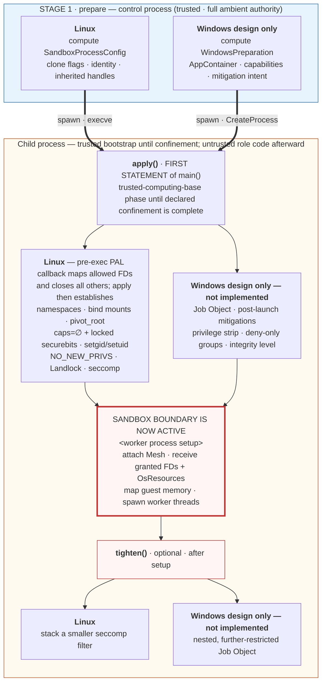
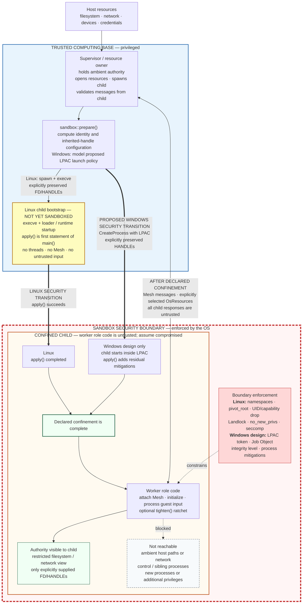

# OpenVMM / OpenHCL Worker Sandboxing — Design Document

> **Status:** Design rationale for the current sandbox implementation.
> **Audience:** Maintainers and security reviewers.
>
> For usage and current platform support, see [`../README.md`](../README.md).

---

---

## 1. Overview

### 1.1 Goal

Give every OpenVMM and OpenHCL worker process a **default-deny
sandbox** that is established before the worker executes any
attacker-reachable code, is described in an **intent-level,
platform-neutral vocabulary** that worker authors can write and
security reviewers can audit, and is enforced by **first-class OS
primitives** on both Linux and Windows.

Concretely, a worker that has been compromised must be unable to:

- open any filesystem path the control process did not grant it,
- create any network connection it was not granted,
- spawn a child process,
- signal, `ptrace`, debug, or read the memory of any other process,
- acquire any privilege or capability it did not start with,
- reach any kernel attack surface (syscall / `ioctl` / Win32k) beyond
  what its declared role requires.

The measure of success is that this holds **by construction and by
default** — a worker author who writes no sandbox code at all gets a
worker that refuses to start, not a worker that runs unconfined.

### 1.2 Non-goals

- Sandboxing single-process launches
- Replacing operator-deployed MAC systems (SELinux, AppArmor, WDAC).
  These are complementary; we document recommended policies in
  `Guide/` but do not author them at runtime.

### 1.3 Terminology

| Term | Meaning |
|---|---|
| **Control process** | The long-lived, multi-threaded process that spawns and supervises workers: `openvmm_entry` (OpenVMM host) or `underhill_core` (OpenHCL). Holds the ambient authority the workers must not inherit. |
| **Mesh host** | A child OS process created by `mesh_process` and joined to the control process's Mesh node. It runs a `WorkerHostRunner` and may host one or more registered workers. |
| **Worker** | A self-contained lifecycle component launched by `mesh_worker` to perform one role (a device emulator, diagnostics server, or VM tombstone holder). In the sandboxed deployment, it runs inside a dedicated Mesh host process; the host runtime and worker are confined together. |
| **Profile** | An opaque, immutable policy value, built from `Profile::deny_all()` in the crate that owns the worker and linked into whoever applies it. **Not** a wire type — policy is linked, not sent (C5). |
| **`prepare`** | Control-process setup done before the child exists, via `sandbox::prepare()`. On Linux: handle hygiene, grant serialization, identity. On Windows: additionally the entire LPAC construction, since there is no post-launch equivalent. |
| **`apply`** | The worker confining itself, as the first statement of `main()`, via `sandbox::apply()`. On Linux: the *entire* sandbox. On Windows: the post-launch half. |
| **`tighten`** | Optional progressive tightening, run by the worker after its own initialization completes, via an additive-only `Restrictions` spec. Runs `sandbox::tighten()`. |
| **Intent** | A platform-neutral capability statement — e.g. `Network::None`, `Syscalls::Deny(...)` — expressed through the widening builder ([§6.1](#61-type-vocabulary)) and translated by each backend into platform primitives. Public. |

### 1.4 Existing process model

OpenVMM and OpenHCL use Mesh to launch and communicate with worker processes.
`mesh_process` spawns another instance of the current executable and gives it a
Mesh invitation. `mesh_worker` then selects and runs registered workers inside
that **Mesh host process**. A host may run one or more workers; because the
sandbox is process-wide, the host runtime and every worker in it share one
profile.

The sandbox must be applied before the child joins Mesh or processes worker
parameters. The Mesh invitation handle is explicit bootstrap authority and must
survive handle filtering. After confinement, Mesh messages and their
`OsResource` sideband deliver the worker's remaining handles. Possession of a
channel controls reachability but does not make messages trustworthy, so the
control process must validate data received from a sandboxed worker.

For the full process, worker, transport, and resource-transfer model, see
[Using Mesh](../../../Guide/src/reference/architecture/openvmm/mesh/usage.md#workers)
and [How Mesh works](../../../Guide/src/reference/architecture/openvmm/mesh/internals.md#joining-a-mesh).

---

## 2. Requirements

Requirements carry stable IDs. Design sections, tests, and PRs cite
them.

### 2.1 Functional requirements

| ID | Requirement |
|---|---|
| **R-F1** | A single crate, `support/sandbox`, exposes the platform-neutral sandbox API. Consumers do not `#[cfg]` their calls by target OS; an unavailable backend fails explicitly rather than running unconfined. |
| **R-F2** | The sandbox is established in named, ordered stages — `prepare` (control process, before spawn), `apply` (worker, first statement of `main()`), and the optional `tighten` — as defined in [§5.1](#51-the-three-stages). |
| **R-F3** | The linked `Profile` is the sole source of sandbox policy. Per-spawn identity and handle data describe launch inputs but cannot widen the profile's policy. |
| **R-F4** | The worker's sandbox is fully applied before the worker attaches to Mesh, starts an async runtime, reads configuration, or touches the network. |
| **R-F5** | Workers may optionally tighten their sandbox further after initialization completes (`tighten`), and this must be a strict ratchet — it can never relax an applied restriction. |
| **R-F6** | Non-filesystem resources are supplied explicitly as launch-time handles or typed Mesh resources. Filesystem access is limited to paths granted by the linked profile; workers receive no ambient host resource authority. |
| **R-F8** | A developer can disable sandbox enforcement for debugging, but no runtime input can disable it in a release build. |

### 2.2 Security requirements

| ID | Requirement | Threat addressed |
|---|---|---|
| **R-S1** | Default-deny: a worker whose `Profile` (built from `deny_all()`) grants nothing can reach nothing. Absence of policy denies; it does not permit. | All |
| **R-S2** | No ambient filesystem authority. A compromised worker cannot `open(2)` / `CreateFile` any path outside its granted view, including via `/proc/self/fd` re-open or `..` traversal. | Lateral movement to host FS |
| **R-S3** | No ambient network authority. A worker not granted network access cannot create a socket that reaches any peer. | Exfiltration, lateral movement |
| **R-S4** | No privilege acquisition. A worker cannot gain a capability, privilege, or token group it did not start with — including via `execve` of a setuid binary or a token-manipulating API. | Privilege escalation |
| **R-S5** | No process creation. A worker cannot `fork`, `execve`, or `CreateProcess`. | Payload staging, sandbox escape via helper |
| **R-S6** | No inter-process reach. A worker cannot `ptrace`, debug, signal, open, or read the memory of any other process, including its siblings and its own control process. | Lateral movement between workers |
| **R-S7** | No ambient descriptor authority. Every FD/HANDLE in the worker is on an explicit allowlist; everything else is closed or non-inheritable before the worker runs. | Ambient-authority leak |
| **R-S8** | Minimized kernel attack surface. Workers restrict their syscall surface (Linux, opt-in per [R-S13]) and disable Win32k (Windows). | Kernel LPE from a compromised worker |
| **R-S9** | No dynamic code. A worker cannot make writable memory executable or load an unsigned/remote image. | Payload execution |
| **R-S10** | No attacker-reachable code runs before the sandbox is applied, and no async-signal-safe fork/exec window is required to achieve it. On Linux the worker self-applies its sandbox as the first statement of `main()`, in a fresh single-threaded address space. | Pre-confinement exposure |
| **R-S11** | No third-party sandbox crate type (`landlock::*`, `seccompiler::*`, `caps::*`, `windows-sys::*`) appears in the public API of `support/sandbox`. | Public API coupling |
| **R-S12** | Sandbox failure of a *required* primitive aborts the worker. It never degrades silently. | Fail-loud |
| **R-S13** | Syscall filtering (Linux seccomp) is opt-in per worker class, not a universal requirement, because the syscall list encodes link-set details that drift. Workers that opt out must have no reachable resource to abuse. | Policy drift |

### 2.3 Platform & deployment requirements

| ID | Requirement |
|---|---|
| **R-P1** | **OpenHCL baseline: Linux 6.6** (`Guide/src/dev_guide/getting_started/build_ohcl_kernel.md:15-16`, branch `product/hcl-main/6.6`). Landlock ABI 3. |
| **R-P2** | **OpenVMM-host Linux baseline: 5.15 LTS.** Landlock ABI 1 only. |
| **R-P3** | **Windows baseline: Windows 10 1809 (build 17763) / Windows Server 2019.** Covers LPAC, all mitigation policies used here, and nested Job Objects. |
| **R-P4** | Workers may *opportunistically* use features above the baseline, detected at runtime. They must never *require* them. Capability probing degrades; it does not hardcode. |
| **R-P5** | The design must name its supported deployment surfaces and specify the degraded mode for each. See [§7.6](#76-deployment-surface--degradation-matrix). |
| **R-P6** | Linux is the implemented backend. Windows sandboxing has been investigated and its intended shape is documented, but implementation has not been scheduled. |
| **R-P7** | No new external crate dependency is taken where an in-tree equivalent exists. |

### 2.4 Operational requirements

| ID | Requirement |
|---|---|
| **R-O1** | Per-spawn sandbox cost stays within the noise of existing `mesh_process` spawn cost. Budget: **< 5 ms** added per spawn on both platforms. |
| **R-O2** | A sandbox denial is diagnosable from outside the worker. The control process must be able to report *which* worker, *which* profile, and *what* was denied — without running rich code inside a dying worker. |
| **R-O3** | Sandbox policy changes are reviewable as a diff. A reviewer must be able to see what a profile grants without reading BPF or SID constants. |
| **R-O4** | CI runs both sandbox-enabled and sandbox-disabled configurations. |
| **R-O5** | The design must not require root in the OpenVMM-host deployment. OpenHCL's control process is root and may use that; OpenVMM-host may not assume it. |


---

## 3. Decisions

### 3.1 Core design decisions

| # | Decision |
|---|---|
| **D1** | **Three mandatory Linux launch points** — `prepare` computes clone requirements in the control process, PAL creates namespaces and writes fixed ID maps in its clone callback, and `apply` performs rich confinement at the start of the worker — plus optional `tighten`. Windows keeps launch-time LPAC construction in `prepare`. |
| **D2** | **The Linux sandbox preserves PAL's vfork path.** Namespace flags are passed to `clone(2)`. The callback performs only fixed, precomputed `/proc/self/setgroups`, `uid_map`, and `gid_map` writes using libc; allocation, locking, tracing, and policy-rich setup remain post-`execve` in `apply`. |
| **D3** | **`prepare` on Windows is LPAC construction** — AppContainer SID, capability SID list, `STARTUPINFOEX` attribute list, then `CreateProcess`. There is no `EnterAppContainer` API, so this must be control-side. |
| **D4** | **`apply` is the bulk of the sandbox** on Linux, and the post-launch half on Windows — run single-threaded in a fresh process where the allocator and normal crates are safe. |
| **D5** | **Progressive tightening is `tighten`** and is optional and strictly monotonic — expressed as an additive-only `Restrictions` spec, so the ratchet holds by type ([§6.1](#61-type-vocabulary)). |
| **D6** | **Public vocabulary is intent-level and platform-neutral.** No `landlock` / `seccompiler` / `caps` / `windows-sys` types cross the public API. |
| **D7** | **Backends are `cfg`-gated modules inside one crate.** |
| **D8** | **Broker-and-handles is mandatory.** Workers see resources only as inherited FDs / HANDLEs. Deferred: broker server and seccomp user-notify. |
| **D9** | **Handle hygiene is mandatory.** `FD_CLOEXEC` / non-inheritable by default, explicit allowlist, pre-`execve` `close_range` enforcement on Linux, `HANDLE_LIST` on Windows. |
| **D10** | **`mesh_process` stays role-agnostic.** OpenVMM owns role selection and passes the resulting `Profile`; Mesh calls `sandbox::prepare` and passes the prepared launch data intact to PAL. Mesh worker names are not security selectors. |
| **D11** | **Mount namespace + bind mounts + `pivot_root` is the primary Linux FS isolation mechanism.** Landlock is a supplement, applied opportunistically with ABI-aware degradation. |
| **D12** | **Empty network namespace is the primary Linux network restriction.** Landlock network needs ABI 4 / kernel 6.7, above both baselines. |
| **D13** | **Seccomp is opt-in per worker class**, composed additively from library-contributed requirements plus explicit additions. Derived profiles union their syscall denials with the base profile and cannot remove an existing denial. `RET_KILL_PROCESS` in production. |
| **D14** | **Sandbox setup fails closed.** A requested namespace or required confinement primitive that cannot be applied aborts the worker launch; there is no retry with a weaker namespace set. |
| **D15** | **Namespace UID/GID 0 map to the spawning process's effective UID/GID.** Distinct outer host identities are deferred until the control process has an explicit identity allocator. |
| **D16** | **No PID namespace in the initial integration.** User, mount, and (unless networking is unrestricted) network namespaces are created at clone time. |

### 3.2 Additional design rationale

These non-obvious choices are recorded to keep future changes from
accidentally weakening the design.

| # | Decision | Rationale |
|---|---|---|
| **C1** | **No launcher; PAL creates namespaces during its existing vfork-based clone.** The clone callback self-maps namespace IDs with fixed libc writes, then `execve`s. The worker performs policy-rich setup in `apply`. | Preserves PAL's established process path while ensuring the program image starts inside its namespaces. The callback carries only preformatted mapping bytes; allocation-heavy and lock-taking work remains in the fresh post-`execve` image. |
| **C2** | **PID namespaces are currently omitted.** Workers remain in the control process's PID namespace. | R-S6 is met by `PR_SET_DUMPABLE=0`, Yama, and seccomp denial of cross-process operations. Distinct outer UIDs and a PID namespace remain possible later hardening steps. |
| **C3** | **Device access uses FD passing only.** The control process opens `/dev/kvm`, `/dev/mshv`, or similar devices and passes the FD through Mesh, or preserves it at launch if genuinely needed earlier. | Avoids `mknod`, `CAP_MKNOD`, and device-node management inside the new root while reusing Mesh's resource path ([§10.4](#104-mesh-compatibility)). |
| **C4** | **The investigation includes the intended shape of Windows sandboxing, but implementation has not been scheduled.** | Preserves the feasibility work without representing an unmade stakeholder or delivery commitment. |
| **C5** | **Workers build concrete profiles from `Profile::deny_all()` in their owning crate.** Policy is linked, not sent, and `support/sandbox` does not enumerate worker classes. | Adding a worker does not require editing the sandbox crate. The deny-all base guarantees R-S1 by construction; an inventory test provides centralized audit visibility ([§12](#12-testing--ci-strategy)). |
| **C7** | **Apply Landlock before installing seccomp last.** | Installing seccomp first would require permanently permitting the Landlock setup syscalls. |
| **C8** | **Set `PR_SET_DUMPABLE=0` in `apply`, after the credential drop.** | `execve` and effective-UID changes reset the dumpable state. |
| **C9** | **Set `PR_SET_PDEATHSIG` in `apply`, after the credential drop.** | `execve` and `setuid` clear the parent-death signal. |
| **C10** | **Always apply the supporting controls listed in [§7.2](#72-primitive--stage--apply-point-matrix).** | Locked securebits, credential hardening, mount flags, limits, and related controls are cheap and high-value. |
| **C11** | **Fail hard for every requested namespace and required confinement primitive.** | Retrying with fewer boundaries silently changes the security contract. Any fallback must be an explicit, reviewed profile. |
| **C15** | **Handle tags are opaque and caller-defined.** `support/sandbox` never interprets their meaning. | Keeps the crate free of OpenVMM domain concepts and reusable across consumers. |

---

## 4. Threat model

The sandbox assumes a worker has been compromised and limits what the
compromised process can reach.

**OpenVMM (host VMM).** A guest escapes a device emulator — via a bug
in disk-image parsing, a virtio device, or VM configuration handling —
and attempts to leverage OpenVMM's host privileges to reach the host
filesystem, the host network, other processes, or raw devices.

**OpenHCL (paravisor in VTL2).** Two distinct adversaries:
- The **VTL0 guest is fully untrusted**. Guest input reaches device
  workers (e.g. the vTPM worker, see
  `Guide/src/reference/architecture/openhcl/processes.md:104-121`) and
  must not be able to compromise the rest of VTL2.
- The **host is partially untrusted**. A compromised host must not be
  able to use device-emulation paths in OpenHCL to corrupt VTL2 state
  arbitrarily.

**What sandboxing buys.** It mitigates *lateral movement after a
successful memory-safety or logic compromise inside a worker*. The
worker is assumed to be executing attacker-controlled code; the
sandbox ensures that code has nothing to reach.

**What it does not buy.** It is not a substitute for input validation
at trust boundaries. The project's `tracelimit` / `thiserror` /
`open_enum!` conventions remain mandatory and are orthogonal to this
design.

**Residual risk, stated plainly.** For worker classes that opt out of
seccomp (R-S13), a compromised worker retains the ambient syscall
surface: it can still call `socket(2)`, `clone(2)`, `open(2)`, and so
on. The claim is that none of these *reach* anything — an empty
network namespace has no peer, a pivoted root has no path, and
`NO_NEW_PRIVS` plus an empty bounding set means a successful `execve`
gains nothing. This residual surface is a deliberate, documented
acceptance and is re-reviewed per profile ([§14](#14-open-questions--deferred-work), item 5).

---

## 5. Architecture

`support/sandbox` is a small, generic, platform-abstracting crate that
confines each worker process. It carries no OpenVMM domain concepts
(C15): a consumer describes *what a worker may reach* as a linked
`Profile`, and the crate lowers that to the right OS primitives. The
control process is the sole holder of ambient authority. `prepare`
computes inert launch configuration, the process builder realizes it,
and each worker starts from `deny_all()` with only profile grants and
explicitly supplied resources. Policy is **linked, not sent**.

Confinement is established in **three named, ordered stages**, named
for *when they run relative to the new program image* so that the name
alone tells a reader what is legal in each.

### 5.1 The three stages

| | **`prepare`** | **`apply`** | **`tighten`** |
|---|---|---|---|
| **Runs in** | The control process, before the child exists. | The worker, first statement of `main()`. | The worker, after its own init. |
| **API** | `sandbox::prepare()` | `sandbox::apply()` | `sandbox::tighten()` |
| **Threading** | The control process's normal multi-threaded state. | Single-threaded, fresh address space. | Multi-threaded. |
| **What may be called** | Anything. | Normal Rust, full crate ecosystem. | Normal Rust, restricted by the `apply` sandbox. |
| **Contains** | Handle hygiene, grant serialization, identity; on Windows, the whole LPAC construction. | Linux: the *entire* sandbox. Windows: the post-launch half (Job Object, mitigations, token strip). | Monotonic narrowing via a `Restrictions` spec (additive-only). |
| **On failure** | Abort the spawn. | `_exit` the worker (required primitives) or log-and-continue (opportunistic). | Abort the worker. |
| **Mandatory?** | Yes | Yes | No |

**Why the split falls here.** The boundary is the new program image.
`prepare` is everything the *control process* must do before the child
image exists — on Linux only handle hygiene, grant serialization, and
identity; on Windows additionally the whole LPAC construction, because
`CreateProcess` takes the security configuration as data and there is
no `EnterAppContainer` API (D3). `apply` is everything the *worker*
does to itself once its image is live, as ordinary single-threaded
Rust.

**The forked-child stage is deliberately tiny.** PAL already launches
through `clone(CLONE_VM | CLONE_VFORK)`. Namespace flags are added to
that call, and the callback writes preformatted self-maps to
`/proc/self/{setgroups,uid_map,gid_map}` with libc before `execve`.
It performs no allocation, locking, tracing, policy construction, or
filesystem assembly. The worker then runs `apply` in its fresh,
single-threaded image, where normal Rust and policy libraries are safe.

**Windows `apply` is smaller than Linux `apply`.** On Windows the
security-critical work is front-loaded into `prepare` (LPAC is in
effect from `CreateProcess`); `apply` only adds the post-launch
mitigations that must be self-applied. This asymmetry is inherent and
is discussed in [§8.6](#86-asymmetries-with-linux).

`apply` performs one-shot setup that consumes privilege, including namespace
configuration, mount assembly, and credential dropping. `tighten` is limited
to restrictions that can safely stack after initialization and cannot restore
authority. A separate additive-only `Restrictions` type makes widening
unrepresentable. Linux currently supports stacked seccomp denials; other
tightening mechanisms are not implemented.

### 5.2 Lifecycle and trust boundary

The shared API uses the same stages on both platforms, but the Windows
lines below show investigated design rather than implemented behavior.


```mermaid
graph TB
    subgraph CTRL["STAGE 1 · prepare — control process (trusted · full ambient authority)"]
        PL["<b>Linux</b><br/>compute SandboxProcessConfig<br/>clone flags · identity · inherited handles"]
        PW["<b>Windows design only</b><br/>compute WindowsPreparation<br/>AppContainer · capabilities · mitigation intent"]
    end

    subgraph CHILD["Child process — trusted bootstrap until confinement; untrusted role code afterward"]
        AP["<b>apply()</b> · FIRST STATEMENT of main()<br/>trusted-computing-base phase until declared confinement is complete"]
        APL["<b>Linux</b> — pre-exec PAL callback maps allowed FDs<br/>and closes all others; apply then establishes<br/>namespaces · bind mounts · pivot_root<br/>caps=∅ + locked securebits · setgid/setuid<br/>NO_NEW_PRIVS · Landlock · seccomp"]
        APW["<b>Windows design only — not implemented</b><br/>Job Object · post-launch mitigations<br/>privilege strip · deny-only groups · integrity level"]
        SETUP["SANDBOX BOUNDARY IS NOW ACTIVE<br/>&lt;worker process setup&gt;<br/>attach Mesh · receive granted FDs + OsResources<br/>map guest memory · spawn worker threads"]
        TI["<b>tighten()</b> · optional · after setup"]
        TIL["<b>Linux</b><br/>stack a smaller seccomp filter"]
        TIW["<b>Windows design only — not implemented</b><br/>nested, further-restricted Job Object"]

        AP --> APL
        AP --> APW
        APL --> SETUP
        APW --> SETUP
        SETUP --> TI
        TI --> TIL
        TI --> TIW
    end

    PL ==>|spawn · execve| AP
    PW ==>|spawn · CreateProcess| AP

    style CTRL fill:#e8f4fd,stroke:#2b6cb0
    style CHILD fill:#fffaf0,stroke:#c05621
    style SETUP fill:#fff5f5,stroke:#c53030,stroke-width:3px
    style TI fill:#fff5f5,stroke:#c53030
```

The spawn arrow is a **process boundary**, but it is not the Linux sandbox
boundary. On Linux, the new child briefly remains privileged while the dynamic
loader and Rust runtime enter `main()` and `apply()` establishes confinement.
That bootstrap path is trusted computing base (TCB): it must not start threads,
consume attacker-controlled input, attach to Mesh, or run worker-role code.
The Linux security transition occurs only when `apply()` completes. In the
investigated Windows design, the primary LPAC boundary is active at
`CreateProcess`, and `apply()` adds the post-launch remainder before worker
setup ([§8.6](#86-asymmetries-with-linux)).
`tighten` is optional and runs only after `<worker process setup>` (Mesh attach
and resource delivery), when the worker can shed the init-only syscalls that had
to be in `apply`'s union filter.

The same architecture viewed as a security boundary, rather than as a
stage sequence, is shown below. The red box begins **after `apply()` on Linux**.
In the investigated Windows design it would begin at `CreateProcess`. The
control process and Linux's privileged child bootstrap remain outside the box.
Only Mesh IPC and explicitly selected resources cross it after confinement.


```mermaid
flowchart TB
    RESOURCES["Host resources<br/>filesystem · network · devices · credentials"]

    subgraph TCB["TRUSTED COMPUTING BASE — privileged"]
        SUPERVISOR["Supervisor / resource owner<br/>holds ambient authority<br/>opens resources · spawns child<br/>validates messages from child"]
        PREPARE["sandbox::prepare()<br/>compute identity and inherited-handle configuration<br/>Windows: model proposed LPAC launch policy"]
        LINUX_BOOT["Linux child bootstrap — NOT YET SANDBOXED<br/>execve + loader / runtime startup<br/>apply() is first statement of main()<br/>no threads · no Mesh · no untrusted input"]

        SUPERVISOR --> PREPARE
        PREPARE -->|"Linux: spawn + execve<br/>explicitly preserved FD/HANDLEs"| LINUX_BOOT
    end

    subgraph SANDBOX["SANDBOX SECURITY BOUNDARY — enforced by the OS"]
        direction TB

        ENFORCEMENT["Boundary enforcement<br/><b>Linux:</b> namespaces · pivot_root · UID/capability drop<br/>Landlock · no_new_privs · seccomp<br/><b>Windows design:</b> LPAC token · Job Object<br/>integrity level · process mitigations"]

        subgraph TARGET["CONFINED CHILD — worker role code is untrusted; assume compromised"]
            LINUX_CONFINED["Linux<br/>apply() completed"]
            WINDOWS_BOOT["Windows design only<br/>child starts inside LPAC<br/>apply() adds residual mitigations"]
            READY["Declared confinement is complete"]
            WORKER["Worker role code<br/>attach Mesh · initialize · process guest input<br/>optional tighten() ratchet"]
            AUTHORITY["Authority visible to child<br/>restricted filesystem / network view<br/>only explicitly supplied FD/HANDLEs"]
            BLOCKED["Not reachable<br/>ambient host paths or network<br/>control / sibling processes<br/>new processes or additional privileges"]

            LINUX_CONFINED --> READY
            WINDOWS_BOOT --> READY
            READY --> WORKER
            WORKER --> AUTHORITY
            WORKER -. blocked .-> BLOCKED
        end

        ENFORCEMENT -. constrains .-> WORKER
    end

    RESOURCES --> SUPERVISOR
    LINUX_BOOT ==>|"LINUX SECURITY TRANSITION<br/>apply() succeeds"| LINUX_CONFINED
    PREPARE ==>|"PROPOSED WINDOWS SECURITY TRANSITION<br/>CreateProcess with LPAC<br/>explicitly preserved HANDLEs"| WINDOWS_BOOT
    SUPERVISOR <-->|"AFTER DECLARED CONFINEMENT<br/>Mesh messages · explicitly selected OsResources<br/>all child responses are untrusted"| WORKER

    style TCB fill:#e8f4fd,stroke:#2b6cb0,stroke-width:2px
    style SANDBOX fill:#fff5f5,stroke:#c53030,stroke-width:4px,stroke-dasharray:8 4
    style TARGET fill:#fffaf0,stroke:#c05621,stroke-width:2px
    style LINUX_BOOT fill:#fefcbf,stroke:#b7791f,stroke-width:2px
    style READY fill:#f0fff4,stroke:#276749,stroke-width:2px
    style ENFORCEMENT fill:#fed7d7,stroke:#c53030
    style AUTHORITY fill:#f0fff4,stroke:#276749
    style BLOCKED fill:#f7fafc,stroke:#4a5568,stroke-dasharray:4 3
```

This presentation follows the
[Chromium broker/target model](https://chromium.googlesource.com/chromium/src/+/HEAD/docs/design/sandbox.md),
which draws privileged and sandboxed processes as separate boxes with IPC as
the explicit crossing, and
[Firecracker's nested trust zones and barriers](https://github.com/firecracker-microvm/firecracker/blob/main/docs/design.md#threat-containment).
Like [gVisor's security model](https://gvisor.dev/docs/architecture_guide/security/),
it distinguishes what the confined component can reach from ambient host
resources. The important difference from Chromium is that the OpenVMM control
process is **not** a general system-call broker: it supplies only resources
explicitly selected for the worker.

The linked `Profile` does **not** cross the boundary; it is already part of the
relevant binary. On Linux, the code path from `execve` through successful
`apply()` is privileged TCB even though it runs in the child process. The design
therefore depends on that path remaining small and unreachable by attacker
input. Once `apply()` succeeds, the same process crosses into the confined,
untrusted worker state. Windows crosses the primary boundary during
`CreateProcess`, then completes residual self-restrictions before exposing the
worker to Mesh or guest input.

### 5.3 Crate boundaries

`support/sandbox` owns the platform-neutral policy vocabulary and computes
inert launch configuration. It does not depend on Mesh or PAL and does not
create processes or enforce handle inheritance itself. PAL and the process
builder realize the prepared configuration; the worker calls `apply` and
optional `tighten`.

Worker-specific profiles and handle meanings remain in consumer crates.
Profiles are linked rather than sent, and platform backends are private
implementation details selected with `cfg`. There is no build script or central
worker catalog.


---

## 6. The `support/sandbox` interface

The public surface is deliberately tiny and **domain-generic**. It names
no worker class, no device, and no Mesh concept — nothing OpenVMM-specific
appears in the crate. A consumer describes a policy by *building on a
default-deny base*, hands the control process an opaque set of tagged
handles, and calls three functions. Everything else is internal.

### 6.1 Type vocabulary

The public vocabulary is intent-level and platform-neutral. Backend types from
Landlock, seccompiler, capabilities crates, or Windows APIs do not cross the
crate boundary.

| Type | Role |
|---|---|
| `Profile` / `Builder` | A linked, immutable policy built from `Profile::deny_all()`. The widening-only builder grants filesystem paths, network scope, optional syscall filtering, and platform capabilities. Syscall deny lists compose by union, so deriving a profile cannot remove a base denial. |
| `Restrictions` | Additive-only post-initialization narrowing. Linux currently implements stacked seccomp denials. |
| `Identity` | Optional requested UID/GID and Windows AppContainer moniker. |
| `HandleTag` / `RawHandle` | Describe child-visible handles that the process builder must preserve. The sandbox crate does not interpret their meaning. |
| `SandboxProcessConfig` | Inert launch configuration returned by `prepare` for the process builder to realize. |
| `WindowsPreparation` | The investigated Windows launch-policy shape. It is not a complete Windows backend. |

Profiles are linked rather than sent, and worker-specific policies remain in
the crates that own those workers. There is no central worker-profile catalog
or platform-specific policy type in the public API.

> **Current limitation:** Linux `tighten` currently supports stacked seccomp
> denials only. `revoke_path` is reserved in the API but returns
> `RequiredPrimitiveUnavailable`; implementing an additional Landlock layer
> requires retaining or reconstructing the base profile's complete grant set.
> Windows `tighten` is not implemented.

### 6.2 Three entry points

```rust
pub fn prepare(
    profile: &Profile,
    identity: &Identity,
    handles: &[(HandleTag, RawHandle)],
) -> Result<SandboxProcessConfig, Error>;

pub fn apply(profile: &Profile) -> Result<(), Error>;

pub fn tighten(restrictions: &Restrictions) -> Result<(), Error>;
```

`prepare` computes inert launch data. The process builder must realize every
field and enforce handle hygiene; the sandbox crate does not mutate the builder
or create a process. `apply` establishes worker-side confinement and must run
before Mesh attachment, thread creation, or untrusted input. `tighten` applies
supported additive restrictions after worker initialization.

The shared signatures are platform-neutral, but backend support is not
symmetric: Linux implements all three stages, while Windows currently exposes
preparation data only and returns `UnsupportedPlatform` from `apply` and
`tighten`.

### 6.3 Deferred cross-binary envelope

A deferred design for carrying launch configuration across an independent
binary boundary is documented in [Appendix B](#appendix-b--deferred-grant-wire-schema).

### 6.4 Current usage

See the [crate README](../README.md) for current profile-authoring,
spawn-preparation, `apply`, `tighten`, and debug-mode examples.

### 6.5 Cookbook — adding a new worker

1. In the **worker's own crate** (or the `openvmm` crate), define a
   `fn profile() -> sandbox::Profile` built from `Profile::deny_all()`,
   granting only what the worker needs, and `const` `HandleTag`s for
   any pre-Mesh handles it requires.
2. If the worker uses `tighten`, add a `fn steady_state() ->
   sandbox::Restrictions` (built from `Restrictions::none()`) naming only
   the init-only surface to drop after startup.
3. Call `sandbox::apply(&profile())` as the first statement of the
   worker's `main()`.
4. At the spawn site, build the `Identity` and the handle allowlist and
   call `sandbox::prepare(..)` before spawning.
5. Add the positive-denial test from [§12](#12-testing--ci-strategy),
   and register the profile in the inventory test that enumerates every
   `deny_all()` call site (the audit signal that replaces the old
   central enum).

Steps 1, 2, and 5 are where security review focuses; steps 3 and 4 are
mechanical. Nothing in `support/sandbox` is edited.

---

## 7. Linux design

### 7.1 Primitive catalog

Nine load-bearing primitives plus a set of supporting controls. This
section records what we use, where, and why, including the rejected
alternatives most likely to be reconsidered.

| Primitive | Role in this design | Baseline | Notes / why not more |
|---|---|---|---|
| **Mount NS + bind mounts + `pivot_root`** | **Primary FS isolation** (D11, R-S2). The worker's `/` is a curated view built from explicit bind mounts; it cannot `open(2)` a path the control process did not bind in. | 2.4.19+ | Hard kernel boundary, not a path-string matcher. Requires `CAP_SYS_ADMIN` in the caller's user namespace, hence the `CLONE_NEWUSER`-first sequence. `chroot(2)` alone is escapable from a held `dirfd`; we use `pivot_root` + `umount2(MNT_DETACH)`. |
| **Network NS (empty)** | **Primary network restriction** (D12, R-S3). | 2.6.24+ | Landlock network scoping would be the elegant answer but needs ABI 4 / kernel 6.7 — above both baselines (R-P1, R-P2). An empty netns has no interface and no peer, so `socket()` succeeds and reaches nothing. |
| **User NS (`CLONE_NEWUSER`)** | **Unprivileged bootstrap** for the other `CLONE_NEW*` calls, and the substrate for the UID remap. | 3.8+ | Not a boundary in its own right in our model. Where the control process already has `CAP_SYS_ADMIN` (OpenHCL), it is still used, because it is what makes the uid_map remap possible. Blocked on some distros — see [§7.6](#76-deployment-surface--degradation-matrix). |
| **Linux capabilities + securebits** | **Configuration hygiene** (R-S4). Drop all five sets to empty, then lock securebits so they cannot be re-acquired. | Universal | `SECBIT_NOROOT_LOCKED \| SECBIT_NO_SETUID_FIXUP_LOCKED \| SECBIT_NO_CAP_AMBIENT_RAISE_LOCKED`. Without the locked securebits, a UID-0 worker regains caps across `execve`. |
| **`PR_SET_NO_NEW_PRIVS`** | Prerequisite for unprivileged seccomp and Landlock. | 3.5+ | Set in **`apply`**, right before the filters it enables. Survives `execve` and cannot be cleared. |
| **seccomp-bpf** | **Dangerous syscall denial** (R-S8), **opt-in per worker class** (D13, R-S13). | Universal | Current profiles use a default-allow denylist to avoid maintaining each worker's complete link-set-dependent syscall inventory. The mandatory baseline blocks namespace escapes and historically risky kernel surfaces; profiles may add further denials. `RET_KILL_PROCESS` in production and `EPERM` in debug builds. Filters stack, which makes `tighten` monotonic. Blind to io_uring SQE opcodes — see below. |
| **Landlock** | **Supplementary FS restriction** (D11), applied opportunistically with ABI-aware degradation (D16). | 5.13+ | Explicitly *not* the primary FS mechanism. On the OpenVMM-host baseline it is ABI 1 only: no `FS_REFER`, no `FS_TRUNCATE`, so it cannot fully restrict cross-directory rename or `O_TRUNC`. Applied *before* seccomp (C7) so the final filter can deny the Landlock syscalls. |
| **IPC / UTS / cgroup NS** | Cheap defense-in-depth name hiding. Default-on wherever mount NS is on. | Universal | Not boundaries on their own. |
| **PID NS** | **Omitted** (C2). | — | `unshare(CLONE_NEWPID)` moves only future children; `execve` does not move the caller. R-S6 is met by other means — see the supporting controls below. |

**Supporting controls — all mandatory unless noted:**

| Control | Purpose | Stage |
|---|---|---|
| `MS_NOSUID \| MS_NODEV` on every bind mount, plus `MS_NOEXEC` and `MS_RDONLY` unless the spec opts out | Defangs mount contents: no setuid escalation, no device nodes, no execution from data mounts | `apply` |
| `MS_REC \| MS_PRIVATE` on `/` before `pivot_root` | Hard prerequisite of `pivot_root`; also stops mount events propagating back out | `apply` |
| `/proc` with `hidepid=2,subset=pid` | Hides other processes' `/proc` entries — a component of R-S6 | `apply` |
| `/sys` read-only, or omitted entirely | Reduces attack surface | `apply` |
| `close_range` outside the fixed child-FD allowlist | Prevents any unexpected descriptor from crossing `execve` (R-S7) | `clone` |
| `keyctl(KEYCTL_JOIN_SESSION_KEYRING, NULL)` | Detaches the inherited session keyring (Kerberos tickets, MSI tokens, NFS auth). **Opportunistic** — blocked by Docker's default seccomp, which is acceptable since container keyrings are typically empty | `apply` |
| `prctl(PR_SET_DUMPABLE, 0)` | Blocks same-UID `ptrace` at Yama level 0 and locks `/proc/PID/` ownership to root. Component of R-S6. **Must run after the credential drop** (C8) | `apply` |
| `prctl(PR_SET_PDEATHSIG, SIGKILL)` | Worker dies with its control process. **Set in `apply`, after the credential drop clears it** (C9) | `apply` |
| `IORING_REGISTER_RESTRICTIONS` on every ring, for workers that use io_uring; seccomp denial of `io_uring_setup`/`_register`/`_enter` for workers that do not | seccomp cannot see SQE opcodes, so there is no middle ground | `apply` / worker |
| Yama `ptrace_scope` | Operator-deployed; documented in `Guide/`, not authored at runtime | — |

**Deferred, with rationale:** eBPF-LSM (requires `CONFIG_BPF_LSM=y`,
not universal, and policy authoring in a domain poorly suited to our
review conventions); seccomp user-notify broker (no current use case
needs reactive resource grants); cgroup v2
device BPF (superseded by C3's FD-passing decision); `pledge`-style
abstractions (no mainline Linux equivalent; rejected upstream).

### 7.2 Primitive × stage × apply-point matrix

Legend — stages are as defined in [§5.1](#51-the-three-stages): `prepare` =
control process, before the spawn; `clone` = PAL's minimal vfork-safe
callback; `apply` = worker startup, single-threaded and freshly execve'd;
`tighten` = after worker init. **R** = required and fails closed.

| Primitive | Stage | Class | Ordering constraint |
|---|---|---|---|
| Create source FDs with `O_CLOEXEC` or an equivalent atomic flag | normal operation | R | At FD creation; defense in depth against every spawn path |
| Compute the fixed child-FD allowlist | `prepare` | R | Before spawn |
| `setrlimit` bundle | `apply` | R | Early; before the credential drop |
| `clone(CLONE_NEWUSER\|CLONE_NEWNS[\|CLONE_NEWNET])` | `clone` | R | Namespace set is fixed by the linked profile; no weaker retry |
| write `/proc/self/setgroups` = `deny` | `clone` | R | libc-only callback, before `gid_map` |
| write `/proc/self/uid_map`, `gid_map` | `clone` | R | Preformatted `0 <effective-id> 1` mappings, before `execve` |
| `mount(NULL, "/", NULL, MS_REC\|MS_PRIVATE, NULL)` | `apply` | R | Before any bind mount |
| Bind mounts + `MS_BIND\|MS_REMOUNT` flag fixups | `apply` | R | Remount is required: the original `MS_BIND` does not carry `NOSUID`/`NODEV`/`NOEXEC` |
| Mount `/proc` (`hidepid=2,subset=pid`), `/sys` ro | `apply` | O | Within the new root |
| `pivot_root` + `umount2(".", MNT_DETACH)` + `chdir("/")` | `apply` | R | After the new root is fully populated |
| Map allowlisted FDs, then `close_range` every other FD | `clone` | R | In PAL's private child FD table, after pre-exec FD consumers and before `execve` |
| `keyctl(KEYCTL_JOIN_SESSION_KEYRING, NULL)` | `apply` | O | — |
| Clear ambient caps → `capset` zero → `PR_CAPBSET_DROP` all | `apply` | R | **After** mounts, which may need `CAP_SYS_ADMIN` |
| `prctl(PR_SET_SECUREBITS, ...LOCKED)` | `apply` | R | Immediately after the capability drop |
| `setgroups([])` → `setgid` → `setuid` | `apply` | R | **In that order.** `setuid` last, or the later calls lose privilege |
| `prctl(PR_SET_DUMPABLE, 0)` | `apply` | R | **After `setuid`** — the credential change resets it (C8) |
| `prctl(PR_SET_PDEATHSIG, SIGKILL)` | `apply` | R | **After `setuid`** — the credential change clears it (C9) |
| `prctl(PR_SET_NO_NEW_PRIVS, 1)` | `apply` | R | Before Landlock and seccomp, the primitives it enables |
| Landlock ABI probe + ruleset apply | `apply` | O | After mounts (paths must exist); **before** seccomp (C7) |
| seccomp filter install | `apply` | O (per D13) | **Last.** Least reversible, and it can now deny the Landlock syscalls |
| Additional stacking seccomp filter | `tighten` | O | After worker init |
| Tighter Landlock ruleset | `tighten` | O | After worker init |

### 7.3 Composition-order rationale

Three ordering constraints are load-bearing and non-obvious. Getting
any of them wrong produces a sandbox that silently does less than it
appears to.

1. **`CLONE_NEWUSER` must be first and alone.** It is what grants
   `CAP_SYS_ADMIN` inside the new namespace, and every subsequent
   `unshare` requires that. The uid/gid map writes must happen in the
   window after entering the new user namespace but before any map has
   been written — the kernel permits exactly one write.

2. **Credential drops come after mounts, and `DUMPABLE`/`PDEATHSIG`
   come after credentials.** Mount setup may need `CAP_SYS_ADMIN` in
   the new user namespace, so capabilities cannot be dropped first.
   And changing the effective UID resets the dumpable flag to
   `/proc/sys/fs/suid_dumpable` and clears the parent-death signal —
   so both must be re-established afterwards. This is C8 and C9, and
   it is the most commonly-missed sequencing bug in this class of
   code.

3. **Landlock before seccomp** (C7). Both are one-way ratchets, so
   the order determines what the *final* filter must permit. Applying
   Landlock first means the seccomp filter can deny
   `landlock_create_ruleset`, `landlock_add_rule`, and
   `landlock_restrict_self` outright. Applying seccomp first would
   force a permanent hole for all three.

The single-threaded property holds for the entire `apply` sequence by
construction: the worker self-applies before it starts any async
runtime or spawns any thread ([§7.5](#75-why-self-apply-is-safe)),
which is what makes Landlock (no TSYNC below ABI 8) and
seccomp-without-TSYNC both behave predictably.

### 7.4 Control flow — Linux

```mermaid
sequenceDiagram
    autonumber
    participant CP as Control Process<br/>(multi-threaded)
    participant K as Linux kernel
    participant C as Child<br/>(pre-exec PAL callback)
    participant W as Worker<br/>(post-execve, single-threaded main)

    rect rgb(232, 244, 253)
        Note over CP: A — prepare (control process)
        CP->>CP: config = sandbox::prepare(profile, identity, handles)
        CP->>CP: process builder realizes SandboxProcessConfig
        CP->>C: clone(NEWUSER|NEWNS[|NEWNET], CLONE_VM|CLONE_VFORK)
        C->>K: write setgroups, uid_map, gid_map
        C->>C: map allowlisted FDs to fixed targets
        C->>K: close_range(all non-allowlisted FDs)
    end

    rect rgb(240, 255, 244)
        Note over C,W: B — execve
        C->>W: execve(worker, argv, envp)<br/>mesh fd (IPC_FD=3) inherited
        Note right of W: main() — single-threaded, fresh heap.<br/>Normal Rust from here: no fork, no ASYNC-SIGNAL zone.
    end

    rect rgb(255, 245, 245)
        Note over W,K: C — apply, in order (worker main())
        W->>K: setrlimit bundle
        W->>K: mount(/, MS_REC|MS_PRIVATE)
        W->>K: bind mounts + MS_REMOUNT with NOSUID|NODEV|NOEXEC|RDONLY
        W->>K: mount /proc (hidepid=2,subset=pid); /sys ro
        W->>K: pivot_root; umount2(".", MNT_DETACH); chdir("/")
        W->>K: keyctl(JOIN_SESSION_KEYRING, NULL)
        W->>K: clear ambient; capset zero; PR_CAPBSET_DROP all
        W->>K: prctl(PR_SET_SECUREBITS, ...LOCKED)
        W->>K: setgroups([]); setgid; setuid
        W->>K: prctl(PR_SET_DUMPABLE, 0)        [after setuid]
        W->>K: prctl(PR_SET_PDEATHSIG, SIGKILL)  [after setuid]
        W->>K: prctl(PR_SET_NO_NEW_PRIVS, 1)
        W->>K: landlock: probe ABI, build ruleset, restrict_self
        W->>K: seccomp(SET_MODE_FILTER, initial)   [last]
    end

    rect rgb(240, 255, 244)
        Note over W: D — safe to initialize
        W->>W: apply() succeeds
        W->>W: Mesh attach (try_run_mesh_host on IPC_FD); logging; config
    end

    rect rgb(232, 244, 253)
        Note over W,K: E — tighten (optional)
        W->>W: sandbox::tighten(restrictions)
        W->>K: seccomp(SET_MODE_FILTER, stricter) — stacks
    end
```

### 7.5 Why self-apply is safe

The redesign's motivating complaint (R-S10) was policy-rich work inside
a `clone(2)` callback sharing the parent's address space, where any
allocation, mutex, or tracing call risks deadlock or corruption. The
remaining callback is constrained to fixed libc writes for ID mapping;
Landlock, seccomp, mounts, capabilities, and tracing stay post-`execve`.

Two properties make `apply` safe to write in ordinary Rust:

1. **Single-threaded.** A freshly `execve`'d process enters `main()`
   with exactly one thread. The sandbox self-applies before it starts
  any async runtime or spawns any thread, so no other thread can
  observe the half-built post-exec sandbox.

2. **Clean address space.** `execve` replaced the image: the heap, the
   allocator, every mutex, and the `tracing` subsystem are freshly
   initialized and in a known-good state. There is no inherited
   mid-update lock, so `malloc`, `String`, `tracing`, and the
   `landlock` / `seccompiler` / `caps` crates are all safe to call.

The clone callback therefore retains an async-signal-safety contract,
but its surface is intentionally fixed and small: stack-only mapping
data and `open`/`write`/`close`/`execve`-path libc operations. Normal
policy evolution occurs in `apply` and cannot enlarge that callback.

**The one discipline that remains.** `apply` must run before the worker
starts its first thread. That is a single, auditable ordering property
— `apply` is the first statement of `main()` — enforced by one CI test
([§12](#12-testing--ci-strategy)) that traces a worker and asserts the
sandbox syscalls precede any `clone(2)`/thread creation. That one test
replaces the entire five-layer async-signal-safety apparatus.

**The pre-`main` window (C1).** The C-runtime and Rust startup code
between `execve` and `main()` runs unconfined. This is accepted: it is
our own trusted binary's startup, it touches no attacker-controlled
input, and it is identical to the startup of any other process. The
sandbox is in force before the worker reads its configuration, attaches
to its Mesh channel, or sees any guest data — which is the property
R-F4 actually requires.

### 7.6 Deployment surface & degradation matrix

Three supported surfaces (R-P5):

| | **S1 — Bare host** | **S2 — Docker, default seccomp** | **S3 — k8s `restricted` PodSecurity** |
|---|---|---|---|
| **Who** | OpenHCL VTL2; OpenVMM-host on a dedicated machine | OpenVMM-host in a container | OpenVMM-host in a hardened cluster |
| `clone(CLONE_NEWUSER)` | ✅ | Deployment profile must permit it | Deployment profile must permit it |
| `clone(CLONE_NEWNS)` | ✅ | ✅ with the new user namespace | ✅ with the new user namespace |
| `mount`, `pivot_root` | ✅ | ✅ inside the user NS | ✅ inside the user NS |
| `clone(CLONE_NEWNET)` | ✅ | ✅ with the new user namespace | ✅ with the new user namespace |
| Capability drop | ✅ | ✅ | ✅ (already forced to drop) |
| seccomp | ✅ | ✅ (stacks under Docker's profile) | ✅ — but note `restricted` forbids `Unconfined`, so our filter must be *additive* |
| Landlock | ✅ | ✅ | ✅ |
| `keyctl(JOIN_SESSION_KEYRING)` | ✅ | ❌ blocked by default profile | ❌ |
| io_uring | ✅ | ❌ blocked by default profile (which is fine) | ❌ |

**Known hard failure — Ubuntu 24.04 and unprivileged user
namespaces.** Ubuntu 24.04's AppArmor restricts unprivileged
user-namespace creation without a matching profile, and RHEL ≤ 7 and
older distros disable it via `user.max_user_namespaces=0` or
`kernel.unprivileged_userns_clone=0`. On those systems, S2 and S3
cannot create the user namespace, and therefore cannot create the
mount or network namespace either.

**Failure behavior.** Per D14 and C11, namespace setup is required. On
such a system the worker does not launch, and the control process
reports the failed sandbox primitive. There is no automatic retry
without mount or network isolation. The operator must enable the
required user-namespace policy, for example with an AppArmor profile
addition or `sysctl kernel.unprivileged_userns_clone=1`, or explicitly
select a future weaker profile if one is designed and reviewed.

The **OpenHCL profile classifies all of these as required**, because
OpenHCL controls its own kernel and there is no legitimate reason for
them to be unavailable. An OpenHCL worker that cannot build its
namespaces fails to launch.

### 7.7 Kernel / ABI degradation

Per D16 and R-P4, features are probed at runtime, never pinned:

| Feature | OpenHCL (6.6) | OpenVMM-host (5.15) | Degradation |
|---|---|---|---|
| Landlock ABI | 3 — FS read/write/refer/truncate | 1 — FS read/write only | Probe with `landlock_create_ruleset(NULL, 0, LANDLOCK_CREATE_RULESET_VERSION)`; request the best available rights and drop unsupported ones. On ABI 1, cross-directory rename and `O_TRUNC` are not restrictable — the mount-NS boundary covers this, which is one more reason D11 makes mount NS primary. |
| Landlock network | ❌ (needs ABI 4 / 6.7) | ❌ | Empty netns is the mechanism (D12). Not a degradation — it is the design. |
| Landlock `IOCTL_DEV` | ❌ (needs ABI 5 / 6.10) | ❌ | seccomp `ioctl` argument filtering for the sensitive cases, per profile. |
| `close_range` | ✅ | ✅ (5.9+) | None. |
| io_uring restrictions | ✅ | ✅ (5.10+) | None. |
| seccomp user-notify + `ADDFD` | ✅ | ✅ (5.9+) | Present but currently unused (deferred broker). |

**If the OpenHCL kernel branch advances past 6.6**, workers pick up the
higher Landlock ABI automatically via the probe. We do not pin.

### 7.8 Device access — `/dev/kvm` and `/dev/mshv`

Per C3, **FD passing only.** The control process opens the device
node and hands the FD to the worker as a typed `Resource` field on its
Mesh config message — the `OsResource` sideband
([§10.4](#104-mesh-compatibility)), *after* `apply` — not as a grant
allowlist entry and not as ambient access. The worker never sees a
device node in its root, and `MS_NODEV` on every bind mount means it
could not use one if it did.

This avoids a Firecracker-style `mknod` + `chown` pattern, which would
require `CAP_MKNOD` in a pre-`exec` context that no longer exists once
the launcher is dropped. FD passing needs no elevated capability in
the worker path and satisfies R-O5 (no root requirement for
OpenVMM-host).

**Residual risk.** A passed device FD still carries its full `ioctl`
surface, and that surface is security-relevant. Profiles for workers
holding a KVM or MSHV FD should opt into seccomp with `ioctl`
argument filtering. Enumerating which currently-passed FDs are
powerful enough to warrant proxying through a Mesh protocol object
instead of raw passing is tracked in [§14](#14-open-questions--deferred-work), item 3.

---

## 8. Windows design

> **Status: design investigation, not a delivery commitment.** This section
> records the intended shape of Windows sandboxing. The current crate produces
> `WindowsPreparation` launch data, but worker-side `apply` and `tighten`
> return `UnsupportedPlatform`. Implementation has not been scheduled.

This section mirrors [§7](#7-linux-design) so the proposed Windows backend can
be reviewed against the implemented Linux backend.

### 8.1 Primitive catalog

| Primitive | Role in this design | Baseline | Notes / why not more |
|---|---|---|---|
| **AppContainer** | The isolation container itself: a distinct SID, an isolated object namespace, an isolated registry hive view, and a per-container filesystem area. | Win 8 / Server 2012 | An AppContainer alone is **not sufficient** — it still passes DAC checks against anything ACLed to `Everyone` or `AUTHENTICATED_USERS`, which is most of the system. |
| **LPAC opt-out** (`PROCESS_CREATION_ALL_APPLICATION_PACKAGES_OPT_OUT`) | ★ **The load-bearing bit.** Converts the AppContainer from default-allow-for-package-SIDs to default-deny: access now requires an explicit `ALL_RESTRICTED_APP_PACKAGES` ACE. | Win 10 1703+ | This is the Windows analogue of `pivot_root` — it is what makes the FS/registry/object surface default-deny (R-S2). |
| **Capability SIDs** | The *only* re-grants out of LPAC default-deny. Each is a named, auditable hole. | 1703+ | We grant the minimum: typically `lpacCom` and `lpacCryptoServices`, plus `registryRead` where a worker genuinely reads policy. Network capabilities (`internetClient`, `internetClientServer`, `privateNetworkClientServer`) are **omitted by default** — that omission *is* R-S3 on Windows. |
| **`PROC_THREAD_ATTRIBUTE_HANDLE_LIST`** | **Mandatory** for LPAC, and it is R-S7 on Windows: an explicit allowlist of inheritable handles. | Win Vista+ | Every handle the worker needs must be on the list, and every other handle in the parent must have `HANDLE_FLAG_INHERIT` cleared. An LPAC process launched without it may fail to start or inherit unexpected handles. |
| **Launch-time mitigation policies** (`PROC_THREAD_ATTRIBUTE_MITIGATION_POLICY`) | Mitigations that can *only* be set at creation: CFG, some ASLR flavors, user shadow stack, `NoRemoteImages`. | Win 8+ (per-flag varies) | Must be on the parent-side attribute list; there is no post-launch equivalent. |
| **`ProcessSystemCallDisablePolicy`** (Win32k lockdown) | Blocks the entire `user32`/`gdi32` syscall surface — historically the largest source of Windows kernel LPE. | Win 8+ | Headless workers need no windows, so this should be on for essentially every profile. It is the closest Windows analogue to seccomp's surface-reduction role (R-S8). |
| **Other post-launch mitigation policies** | `ProcessDynamicCodePolicy` (W^X), `ProcessChildProcessPolicy` (R-S9), `ProcessExtensionPointDisablePolicy`, `ProcessImageLoadPolicy`, `ProcessStrictHandleCheckPolicy`, `ProcessSignaturePolicy`, `ProcessSideChannelIsolationPolicy`. | Varies | Self-applied in `apply`. Each is one-way for the process lifetime, which is what makes `tighten` monotonic on Windows. |
| **Job Objects** | Resource caps and a second child-process block. Nested jobs give us the `tighten` ratchet. | Win 8+ for nesting | `JOB_OBJECT_LIMIT_ACTIVE_PROCESS = 1`, `BREAKAWAY_OK` cleared, plus memory and CPU caps. Also carries the parent-death semantics via `JOB_OBJECT_LIMIT_KILL_ON_JOB_CLOSE` — the Windows analogue of `PR_SET_PDEATHSIG`. |
| **Token surgery** | `AdjustTokenPrivileges(SE_PRIVILEGE_REMOVED)` to empty the privilege set (R-S4); `AdjustTokenGroups(SE_GROUP_USE_FOR_DENY_ONLY)` for residual groups. | Universal | `SE_PRIVILEGE_REMOVED` is irreversible for the token's lifetime, unlike `SE_PRIVILEGE_DISABLED`. Always use `REMOVED`. |
| **Integrity level** | Set to Low. | Vista+ | Mostly subsumed by LPAC, but cheap and it hardens the write side of the object manager. |

**Baseline: Windows 10 1809 (build 17763) / Windows Server 2019.**
This floor is chosen to cover LPAC (needs 1703+), the full
post-launch mitigation policy set, and nested Job Objects.
*This floor is an inference, not inherited from either source
document — see [§14](#14-open-questions--deferred-work) item 1.*

**Deferred, with rationale:** restricted tokens
(`CreateRestrictedToken`) — largely subsumed by LPAC and they
interact badly with it; `SetProcessMitigationPolicy` for
`ProcessUserShadowStackPolicy` beyond the launch-time flag (hardware
dependent, revisit); Windows Sandbox / HVCI-style containers (far
heavier than the process-boundary model in [§4](#4-threat-model)).

### 8.2 Primitive × stage matrix

Legend as in [§7.2](#72-primitive--stage--apply-point-matrix). Note the
distribution difference: on Windows the security-critical work is
front-loaded into **`prepare`**, because `CreateProcess` takes the
security configuration as data and there is no `EnterAppContainer` API.
**`apply`** on Windows adds only the post-launch mitigations that must
be self-applied. Neither stage has a forked-child window, so no
async-signal-safety hazard exists on either platform
([§8.6](#86-asymmetries-with-linux)).

| Primitive | Stage | Class | Ordering constraint |
|---|---|---|---|
| `CreateAppContainerProfile` (if not registered) | `prepare` | R | Idempotent; `HRESULT_FROM_WIN32(ERROR_ALREADY_EXISTS)` is success |
| `DeriveAppContainerSid(name)` | `prepare` | R | Needs the profile to exist |
| Build `SID_AND_ATTRIBUTES[]` from the profile's LPAC capabilities | `prepare` | R | — |
| Populate `SECURITY_CAPABILITIES` | `prepare` | R | Holds the AppContainer SID + capability array |
| `InitializeProcThreadAttributeList` | `prepare` | R | Count must match the number of `UpdateProcThreadAttribute` calls exactly |
| `UpdateProcThreadAttribute` — `SECURITY_CAPABILITIES` | `prepare` | R | — |
| `UpdateProcThreadAttribute` — `ALL_APPLICATION_PACKAGES_POLICY = OPT_OUT` | `prepare` | **R** | ★ The LPAC bit. Without it this is a plain AppContainer, not LPAC |
| `UpdateProcThreadAttribute` — `MITIGATION_POLICY` | `prepare` | R | Launch-only mitigations; no second chance |
| `UpdateProcThreadAttribute` — `HANDLE_LIST` | `prepare` | **R** | Mandatory for LPAC |
| `UpdateProcThreadAttribute` — `JOB_LIST` | `prepare` | O | Puts the worker in a job from birth |
| Clear `HANDLE_FLAG_INHERIT` on all non-allowlisted handles | `prepare` | R | Before `CreateProcess` |
| — `CreateProcess(EXTENDED_STARTUPINFO_PRESENT, bInheritHandles = TRUE)` — | | | LPAC is in effect **from creation**, not from `apply` |
| `CreateJobObject` + `AssignProcessToJobObject` | `apply` | O | Skip if `JOB_LIST` already placed it |
| `SetProcessMitigationPolicy(ProcessSystemCallDisablePolicy)` | `apply` | R | Win32k lockdown. **Before** any code that might touch user32/gdi32 |
| `SetProcessMitigationPolicy(ProcessDynamicCodePolicy)` | `apply` | R | After any JIT-ish init, if any (there is none in our workers) |
| `SetProcessMitigationPolicy(ProcessChildProcessPolicy)` | `apply` | R | — |
| `SetProcessMitigationPolicy(ExtensionPoint, ImageLoad, StrictHandleCheck, Signature, SideChannelIsolation)` | `apply` | O | — |
| `AdjustTokenPrivileges(SE_PRIVILEGE_REMOVED, ...)` | `apply` | R | Irreversible; do it after anything that needed a privilege |
| `AdjustTokenGroups(SE_GROUP_USE_FOR_DENY_ONLY, ...)` | `apply` | O | — |
| `SetTokenInformation(TokenIntegrityLevel, Low)` | `apply` | O | — |
| `SetKernelObjectSecurity` — restrictive DACL on process + token | `apply` | O | Blocks same-user handle-opening — the R-S6 analogue |

### 8.3 Composition-order rationale

Two constraints matter:

1. **Anything that is launch-only must be complete before
   `CreateProcess`.** Unlike Linux — where the entire sandbox is
   applied by the worker in `apply` — Windows has a hard set of
   one-shot creation-time decisions: the AppContainer SID, the
   capability set, the LPAC opt-out, the handle list, and the
   launch-only mitigation flags. A bug here cannot be repaired in
   `apply`; it silently produces a weaker sandbox. This is why the
   Windows `prepare` stage is larger in *policy* terms than the Linux
   one even though it carries no async-signal-safety risk.

2. **Irreversible token operations go last within `apply`.**
   `SE_PRIVILEGE_REMOVED` cannot be undone, and Win32k lockdown will
   fault any subsequent user32/gdi32 touch. Both are ordered after
   everything that might legitimately need them.

### 8.4 Control flow — Windows

```mermaid
sequenceDiagram
    autonumber
    participant CP as Control Process<br/>(multi-threaded)
    participant SM as Windows<br/>Security Manager
    participant W as Worker<br/>(LPAC from birth)

    rect rgb(232, 244, 253)
        Note over CP: A — prepare: build grant + LPAC config
        CP->>CP: config = sandbox::prepare(profile, identity, handles)<br/>identity.app_container = "OpenVMM.Worker.DeviceWorker"
        CP->>CP: caller realizes WindowsPreparation
        CP->>SM: CreateAppContainerProfile (idempotent)
        CP->>SM: DeriveAppContainerSid(identity.app_container)
        SM-->>CP: AppContainer SID (S-1-15-2-...)
        CP->>CP: SID_AND_ATTRIBUTES[] from profile LPAC capabilities
        CP->>CP: SECURITY_CAPABILITIES
        CP->>CP: InitializeProcThreadAttributeList
        CP->>CP: Update — SECURITY_CAPABILITIES
        CP->>CP: Update — ALL_APPLICATION_PACKAGES_POLICY = OPT_OUT ★
        CP->>CP: Update — MITIGATION_POLICY (launch-only flags)
        CP->>CP: Update — HANDLE_LIST (mandatory)
        CP->>CP: Update — JOB_LIST
        CP->>CP: clear HANDLE_FLAG_INHERIT on all non-allowlisted handles
    end

    rect rgb(240, 255, 244)
        Note over CP,SM: B — CreateProcess; LPAC in effect from creation
        CP->>SM: CreateProcess(worker.exe, EXTENDED_STARTUPINFO_PRESENT,<br/>bInheritHandles = TRUE, &startup_info)
        SM->>SM: build LPAC primary token:<br/>AppContainer SID + capability SIDs<br/>+ ALL_APPLICATION_PACKAGES restriction
        SM->>W: main() starts already under LPAC
    end

    rect rgb(255, 245, 245)
        Note over W,SM: C — apply: post-launch residual tightening
        W->>SM: CreateJobObject + AssignProcessToJobObject
        W->>SM: SetProcessMitigationPolicy(ProcessSystemCallDisablePolicy) — Win32k
        W->>SM: SetProcessMitigationPolicy(DynamicCode, ChildProcess,<br/>ExtensionPoint, ImageLoad, StrictHandleCheck,<br/>Signature, SideChannelIsolation)
        W->>SM: AdjustTokenPrivileges(SE_PRIVILEGE_REMOVED, all)
        W->>SM: AdjustTokenGroups(SE_GROUP_USE_FOR_DENY_ONLY)
        W->>SM: SetTokenInformation(TokenIntegrityLevel, Low)
        W->>SM: SetKernelObjectSecurity — restrictive DACL on process + token
    end

    rect rgb(240, 255, 244)
        Note over W: D — safe to initialize
        W->>W: Mesh attach on the inherited Mesh handle
        W->>W: logging; config
    end

    rect rgb(232, 244, 253)
        Note over W,SM: E — tighten (optional)
        W->>W: sandbox::tighten(restrictions)
        W->>SM: nested Job Object; additional mitigation policies
    end
```

### 8.5 AppContainer profile lifecycle & naming

`Identity.app_container` is a string; the naming *policy* lives in
the control process. Three options, with the v1 choice:

| Policy | Name shape | Pros | Cons |
|---|---|---|---|
| **Per worker class** ✅ **v1** | `OpenVMM.Worker.DeviceWorker` | One-time registration; stable ACLs; simple debugging; profile survives crashes | Two concurrently-running device workers share a SID, so they share the AppContainer FS/registry area and can reach each other's objects |
| Per VM | `OpenVMM.Worker.DeviceWorker.{vm_guid}` | Cross-VM isolation between workers of the same class | Registration churn; requires cleanup on VM teardown; ACLs must be provisioned per VM |
| Per instance | `OpenVMM.Worker.DeviceWorker.{spawn_guid}` | Maximum isolation | Profile-registration cost on every spawn; leaked profiles on crash; heavy |

**v1 = per worker class.** It matches the Linux default (D15: one UID
per worker class, not per spawn), keeps the two platforms conceptually
aligned, and defers the cleanup/GC problem. Per-VM naming is the
natural hardening step and is tracked in
[§14](#14-open-questions--deferred-work) item 2 alongside the Linux
ephemeral-UID option.

**Cleanup.** `DeleteAppContainerProfile` is called on graceful
shutdown for per-VM and per-instance policies only. For per-class
(v1) the profile is intentionally persistent; a stale profile is
harmless and is reused on the next launch.

**Debugging LPAC.** Attaching a debugger to an LPAC process requires
the debugger to hold `SeDebugPrivilege` and, for some operations, to
run elevated. The dev-mode escape hatch in
[the crate README](../README.md) applies here as well: with the
dev-mode environment variable set and the build not marked as a
production build, the control process launches the worker without the
LPAC attributes so that ordinary debugging works. This is refused in
production builds (R-O4).

### 8.6 Asymmetries with Linux

Three differences are structural, not incidental, and reviewers should
understand them before comparing the two backends:

1. **The weight of `prepare` vs `apply` is inverted.** Neither platform
   has a forked-child stage, so async-signal-safety is moot on both
   ([§7.5](#75-why-self-apply-is-safe)). But the split falls in
   opposite places: on Linux `prepare` is thin (hygiene + grant) and
   `apply` is the *entire* sandbox; on Windows `prepare` is the whole
   LPAC construction and `apply` is a thin post-launch remainder. The
   cause is `CreateProcess`, which consumes the security configuration
   as data and has no `EnterAppContainer` counterpart — so the security
   decisions must be made before the worker's image even exists.

2. **The sandbox is in effect earlier on Windows.** A Windows worker's
   `main()` is already inside LPAC (applied at `CreateProcess`); a
   Linux worker's `main()` runs its first statement — `sandbox::apply()`
   — still holding capabilities and its original UID, dropping them
   within `apply`. The Linux pre-`apply` window (loader + runtime init)
   is why the Linux "apply first, do nothing else" rule matters more.

3. **Failure is louder on Windows.** A missing capability SID
   produces `ERROR_ACCESS_DENIED` at the first use, often deep inside
   a system DLL and with a poor error message. A missing Linux
   primitive produces a degraded-but-running sandbox. This is why
   Windows profiles should be validated by the positive-denial tests
   in [§12](#12-testing--ci-strategy) at least as rigorously as
   Linux ones.

---

## 9. Intent → primitive mapping

The builder methods in [§6.1](#61-type-vocabulary) — `read`,
`read_write`, `network`, `syscalls`, `capability`, `limit` — are the
**public** intent vocabulary. This section is the translation table:
what each policy dimension compiles to on each platform, and in which
stage. It is how profiles are authored and reviewed, and it is the
artifact that keeps the two backends honest about covering the same
ground.

The builder is widening-only, so a profile can only ever *add* to
`deny_all()`; that is what lets a security reviewer read a profile as a
short list of grants against a known-empty base. Post-`apply`
narrowing is monotonic for a different reason: the `tighten` ratchet
takes an additive-only `Restrictions` ([§6.1](#61-type-vocabulary)), not
a profile (R-F5).

**Stage** columns use the values from [§5.1](#51-the-three-stages): on Linux
namespace creation and ID mapping are `clone`, while policy-rich work
is `apply`; on Windows launch-only work is `prepare` and the rest is
`apply`.

| Policy dimension | Linux backend | Linux stage | Windows LPAC backend | Win stage |
|---|---|---|---|---|
| `NamespaceIsolation` | `clone(CLONE_NEWUSER\|CLONE_NEWNS[\|CLONE_NEWNET])`, then self-map UID/GID 0. **No `CLONE_NEWPID`** (C2) | **`clone`** | Inherent to AppContainer | `prepare` (inherent) |
| `Filesystem::Rootfs(binds)` | `MS_REC\|MS_PRIVATE` → bind mounts → `MS_REMOUNT` flag fixups → `pivot_root` → `umount2(MNT_DETACH)` | **`apply`** | LPAC opt-out makes the FS default-deny; per-container FS area | `prepare` (inherent) |
| `Filesystem::LandlockSupplement` | ABI probe → ruleset → `landlock_restrict_self`. **Before seccomp** (C7) | **`apply`** | N/A | — |
| `NetworkAccess::None` | Empty netns + optional seccomp `EAFNOSUPPORT` on `socket()` | `clone` + **`apply`** | **Omit** `internetClient`, `internetClientServer`, `privateNetworkClientServer` capability SIDs | **`prepare`** |
| `NetworkAccess::LoopbackOnly` | Netns + bring `lo` up | `clone` + **`apply`** | No network capability SIDs; Job Object network rate control | `prepare` + `apply` |
| `NetworkAccess::Unrestricted` | Preserve the caller's network namespace | **`prepare`** | Not yet implemented | — |
| Launch handles: allowlist only | Atomic `O_CLOEXEC` at creation + fixed target mapping and `close_range` in PAL's pre-exec child callback | `prepare` + **`clone`** | `PROC_THREAD_ATTRIBUTE_HANDLE_LIST` (mandatory) + parent `HANDLE_FLAG_INHERIT` sweep | **`prepare`** |
| `Privileges::DropAll` | clear ambient → `capset` zero → `PR_CAPBSET_DROP` all → locked securebits | **`apply`** | `AdjustTokenPrivileges(SE_PRIVILEGE_REMOVED)` | **`apply`** |
| `Credentials::Uid(uid)/Gid(gid)` | uid_map/gid_map then `setgroups([])`→`setgid`→`setuid` | **`apply`** | AppContainer SID *is* the identity; `AdjustTokenGroups(SE_GROUP_USE_FOR_DENY_ONLY)` for residual groups | `prepare` + `apply` |
| `NoNewPrivs` | `prctl(PR_SET_NO_NEW_PRIVS, 1)` — before the filters it enables | **`apply`** | Analogous LPAC token behavior | `prepare` (inherent) |
| `Subprocess::Deny` | seccomp block on `clone`, `clone3`, `fork`, `vfork`, `execve`, `execveat` | **`apply`** | `ProcessChildProcessPolicy` + Job Object `ACTIVE_PROCESS = 1` | **`apply`** |
| `DynamicCode::Deny` | seccomp filter on `mprotect(PROT_EXEC)` / `mmap(PROT_EXEC)` | **`apply`** | `ProcessDynamicCodePolicy` | **`apply`** |
| `RemoteImages::Deny` | Landlock `FS_EXECUTE` denied outside the root; `MS_NOEXEC` on data mounts | **`apply`** | `ProcessImageLoadPolicy` (`NoRemoteImages`) | **`prepare`** (launch-only) |
| `UserInterface::Deny` | Inherent — headless netns, no display socket bound in | (inherent) | `ProcessSystemCallDisablePolicy` (Win32k lockdown) + no UI capability SIDs | `prepare` + **`apply`** |
| `ExtensionPoints::Deny` | N/A | — | `ProcessExtensionPointDisablePolicy` | **`apply`** |
| `IntegrityLevel::Low` | N/A | — | `SetTokenInformation(TokenIntegrityLevel, ...)` | **`apply`** |
| `Debuggability::Deny` | `prctl(PR_SET_DUMPABLE, 0)` **after `setuid`** (C8) + `/proc` `hidepid=2,subset=pid` + seccomp `ptrace` deny | **`apply`** | Restrictive DACL on the process and token objects | **`apply`** |
| `ParentDeath::Kill` | `prctl(PR_SET_PDEATHSIG, SIGKILL)` **after `setuid`** (C9) | **`apply`** | Job Object `JOB_OBJECT_LIMIT_KILL_ON_JOB_CLOSE` | `prepare` or `apply` |
| `SyscallFilter(name)` | `seccomp(SET_MODE_FILTER, ...)` — **last** in `apply` (C7) | **`apply`** | Win32k lockdown covers the analogous surface | — |
| `LpacCapability(name)` | N/A | — | Add the named capability SID — only when the worker genuinely needs the API surface | **`prepare`** |
| `IoUring::Restricted` | `IORING_REGISTER_RESTRICTIONS` per ring; or seccomp-deny `io_uring_*` entirely if unused | `apply` / worker | N/A | — |

**Naming discipline.** The policy vocabulary stays platform-neutral.
Where a dimension genuinely has no analogue on one platform, the
missing side is a **no-op, never an error** — backends silently ignore
grants that do not apply. That is what lets a `Profile` be written once
and interpreted per-platform without a `#[cfg]` at each call site.

**Coverage rule.** Every security requirement in
[§2.2](#22-security-requirements) must be satisfied by at least one
row on each platform. A profile review that leaves a requirement
uncovered on one platform must say so explicitly and record it as
accepted residual risk.

---

## 10. Resource brokering & handle hygiene

### 10.1 Resource flow

The process builder preserves only handles required before Mesh attaches,
normally the Mesh bootstrap transport and configured standard I/O.
`sandbox::prepare` records requested child-visible handles in
`SandboxProcessConfig`; it does not transfer them or provide worker-side
lookup.

Normal working resources—device, memory, disk, and network handles—arrive
after `apply` as typed Mesh messages using the `OsResource` sideband. Their
message fields provide the resource meaning, so the sandbox crate does not need
domain-specific handle kinds.

A seccomp user-notify broker remains possible future work if a worker
eventually needs resources whose identity cannot be known before startup.

### 10.2 Handle hygiene

`prepare` records the child-visible handles that must survive launch. The
process builder is responsible for preserving those handles and configured
standard I/O while closing or marking every other descriptor non-inheritable.

On Linux, source descriptors should use atomic `O_CLOEXEC`-style creation. PAL
maps allowed descriptors to their child targets and closes everything else in
the child's private descriptor table before `execve`, preventing concurrent
parent activity from leaking descriptors.

The investigated Windows design uses `PROC_THREAD_ATTRIBUTE_HANDLE_LIST` plus
non-inheritable-by-default handles; Windows enforcement is not currently
implemented.

### 10.4 Mesh compatibility

`mesh_process` owns the bootstrap convention, including the fixed Unix IPC
descriptor and invitation data. Sandbox preparation must preserve that
transport without renumbering or interpreting it. The worker completes `apply`
before `try_run_mesh_host`, so Mesh is the first external authority it reaches
after confinement.

Working resources continue to use Mesh's typed `OsResource` sideband. See
[Using Mesh](../../../Guide/src/reference/architecture/openvmm/mesh/usage.md#workers)
and [How Mesh works](../../../Guide/src/reference/architecture/openvmm/mesh/internals.md#joining-a-mesh)
for transport and lifecycle details.

---

## 11. Failure modes, observability, and auditing

### 11.1 Required vs opportunistic

Per D14/C11, requested namespace and primary confinement primitives are
**required**. Explicitly supplementary mechanisms may be
**opportunistic** when a primary boundary remains in force; Landlock is
the current example because the mount namespace remains authoritative.

| Class | On failure | Emits |
|---|---|---|
| **Required** | Worker exits immediately with `EXIT_SANDBOX_FAILED`; the control process reports the spawn as failed | `sandbox.failed` (error) |
| **Opportunistic** | Log and continue | `sandbox.degraded` (warn) |

Namespace creation is never opportunistic in the initial OpenVMM
integration (see [§7.6](#76-deployment-surface--degradation-matrix)).

**No silent fallback.** An opportunistic failure is still an event
with a named primitive and an errno; it is never swallowed. A profile
that degrades on every launch in a given deployment is a
misconfiguration that the operator should be able to see and fix.

### 11.2 Reporting failures from inside the sandbox

`apply` failures happen inside a worker that may already have lost
its filesystem, its network, and its ability to log. Three channels,
in order of preference:

1. **Exit code.** `EXIT_SANDBOX_FAILED` (a distinct, documented
   value) tells the control process the category without needing any
   working I/O in the worker.
2. **A pre-opened diagnostic FD.** stderr, or a dedicated pipe, is
   opened before the sandbox is applied and included in the handle
   allowlist. `apply` writes a single structured line to it before
   exiting. Because it is a pre-opened handle, it survives
   `pivot_root` and the credential drop.
3. **The Mesh channel**, once attached — for `sandbox.degraded`
   events, which by definition occur on a path that keeps running.

The control process correlates all three and emits one event per
spawn, so the operator sees "device worker for VM X failed to
sandbox: `clone(CLONE_NEWUSER)` returned `EPERM`" rather than an
opaque nonzero exit.

### 11.3 Structured event fields

Both `sandbox.degraded` and `sandbox.failed` carry:

| Field | Meaning |
|---|---|
| `worker_name` | The worker class |
| `profile_name` | The profile applied, by its defining crate and site |
| `primitive` | The primitive that failed, e.g. `unshare.CLONE_NEWUSER` |
| `errno` / `hresult` | The raw platform error |
| `class` | `required` or `opportunistic` |

Seccomp application failures carry the primitive and platform error. Denylist
maintenance is review-driven rather than learned from runtime traces:
new denials require a security rationale and focused enforcement coverage.

### 11.4 Audit posture

- **Production:** seccomp `RET_KILL_PROCESS`. Reaching a denied syscall
  terminates the worker.
- **Development:** denied syscalls return `EPERM`, allowing focused tests
  and local diagnosis without weakening the filter.
- **Selecting between them** is a build/deploy property, not a
  runtime flag a compromised process could flip (R-O4).

Because seccomp is opt-in per worker class (D13), a worker class with
no filter has no denial telemetry at all. That is the accepted cost
of D13's staged rollout, and it is recorded as residual risk in
[§4](#4-threat-model).

---

## 12. Testing & CI strategy

### 12.1 Mandatory tests

Three tests are required before the crate can be considered done. The first two
gate policy and enforcement correctness; the third preserves the
apply-before-threads ordering invariant.

1. **Profile inventory + snapshot test.** Enumerate every
   `Profile::deny_all()` call site across the workspace — the audit
   signal that replaces the old central enum — and, for each, render
   the built `Profile` to a stable text form and compare against a
   checked-in snapshot. Any change to a profile shows up as a diff in
   the PR, which is what makes the review requirement enforceable
   rather than aspirational.

2. **Positive-denial test — per profile.** For each
   profile, launch a small test worker under it and assert that each
   thing the profile is *supposed* to forbid actually fails:

   | Assertion | Linux |
   |---|---|
   | Cannot open a path outside the rootfs | `open("/etc/shadow")` → `ENOENT`/`EACCES` |
   | Cannot reach the network | `connect()` → `ENETUNREACH` |
   | Cannot spawn a child | `fork`/`execve` → denied |
   | Cannot see other processes | `/proc` shows only self |
   | Holds no capabilities/privileges | `/proc/self/status` `CapEff: 0` |
   | Holds no unexpected handles | `/proc/self/fd` matches the allowlist |

   This is the test that catches a sandbox that *looks* applied but is
   not — for example a Landlock ruleset that silently degraded to nothing. A
   future platform backend must add equivalent assertions for each enforced
   invariant.

3. **Apply-ordering trace test (Linux).** As described in
   [§7.5](#75-why-self-apply-is-safe): run a worker under `strace -f`
   and assert that the sandbox syscalls emitted by `apply` (`unshare`,
   the `/proc/self/*` writes, `mount`, `pivot_root`, `seccomp`, …) all
   precede the first `clone(2)`/thread creation — i.e. `apply` ran
   while the process was still single-threaded and before any async
   runtime spun up. This replaces the entire async-signal-safety
   apparatus with a single ordering assertion, and fails the build if
   `apply` is ever moved after thread startup. Regression barrier for
   R-S10.

### 12.2 CI matrix

Current sandbox CI should cover the implemented Linux backend with confinement
enabled and with the debug-only escape hatch. Platform-specific
positive-denial tests must run wherever a backend is implemented. Windows CI
requirements should be defined when Windows implementation is scheduled.

VMM tests should run with sandboxing enabled by default; exceptions must be
explicit and visible.

### 12.3 Profile-development workflow

The current design uses a default-allow denylist instead of attempting to derive
complete per-worker syscall inventories. Update the policy as follows:

1. Identify a syscall that provides an unnecessary privilege, escape vector,
   or disproportionately risky kernel attack surface.
2. Confirm that the affected worker classes do not legitimately require it.
3. Add it to the mandatory baseline when it is universally inappropriate, or
   to the relevant profile's additional deny list when role-specific.
4. Document the security rationale and add focused filter-construction or
   enforcement coverage.
5. Run the affected workers through their full lifecycle, including shutdown
   and error paths.

This trades some theoretical syscall minimization for a policy that can remain
enabled and maintained as worker link sets, libc, allocators, and toolchains
change.

---

## 13. Migration & rollout

### 13.1 Process launch integration

The vestigial `mesh_process::SandboxProfile` callback is removed. A caller
selects a linked `sandbox::Profile` and passes it to
`ProcessConfig::new_with_sandbox`; Mesh calls `sandbox::prepare` and passes
the resulting launch data intact to PAL. Mesh remains unaware of OpenVMM roles
and platform-specific launch mechanics:

| Responsibility | Location |
|---|---|
| Clone namespace flags and self-ID mapping | `support/pal/src/unix/process.rs`, `support/pal/src/unix/process/linux.rs` |
| Profile preparation and declaration of the Mesh bootstrap handle | `support/mesh/mesh_process/src/lib.rs` |
| Platform-specific interpretation of prepared launch data and handle restriction | `support/pal/src/{unix,windows}/process.rs` |
| OpenVMM role and linked-profile selection | `openvmm/openvmm_entry/src/sandbox_profiles.rs` |

`support/pal` carries only mechanism: it consumes the prepared configuration,
extracts the platform-specific launch fields, and applies them during process
creation. It does not know profiles or OpenVMM roles. `support/sandbox`
computes policy-derived launch data, while `mesh_process` passes that data
through without interpreting Linux clone flags or namespace setup.


### 13.2 Rollout controls

The only runtime escape hatch is `OPENVMM_SANDBOX_DISABLE`, and it is honored
only in debug builds. Release builds ignore it. Sandbox integration should
therefore fail explicitly rather than infer disabled mode from missing launch
data. CI should exercise both normal confinement and the debug-only disabled
path.

---

## 14. Open questions & deferred work

Item 1 should be resolved before a Windows implementation starts. Items 2–6
are future work with a documented trigger for revisiting.

| # | Question | Owner / trigger | Notes |
|---|---|---|---|
| 1 | **Confirm the Windows baseline.** This document assumes Windows 10 1809 / Server 2019. | Before implementation | Chosen to cover LPAC (1703+), the post-launch mitigation policy set, and nested Job Objects. Not inherited from either source document — needs an explicit product decision. |
| 2 | **Per-VM identity** — ephemeral per-spawn UIDs (Linux) and per-VM AppContainer names (Windows). | When multi-tenant hosting is a requirement | Linux currently uses per-worker-class identity (D15); the proposed Windows design uses the same model ([§8.5](#85-appcontainer-profile-lifecycle--naming)). The hardened variant costs identity provisioning and cleanup on both sides. |
| 3 | **Which passed handles are powerful enough to need proxying?** A `/dev/kvm` or VFIO FD carries a large `ioctl` surface. | During per-class profile authoring | Enumerate per worker class; decide raw FD vs. Mesh protocol object vs. seccomp `ioctl` argument filtering. |
| 4 | **Workers that cannot enumerate their resource needs up front.** | If such a worker appears | The seccomp user-notify broker is the answer and the kernel support is present on both baselines; it is deferred only because nothing needs it. |
| 5 | **Periodic residual-syscall-surface re-review.** | Each release, per profile | Review new kernel interfaces and worker functionality for syscalls that should join the mandatory or role-specific deny sets. Requires the per-entry rationale from [§12.3](#123-profile-development-workflow). |
| 6 | **Zygote / pre-forked worker pool.** | If spawn latency becomes a problem | Revisit only with measured latency data; a zygote reintroduces exactly the "state inherited from a process that did other things first" hazard this design eliminates. |

---

## 15. References


### In-tree code

| Path | Relevance |
|---|---|
| `support/pal/src/unix/process/linux.rs` | Linux clone callback and namespace setup |
| `support/mesh/mesh_process/src/lib.rs` | Mesh bootstrap and sandbox-aware process configuration ([§10.4](#104-mesh-compatibility)) |
| `support/mesh/mesh_node/src/resource.rs` | `Resource`/`OsResource` sideband that carries OS handles inside Mesh messages ([§10.4](#104-mesh-compatibility)) |
| `support/mesh/mesh_protobuf/` | Possible encoding for the deferred grant design in Appendix B |
| `Guide/src/dev_guide/getting_started/build_ohcl_kernel.md` | OpenHCL kernel branch `product/hcl-main/6.6` — the basis for R-P1 |

### External

- Linux `landlock(7)`, `seccomp(2)`, `user_namespaces(7)`,
  `capabilities(7)`, `pivot_root(2)`, `prctl(2)`, `close_range(2)`,
  `signal-safety(7)`
- Windows: *Creating an LPAC*, `PROC_THREAD_ATTRIBUTE_*` reference,
  `SetProcessMitigationPolicy`, AppContainer capability SID reference
- Prior art: Firecracker jailer, crosvm, QEMU `-sandbox`, Chromium's
  sandbox, systemd unit hardening

---

## Appendix B — Deferred grant wire schema

> **Status: not implemented.** The current crate has no `Grant` wire type,
> `SANDBOX_GRANT` environment variable, `mesh_protobuf` dependency, or
> wire-version check. `prepare` returns an in-process
> `SandboxProcessConfig` directly to the process-launch caller. This appendix
> records a possible future envelope if control and worker configuration must
> cross an independent binary boundary.
>
> **Requirement for any future implementation:** an incompatible wire version
> must cause a hard startup failure, never silent interpretation under the
> wrong schema.
>
> Any implementation must include round-trip coverage for every supported
> envelope shape and verify that unknown incompatible versions fail before
> worker initialization.

### B.1 Rationale and versioning

One investigated transport would encode the `Grant` with `mesh_protobuf` and
deliver it through a base64 **`SANDBOX_GRANT` environment variable**, following
the existing `MESH_WORKER_INVITATION` pattern
([§10.4](#104-mesh-compatibility)).

**Why the environment, not a pipe on a fixed FD.** The invitation
proves the pattern is acceptable here: it already carries a raw fd
number in an env var, on the reasoning that the number is meaningless
outside the process and the value is not a secret
(`mesh_process/src/lib.rs:84-86`). Reusing the same mechanism means the
sandbox adds **no reserved FD** and does **not** renumber `IPC_FD = 3`.
The grant must be readable before Mesh exists, which rules out sending
it *over* Mesh.

**Why not ship policy on the wire.** Policy is linked into the worker,
not sent (C5). Only the small dynamic delta — identity and the handle
allowlist — travels. This keeps the envelope well under a kilobyte and
means a compromised control process cannot dictate a worker's Linux
policy: the worker applies its own compiled-in `Profile`.

**Versioning — and no policy hash.** `wire_version` starts at 1 and is
bumped only for incompatible envelope changes; adding an optional field
does not require a bump (`mesh_protobuf` field numbering handles that).
There is **no `SANDBOX_PROFILE_HASH`:** under self-apply the
worker is the sole authority on its own Linux policy, so there is no
second copy across the boundary to fall out of sync — a policy hash
would verify bytes only one process holds. If parent and worker are
ever shipped as *independently built* binaries, add a narrow
`contract_hash` over the shared surface (the handle-tag vocabulary and
the Windows launch-time half) rather than resurrecting a whole-policy
hash; prefer sharing the tag constants through one crate so a mismatch
is a compile error instead.

### B.2 Envelope mechanics

A future envelope would be constructed by the control process and attached to
the worker launch. Before joining Mesh or consuming untrusted input, the worker
would decode it, reject an incompatible `wire_version`, and resolve any
pre-Mesh handle assignments. Sandbox policy would remain linked into the worker
rather than supplied by the envelope.

The exact `prepare` and `apply` interfaces should be designed when this
mechanism is implemented; they need not preserve the obsolete prototype
described by this appendix.


### B.3 Schema

The investigated schema assumes `mesh_protobuf` with
`#[derive(MeshPayload)]`. The
`.proto` descriptor below is generated from the Rust types by
`mesh_protobuf`'s `protofile` module — it documents the wire format
for external review and future non-Rust consumers, and is not itself
compiled.

```proto
syntax = "proto3";
package openvmm.sandbox.v1;

// The entire pre-Mesh envelope. Note what is absent: no policy, no
// profile identifier, no profile hash, no mount specs. Policy is
// linked into the worker, not sent (C5); only identity and the
// inherited-handle allowlist cross the boundary.
message Grant {
  uint32   wire_version = 1;  // == sandbox::WIRE_VERSION
  Identity identity     = 2;
  repeated HandleAssignment handles = 3;
}

message Identity {
  optional uint32 uid           = 1;  // Unix
  optional uint32 gid           = 2;  // Unix
  optional string app_container = 3;  // Windows AppContainer moniker
}

message HandleAssignment {
  uint32 tag = 1;  // opaque HandleTag; meaning owned by the consumer crate
  uint64 raw = 2;  // Unix: FD number. Windows: HANDLE value.
}
```

**Compatibility rules.** Fields are added, never renumbered or reused;
`mesh_protobuf` field numbering makes an added optional field
backward-compatible without a version bump. `wire_version` gates
incompatible structural changes only. There is **no profile hash**: the
worker applies the policy linked into it, so there is no second copy to
reconcile ([§B.1](#b1-rationale-and-versioning)). A worker rejects a
grant whose `wire_version` it does not know, which makes a
control/worker envelope skew a clean startup failure rather than a
silently mismatched sandbox.
